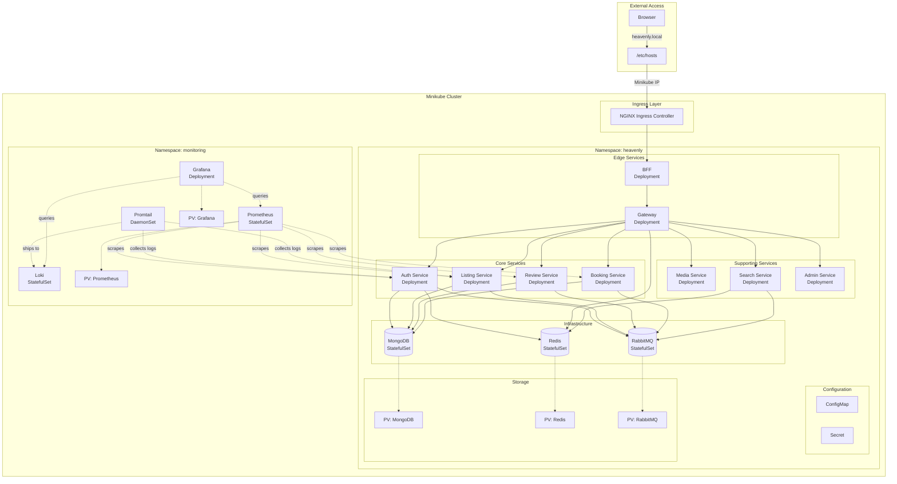
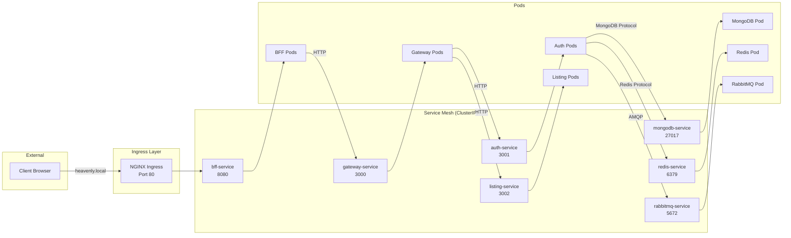
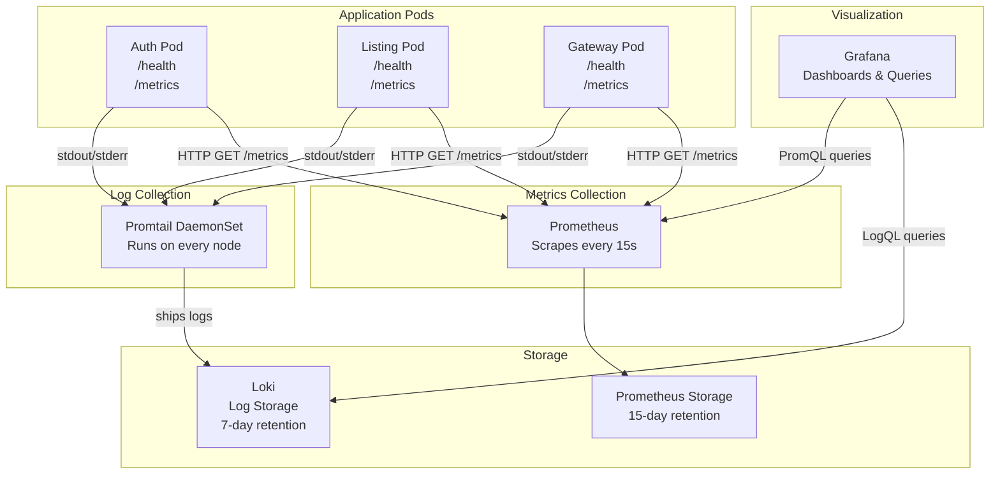
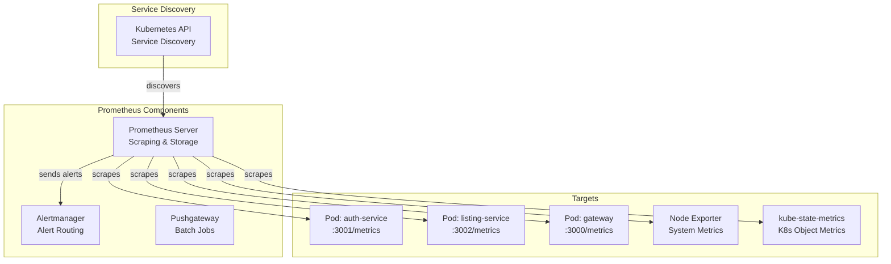
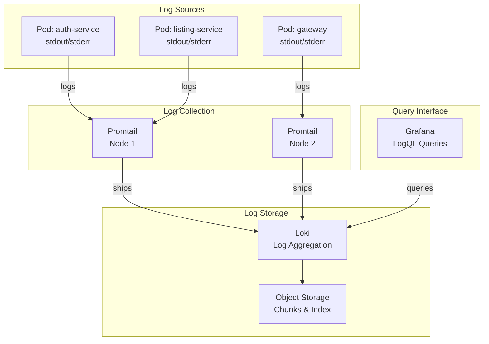

# Technical Design Document: Kubernetes Monitoring Infrastructure

## Overview

This document provides a comprehensive technical design for migrating the Heavenly microservices platform from Docker Compose to Kubernetes with integrated monitoring and observability. The design targets local development using Minikube while maintaining cloud-readiness for future GKE migration.

### Design Goals

1. **Learning-Focused**: Provide clear explanations of Kubernetes concepts for beginners
2. **Production-Ready**: Use industry best practices and patterns
3. **Minimal Code Changes**: Leverage existing service health endpoints and configurations
4. **Incremental Migration**: Support gradual transition from Docker Compose
5. **Cloud-Agnostic**: Design for portability between Minikube and cloud platforms

### System Context

The Heavenly platform consists of:
- **9 Stateless Services**: auth-service, listing-service, review-service, booking-service, media-service, search-service, admin-service, gateway, bff
- **3 Stateful Services**: MongoDB, Redis, RabbitMQ
- **Monitoring Stack**: Prometheus, Grafana, Loki, Promtail

### Migration Strategy

The migration follows a phased approach:

1. **Phase 1**: Infrastructure setup (MongoDB, Redis, RabbitMQ as StatefulSets)
2. **Phase 2**: Core services deployment (auth, listing, review, booking)
3. **Phase 3**: Supporting services (media, search, admin)
4. **Phase 4**: Edge services (gateway, bff) with Ingress
5. **Phase 5**: Monitoring stack installation and configuration
6. **Phase 6**: HPA configuration and testing

## Architecture

### High-Level Architecture



### Namespace Organization

The cluster uses two namespaces for logical isolation:

1. **heavenly**: Application services and infrastructure
2. **monitoring**: Observability stack (Prometheus, Grafana, Loki, Promtail)

This separation provides:
- Clear resource boundaries
- Independent lifecycle management
- Simplified RBAC policies
- Easier troubleshooting

### Network Architecture



**Key Networking Concepts**:

- **ClusterIP Services**: Provide stable internal DNS names (e.g., `mongodb-service.heavenly.svc.cluster.local`)
- **Service Discovery**: Kubernetes DNS automatically resolves service names
- **Load Balancing**: Services distribute traffic across healthy pods using round-robin
- **Health-Based Routing**: Only pods passing readiness probes receive traffic

### Monitoring Architecture



**Monitoring Data Flow**:

1. **Metrics Path**: Pods expose `/metrics` → Prometheus scrapes → Stores in TSDB → Grafana queries with PromQL
2. **Logs Path**: Pods write to stdout/stderr → Promtail collects → Ships to Loki → Grafana queries with LogQL
3. **Health Checks**: Kubernetes probes `/health` → Determines pod readiness/liveness


## Components and Interfaces

### Directory Structure

The Kubernetes manifests are organized in a `k8s/` directory at the project root:

```
k8s/
├── base/
│   ├── namespace.yaml              # Namespace definitions
│   ├── configmap.yaml              # Non-sensitive configuration
│   └── secret.yaml                 # Sensitive credentials (base64 encoded)
├── infra/
│   ├── mongodb-statefulset.yaml    # MongoDB with PVC
│   ├── mongodb-service.yaml        # MongoDB ClusterIP service
│   ├── redis-statefulset.yaml      # Redis with PVC
│   ├── redis-service.yaml          # Redis ClusterIP service
│   ├── rabbitmq-statefulset.yaml   # RabbitMQ with PVC
│   └── rabbitmq-service.yaml       # RabbitMQ ClusterIP service
├── apps/
│   ├── auth-deployment.yaml        # Auth service deployment
│   ├── auth-service.yaml           # Auth ClusterIP service
│   ├── listing-deployment.yaml     # Listing service deployment
│   ├── listing-service.yaml        # Listing ClusterIP service
│   ├── review-deployment.yaml      # Review service deployment
│   ├── review-service.yaml         # Review ClusterIP service
│   ├── booking-deployment.yaml     # Booking service deployment
│   ├── booking-service.yaml        # Booking ClusterIP service
│   ├── media-deployment.yaml       # Media service deployment
│   ├── media-service.yaml          # Media ClusterIP service
│   ├── search-deployment.yaml      # Search service deployment
│   ├── search-service.yaml         # Search ClusterIP service
│   ├── admin-deployment.yaml       # Admin service deployment
│   └── admin-service.yaml          # Admin ClusterIP service
├── edge/
│   ├── gateway-deployment.yaml     # Gateway deployment
│   ├── gateway-service.yaml        # Gateway ClusterIP service
│   ├── bff-deployment.yaml         # BFF deployment
│   ├── bff-service.yaml            # BFF ClusterIP service
│   └── ingress.yaml                # NGINX Ingress for external access
├── hpa/
│   └── hpa.yaml                    # HPA configuration for all stateless services
└── monitoring/
    ├── prometheus-values.yaml      # Helm values for kube-prometheus-stack
    ├── loki-values.yaml            # Helm values for loki-stack and Promtail
    └── grafana-dashboards.yaml     # Dashboard ConfigMap for Grafana sidecar
```

### ConfigMap Design

The ConfigMap stores non-sensitive configuration that services need at runtime.

**File**: `k8s/base/configmap.yaml`

```yaml
apiVersion: v1
kind: ConfigMap
metadata:
  name: heavenly-config
  namespace: heavenly
data:
  # Node environment
  NODE_ENV: "production"
  
  # Infrastructure URLs (using Kubernetes DNS)
  MONGO_URL_AUTH: "mongodb://mongodb-service.heavenly.svc.cluster.local:27017/heavenly_auth"
  MONGO_URL_LISTING: "mongodb://mongodb-service.heavenly.svc.cluster.local:27017/heavenly_listings"
  MONGO_URL_REVIEW: "mongodb://mongodb-service.heavenly.svc.cluster.local:27017/heavenly_reviews"
  MONGO_URL_BOOKING: "mongodb://mongodb-service.heavenly.svc.cluster.local:27017/heavenly_bookings"
  
  REDIS_URL: "redis://redis-service.heavenly.svc.cluster.local:6379"
  
  RABBITMQ_HOST: "rabbitmq-service.heavenly.svc.cluster.local"
  RABBITMQ_PORT: "5672"
  
  # Service URLs (internal communication)
  AUTH_SERVICE_URL: "http://auth-service.heavenly.svc.cluster.local:3001"
  LISTING_SERVICE_URL: "http://listing-service.heavenly.svc.cluster.local:3002"
  REVIEW_SERVICE_URL: "http://review-service.heavenly.svc.cluster.local:3003"
  BOOKING_SERVICE_URL: "http://booking-service.heavenly.svc.cluster.local:3004"
  MEDIA_SERVICE_URL: "http://media-service.heavenly.svc.cluster.local:3005"
  SEARCH_SERVICE_URL: "http://search-service.heavenly.svc.cluster.local:3006"
  ADMIN_SERVICE_URL: "http://admin-service.heavenly.svc.cluster.local:3007"
  GATEWAY_URL: "http://gateway-service.heavenly.svc.cluster.local:3000"
  
  # Service ports
  PORT_AUTH: "3001"
  PORT_LISTING: "3002"
  PORT_REVIEW: "3003"
  PORT_BOOKING: "3004"
  PORT_MEDIA: "3005"
  PORT_SEARCH: "3006"
  PORT_ADMIN: "3007"
  PORT_GATEWAY: "3000"
  PORT_BFF: "8080"
```

**Key Design Decisions**:

1. **Kubernetes DNS Format**: Services use FQDN format `{service-name}.{namespace}.svc.cluster.local`
2. **Database Separation**: Each service gets its own MongoDB database name
3. **Centralized Configuration**: All services reference the same ConfigMap
4. **Environment Consistency**: NODE_ENV set to "production" for all services

### Secret Design

The Secret stores sensitive credentials encoded in base64.

**File**: `k8s/base/secret.yaml`

```yaml
apiVersion: v1
kind: Secret
metadata:
  name: heavenly-secrets
  namespace: heavenly
type: Opaque
data:
  # JWT secrets (base64 encoded)
  JWT_SECRET: <base64-encoded-value>
  JWT_REFRESH_SECRET: <base64-encoded-value>
  
  # Session secret (base64 encoded)
  SESSION_SECRET: <base64-encoded-value>
  
  # Cloudinary credentials (base64 encoded)
  CLOUD_NAME: <base64-encoded-value>
  CLOUD_API_KEY: <base64-encoded-value>
  CLOUD_API_SECRET: <base64-encoded-value>
  
  # RabbitMQ credentials (base64 encoded)
  RABBITMQ_USER: <base64-encoded-value>
  RABBITMQ_PASS: <base64-encoded-value>
  
  # Razorpay credentials (base64 encoded)
  RAZORPAY_KEY_ID: <base64-encoded-value>
  RAZORPAY_KEY_SECRET: <base64-encoded-value>
```

**Secret Creation Process**:

```bash
# Create secret from .env file
kubectl create secret generic heavenly-secrets \
  --from-literal=JWT_SECRET="${JWT_SECRET}" \
  --from-literal=JWT_REFRESH_SECRET="${JWT_REFRESH_SECRET}" \
  --from-literal=SESSION_SECRET="${SESSION_SECRET}" \
  --from-literal=CLOUD_NAME="${CLOUD_NAME}" \
  --from-literal=CLOUD_API_KEY="${CLOUD_API_KEY}" \
  --from-literal=CLOUD_API_SECRET="${CLOUD_API_SECRET}" \
  --from-literal=RABBITMQ_USER="${RABBITMQ_USER}" \
  --from-literal=RABBITMQ_PASS="${RABBITMQ_PASS}" \
  --from-literal=RAZORPAY_KEY_ID="${RAZORPAY_KEY_ID}" \
  --from-literal=RAZORPAY_KEY_SECRET="${RAZORPAY_KEY_SECRET}" \
  --namespace=heavenly
```

**Security Considerations**:

1. **Never Commit Secrets**: The `secret.yaml` file should be in `.gitignore`
2. **Base64 is NOT Encryption**: Secrets are encoded but not encrypted at rest (use encryption providers for production)
3. **RBAC Protection**: Limit secret access to necessary service accounts
4. **Rotation Strategy**: Plan for periodic secret rotation

### StatefulSet Design (MongoDB Example)

StatefulSets provide stable network identities and persistent storage for stateful services.

**File**: `k8s/infra/mongodb-statefulset.yaml`

```yaml
apiVersion: apps/v1
kind: StatefulSet
metadata:
  name: mongodb
  namespace: heavenly
  labels:
    app: mongodb
    component: infrastructure
spec:
  serviceName: mongodb-service
  replicas: 1
  selector:
    matchLabels:
      app: mongodb
  template:
    metadata:
      labels:
        app: mongodb
        component: infrastructure
    spec:
      containers:
      - name: mongodb
        image: mongo:7
        ports:
        - containerPort: 27017
          name: mongodb
        # Note: MongoDB runs without authentication to match the current
        # docker-compose.yml setup. For production, add MONGO_INITDB_ROOT_USERNAME
        # and MONGO_INITDB_ROOT_PASSWORD from dedicated Secret keys (NOT RabbitMQ creds)
        # and update all MONGO_URL values in ConfigMap to include credentials.
        resources:
          requests:
            memory: "256Mi"
            cpu: "250m"
          limits:
            memory: "512Mi"
            cpu: "500m"
        volumeMounts:
        - name: mongodb-data
          mountPath: /data/db
        livenessProbe:
          exec:
            command:
            - mongosh
            - --eval
            - "db.adminCommand('ping')"
          initialDelaySeconds: 30
          periodSeconds: 10
          timeoutSeconds: 5
          failureThreshold: 3
        readinessProbe:
          exec:
            command:
            - mongosh
            - --eval
            - "db.adminCommand('ping')"
          initialDelaySeconds: 10
          periodSeconds: 5
          timeoutSeconds: 3
          failureThreshold: 2
  volumeClaimTemplates:
  - metadata:
      name: mongodb-data
    spec:
      accessModes: [ "ReadWriteOnce" ]
      storageClassName: standard  # Minikube default storage class
      resources:
        requests:
          storage: 10Gi
```

**StatefulSet Key Features**:

1. **Stable Pod Names**: Pods get predictable names like `mongodb-0`, `mongodb-1`
2. **Ordered Deployment**: Pods are created sequentially (0, then 1, then 2...)
3. **Persistent Storage**: Each pod gets its own PersistentVolumeClaim
4. **Stable Network Identity**: Combined with headless service for DNS stability
5. **Graceful Scaling**: Pods are terminated in reverse order during scale-down

**Service for StatefulSet**:

**File**: `k8s/infra/mongodb-service.yaml`

```yaml
apiVersion: v1
kind: Service
metadata:
  name: mongodb-service
  namespace: heavenly
  labels:
    app: mongodb
spec:
  type: ClusterIP
  clusterIP: None  # Headless service for StatefulSet
  ports:
  - port: 27017
    targetPort: 27017
    protocol: TCP
    name: mongodb
  selector:
    app: mongodb
```

**Headless Service Explanation**:

- `clusterIP: None` creates a headless service
- Provides DNS entries for individual pods: `mongodb-0.mongodb-service.heavenly.svc.cluster.local`
- Used for StatefulSet pod discovery and stable networking

### Deployment Design (Auth Service Example)

Deployments manage stateless applications with rolling updates and scaling.

**File**: `k8s/apps/auth-deployment.yaml`

```yaml
apiVersion: apps/v1
kind: Deployment
metadata:
  name: auth-service
  namespace: heavenly
  labels:
    app: auth-service
    component: backend
spec:
  replicas: 1
  revisionHistoryLimit: 5  # Keep last 5 revisions for rollback
  strategy:
    type: RollingUpdate
    rollingUpdate:
      maxUnavailable: 0
      maxSurge: 1
  selector:
    matchLabels:
      app: auth-service
  template:
    metadata:
      labels:
        app: auth-service
        component: backend
      annotations:
        # IMPORTANT: /metrics endpoint must be implemented using prom-client
        # before Prometheus can scrape application metrics. See Requirement 23.
        prometheus.io/scrape: "true"
        prometheus.io/port: "3001"
        prometheus.io/path: "/metrics"
    spec:
      containers:
      - name: auth-service
        image: heavenly-auth:latest
        imagePullPolicy: Never  # Use local images in Minikube
        ports:
        - containerPort: 3001
          name: http
        env:
        # From ConfigMap
        - name: NODE_ENV
          valueFrom:
            configMapKeyRef:
              name: heavenly-config
              key: NODE_ENV
        - name: PORT
          valueFrom:
            configMapKeyRef:
              name: heavenly-config
              key: PORT_AUTH
        - name: MONGO_URL
          valueFrom:
            configMapKeyRef:
              name: heavenly-config
              key: MONGO_URL_AUTH
        - name: REDIS_URL
          valueFrom:
            configMapKeyRef:
              name: heavenly-config
              key: REDIS_URL
        - name: RABBITMQ_HOST
          valueFrom:
            configMapKeyRef:
              name: heavenly-config
              key: RABBITMQ_HOST
        - name: RABBITMQ_PORT
          valueFrom:
            configMapKeyRef:
              name: heavenly-config
              key: RABBITMQ_PORT
        # From Secret (must be declared BEFORE RABBITMQ_URL which references them)
        - name: JWT_SECRET
          valueFrom:
            secretKeyRef:
              name: heavenly-secrets
              key: JWT_SECRET
        - name: JWT_REFRESH_SECRET
          valueFrom:
            secretKeyRef:
              name: heavenly-secrets
              key: JWT_REFRESH_SECRET
        - name: RABBITMQ_USER
          valueFrom:
            secretKeyRef:
              name: heavenly-secrets
              key: RABBITMQ_USER
        - name: RABBITMQ_PASS
          valueFrom:
            secretKeyRef:
              name: heavenly-secrets
              key: RABBITMQ_PASS
        # Composite value — all referenced $(VAR) variables are declared above
        - name: RABBITMQ_URL
          value: "amqp://$(RABBITMQ_USER):$(RABBITMQ_PASS)@$(RABBITMQ_HOST):$(RABBITMQ_PORT)"
        resources:
          requests:
            memory: "128Mi"
            cpu: "100m"
          limits:
            memory: "256Mi"
            cpu: "250m"
        livenessProbe:
          httpGet:
            path: /health
            port: 3001
          initialDelaySeconds: 30
          periodSeconds: 10
          timeoutSeconds: 5
          failureThreshold: 3
        readinessProbe:
          httpGet:
            path: /health
            port: 3001
          initialDelaySeconds: 10
          periodSeconds: 5
          timeoutSeconds: 3
          failureThreshold: 2
```

**Deployment Key Features**:

1. **Rolling Updates**: `maxUnavailable: 0` ensures zero downtime during updates
2. **Environment Injection**: Mix of ConfigMap and Secret references
3. **Resource Management**: Requests guarantee minimum resources, limits prevent overconsumption
4. **Health Checks**: Liveness restarts unhealthy pods, readiness controls traffic routing
5. **Prometheus Annotations**: Enable automatic metrics scraping

**Service for Deployment**:

**File**: `k8s/apps/auth-service.yaml`

```yaml
apiVersion: v1
kind: Service
metadata:
  name: auth-service
  namespace: heavenly
  labels:
    app: auth-service
spec:
  type: ClusterIP
  ports:
  - port: 3001
    targetPort: 3001
    protocol: TCP
    name: http
  selector:
    app: auth-service
```

**ClusterIP Service Explanation**:

- Default service type for internal cluster communication
- Provides stable DNS name: `auth-service.heavenly.svc.cluster.local`
- Load balances across all pods matching the selector
- Only accessible within the cluster

### HPA Design (Auth Service Example)

Horizontal Pod Autoscaler automatically scales pods based on resource metrics.

**File**: `k8s/hpa/auth-hpa.yaml`

```yaml
apiVersion: autoscaling/v2
kind: HorizontalPodAutoscaler
metadata:
  name: auth-service-hpa
  namespace: heavenly
spec:
  scaleTargetRef:
    apiVersion: apps/v1
    kind: Deployment
    name: auth-service
  minReplicas: 1
  maxReplicas: 5
  metrics:
  - type: Resource
    resource:
      name: cpu
      target:
        type: Utilization
        averageUtilization: 70
  behavior:
    scaleUp:
      stabilizationWindowSeconds: 30
      policies:
      - type: Percent
        value: 50
        periodSeconds: 30
      - type: Pods
        value: 2
        periodSeconds: 30
      selectPolicy: Max
    scaleDown:
      stabilizationWindowSeconds: 60
      policies:
      - type: Percent
        value: 50
        periodSeconds: 60
      selectPolicy: Min
```

**HPA Key Features**:

1. **CPU-Based Scaling**: Triggers when average CPU exceeds 70%
2. **Replica Bounds**: Minimum 1, maximum 5 replicas
3. **Scale-Up Behavior**: Aggressive scaling (50% or 2 pods, whichever is more)
4. **Scale-Down Behavior**: Conservative scaling (50% reduction with 60s stabilization)
5. **Stabilization Windows**: Prevent flapping during metric fluctuations

**HPA Requirements**:

- Metrics Server must be enabled: `minikube addons enable metrics-server`
- Pods must have resource requests defined
- CPU metrics take 15-30 seconds to propagate

### Ingress Design

Ingress provides external HTTP access to services.

**File**: `k8s/edge/ingress.yaml`

```yaml
apiVersion: networking.k8s.io/v1
kind: Ingress
metadata:
  name: heavenly-ingress
  namespace: heavenly
  annotations:
    nginx.ingress.kubernetes.io/rewrite-target: /
    nginx.ingress.kubernetes.io/proxy-connect-timeout: "30"
    nginx.ingress.kubernetes.io/proxy-send-timeout: "30"
    nginx.ingress.kubernetes.io/proxy-read-timeout: "30"
spec:
  ingressClassName: nginx
  rules:
  - host: heavenly.local
    http:
      paths:
      - path: /
        pathType: Prefix
        backend:
          service:
            name: bff-service
            port:
              number: 8080
```

**Ingress Setup**:

1. **Enable NGINX Ingress**: `minikube addons enable ingress`
2. **Get Minikube IP**: `minikube ip`
3. **Update /etc/hosts**: Add `<minikube-ip> heavenly.local`
4. **Access Application**: Navigate to `http://heavenly.local`

**Ingress Key Features**:

- **Host-Based Routing**: Routes based on hostname
- **Path-Based Routing**: Can route different paths to different services
- **Timeout Configuration**: Prevents long-running request failures
- **SSL Termination**: Can be configured for HTTPS (future enhancement)


## Data Models

### PersistentVolumeClaim Template

PersistentVolumeClaims (PVCs) request storage resources for pods.

```yaml
apiVersion: v1
kind: PersistentVolumeClaim
metadata:
  name: example-pvc
  namespace: heavenly
spec:
  accessModes:
    - ReadWriteOnce  # Single node read-write access
  storageClassName: standard  # Minikube default
  resources:
    requests:
      storage: 10Gi
```

**Access Modes**:

- **ReadWriteOnce (RWO)**: Volume can be mounted read-write by a single node
- **ReadOnlyMany (ROX)**: Volume can be mounted read-only by many nodes
- **ReadWriteMany (RWX)**: Volume can be mounted read-write by many nodes

**Storage Classes**:

- **Minikube**: Uses `standard` storage class (hostPath provisioner)
- **GKE**: Can use `standard-rwo`, `premium-rwo`, or `standard-rwx`
- **Dynamic Provisioning**: Storage is automatically created when PVC is bound

### Environment Variable Injection Patterns

Kubernetes supports multiple patterns for injecting configuration:

#### Pattern 1: Direct Value

```yaml
env:
- name: NODE_ENV
  value: "production"
```

#### Pattern 2: ConfigMap Reference

```yaml
env:
- name: MONGO_URL
  valueFrom:
    configMapKeyRef:
      name: heavenly-config
      key: MONGO_URL_AUTH
```

#### Pattern 3: Secret Reference

```yaml
env:
- name: JWT_SECRET
  valueFrom:
    secretKeyRef:
      name: heavenly-secrets
      key: JWT_SECRET
```

#### Pattern 4: Composite Value (Variable Substitution)

```yaml
# IMPORTANT: Referenced $(VAR) variables MUST be declared BEFORE the
# composite value that uses them. Kubernetes processes env vars top-to-bottom.
env:
- name: RABBITMQ_USER
  valueFrom:
    secretKeyRef:
      name: heavenly-secrets
      key: RABBITMQ_USER
- name: RABBITMQ_PASS
  valueFrom:
    secretKeyRef:
      name: heavenly-secrets
      key: RABBITMQ_PASS
- name: RABBITMQ_HOST
  valueFrom:
    configMapKeyRef:
      name: heavenly-config
      key: RABBITMQ_HOST
- name: RABBITMQ_URL
  value: "amqp://$(RABBITMQ_USER):$(RABBITMQ_PASS)@$(RABBITMQ_HOST):5672"
```

#### Pattern 5: Entire ConfigMap as Environment Variables

```yaml
envFrom:
- configMapRef:
    name: heavenly-config
```

**Recommendation**: Use Pattern 2 and 3 for explicit control and clarity.

### Resource Specification Model

Every container should define resource requests and limits:

```yaml
resources:
  requests:
    memory: "128Mi"  # Guaranteed minimum
    cpu: "100m"      # 0.1 CPU cores
  limits:
    memory: "256Mi"  # Maximum allowed
    cpu: "250m"      # 0.25 CPU cores
```

**Resource Units**:

- **Memory**: `Mi` (Mebibytes), `Gi` (Gibibytes)
- **CPU**: `m` (millicores), where 1000m = 1 CPU core

**Impact on Scheduling**:

1. **Requests**: Kubernetes scheduler ensures node has enough resources
2. **Limits**: Kubelet enforces maximum usage (OOMKill if exceeded)
3. **QoS Classes**:
   - **Guaranteed**: requests = limits for all resources
   - **Burstable**: requests < limits
   - **BestEffort**: no requests or limits defined

### Health Check Model

Kubernetes supports three types of probes:

#### Liveness Probe

Determines if a container is alive. Failed probes trigger container restart.

```yaml
livenessProbe:
  httpGet:
    path: /health
    port: 3001
  initialDelaySeconds: 30  # Wait before first probe
  periodSeconds: 10        # Probe every 10 seconds
  timeoutSeconds: 5        # Probe timeout
  failureThreshold: 3      # Restart after 3 failures
  successThreshold: 1      # Consider healthy after 1 success
```

#### Readiness Probe

Determines if a container is ready to serve traffic. Failed probes remove pod from service endpoints.

```yaml
readinessProbe:
  httpGet:
    path: /health
    port: 3001
  initialDelaySeconds: 10  # Shorter delay than liveness
  periodSeconds: 5         # More frequent checks
  timeoutSeconds: 3
  failureThreshold: 2      # Remove from service after 2 failures
  successThreshold: 1
```

#### Startup Probe

Determines if a container has started. Disables liveness/readiness until successful.

```yaml
startupProbe:
  httpGet:
    path: /health
    port: 3001
  initialDelaySeconds: 0
  periodSeconds: 5
  failureThreshold: 30     # Allow 150 seconds for startup (30 * 5s)
```

**Probe Types**:

- **httpGet**: HTTP GET request (most common for web services)
- **tcpSocket**: TCP connection attempt
- **exec**: Execute command in container

**Best Practices**:

1. Use same endpoint for liveness and readiness
2. Liveness should check basic functionality (e.g., process alive)
3. Readiness should check dependencies (e.g., database connection)
4. Set `initialDelaySeconds` longer than typical startup time
5. Use startup probes for slow-starting containers

## Monitoring Stack Design

### Prometheus Architecture

Prometheus is a time-series database and monitoring system.



**Prometheus Installation (Helm)**:

```bash
# Add Prometheus community Helm repo
helm repo add prometheus-community https://prometheus-community.github.io/helm-charts
helm repo update

# Install kube-prometheus-stack
helm install prometheus prometheus-community/kube-prometheus-stack \
  --namespace monitoring \
  --create-namespace \
  --values k8s/monitoring/prometheus-values.yaml
```

**Prometheus Values Configuration**:

**File**: `k8s/monitoring/prometheus-values.yaml`

```yaml
# Prometheus configuration
prometheus:
  prometheusSpec:
    # Scrape interval
    scrapeInterval: 15s
    evaluationInterval: 15s
    
    # Retention period
    retention: 15d
    retentionSize: "10GB"
    
    # Storage
    storageSpec:
      volumeClaimTemplate:
        spec:
          storageClassName: standard
          accessModes: ["ReadWriteOnce"]
          resources:
            requests:
              storage: 20Gi
    
    # Service monitor selector (scrape heavenly namespace)
    serviceMonitorSelector:
      matchLabels:
        prometheus: kube-prometheus
    
    # Additional scrape configs for heavenly namespace
    additionalScrapeConfigs:
    - job_name: 'heavenly-services'
      kubernetes_sd_configs:
      - role: pod
        namespaces:
          names:
          - heavenly
      relabel_configs:
      # Only scrape pods with prometheus.io/scrape annotation
      - source_labels: [__meta_kubernetes_pod_annotation_prometheus_io_scrape]
        action: keep
        regex: true
      # Use port from annotation
      - source_labels: [__meta_kubernetes_pod_annotation_prometheus_io_port]
        action: replace
        target_label: __address__
        regex: ([^:]+)(?::\d+)?;(\d+)
        replacement: $1:$2
      # Use path from annotation
      - source_labels: [__meta_kubernetes_pod_annotation_prometheus_io_path]
        action: replace
        target_label: __metrics_path__
        regex: (.+)
      # Add pod name label
      - source_labels: [__meta_kubernetes_pod_name]
        action: replace
        target_label: pod
      # Add namespace label
      - source_labels: [__meta_kubernetes_namespace]
        action: replace
        target_label: namespace
      # Add service label
      - source_labels: [__meta_kubernetes_pod_label_app]
        action: replace
        target_label: service

# Grafana configuration
grafana:
  enabled: true
  adminPassword: "admin"  # Change in production
  
  # Persistence
  persistence:
    enabled: true
    storageClassName: standard
    size: 10Gi
  
  # Data sources (Prometheus pre-configured)
  datasources:
    datasources.yaml:
      apiVersion: 1
      datasources:
      - name: Prometheus
        type: prometheus
        url: http://prometheus-kube-prometheus-prometheus.monitoring:9090
        access: proxy
        isDefault: true

# Alertmanager configuration
alertmanager:
  enabled: true
  alertmanagerSpec:
    storage:
      volumeClaimTemplate:
        spec:
          storageClassName: standard
          accessModes: ["ReadWriteOnce"]
          resources:
            requests:
              storage: 5Gi

# Node exporter (system metrics)
nodeExporter:
  enabled: true

# kube-state-metrics (Kubernetes object metrics)
kubeStateMetrics:
  enabled: true
```

**Key Prometheus Concepts**:

1. **Scraping**: Prometheus pulls metrics from targets (pull model)
2. **Service Discovery**: Automatically discovers targets via Kubernetes API
3. **Relabeling**: Transforms labels before storing metrics
4. **Time Series**: Metrics stored as time-series data (metric name + labels + timestamp + value)
5. **PromQL**: Query language for retrieving and aggregating metrics

**Common PromQL Queries**:

```promql
# CPU usage per pod
rate(container_cpu_usage_seconds_total{namespace="heavenly"}[5m])

# Memory usage per pod
container_memory_usage_bytes{namespace="heavenly"}

# HTTP request rate
rate(http_requests_total{namespace="heavenly"}[5m])

# Pod restart count
kube_pod_container_status_restarts_total{namespace="heavenly"}

# HPA current replicas
kube_horizontalpodautoscaler_status_current_replicas{namespace="heavenly"}
```

### Grafana Dashboard Design

Grafana provides visualization for Prometheus metrics.

The current implementation ships one consolidated dashboard named **Heavenly Services Overview** through `k8s/monitoring/grafana-dashboards.yaml`.

Panels:
- Request rate per service (graph)
- P95 request latency per service (graph)
- CPU usage by pod (graph)
- Memory usage by pod (graph)
- HPA desired replicas (graph)
- Recent Heavenly logs from Loki (logs panel)

The original design can still be expanded into separate dashboards as a future improvement:

- Resource Usage
- HPA Status
- RabbitMQ Monitoring
- Request Latency
- Pod Status
- Logs Explorer

### Loki Architecture

Loki is a log aggregation system inspired by Prometheus.



**Loki Installation (Helm)**:

```bash
# Add Grafana Helm repo
helm repo add grafana https://grafana.github.io/helm-charts
helm repo update

# Install loki-stack
helm install loki grafana/loki-stack \
  --namespace monitoring \
  --values k8s/monitoring/loki-values.yaml
```

**Loki Values Configuration**:

**File**: `k8s/monitoring/loki-values.yaml`

```yaml
# Loki configuration
loki:
  enabled: true
  
  # Persistence
  persistence:
    enabled: true
    storageClassName: standard
    size: 20Gi
  
  # Configuration
  config:
    # Retention via compactor
    compactor:
      retention_enabled: true
      retention_delete_delay: 2h
      delete_request_store: filesystem
    
    # Chunk storage compatible with grafana/loki-stack's Loki 2.6.x image
    schema_config:
      configs:
      - from: 2024-01-01
        store: boltdb-shipper
        object_store: filesystem
        schema: v11
        index:
          prefix: index_
          period: 24h
    
    # Storage config
    storage_config:
      boltdb_shipper:
        active_index_directory: /data/loki/boltdb-shipper-active
        cache_location: /data/loki/boltdb-shipper-cache
        shared_store: filesystem
      filesystem:
        directory: /data/loki/chunks
    
    # Limits
    limits_config:
      enforce_metric_name: false
      reject_old_samples: true
      reject_old_samples_max_age: 168h  # 7 days
      retention_period: 168h  # 7 days
      ingestion_rate_mb: 10
      ingestion_burst_size_mb: 20

# Promtail configuration
promtail:
  enabled: true
  
  # Run as DaemonSet (one per node)
  daemonset:
    enabled: true
  
  # Configuration
  config:
    # Loki endpoint
    clients:
    - url: http://loki:3100/loki/api/v1/push
    
    # Scrape configs
    scrapeConfigs:
    - job_name: kubernetes-pods
      kubernetes_sd_configs:
      - role: pod
        namespaces:
          names:
          - heavenly
      
      # Pipeline stages
      pipeline_stages:
      - docker: {}  # Parse Docker JSON logs
      - match:
          selector: '{namespace="heavenly"}'
          stages:
          - json:
              expressions:
                level: level
                message: message
                timestamp: timestamp
          - labels:
              level:
          - timestamp:
              source: timestamp
              format: RFC3339
      
      # Relabeling
      relabel_configs:
      # Add pod name
      - source_labels: [__meta_kubernetes_pod_name]
        target_label: pod
      # Add namespace
      - source_labels: [__meta_kubernetes_namespace]
        target_label: namespace
      # Add container name
      - source_labels: [__meta_kubernetes_pod_container_name]
        target_label: container
      # Add service label
      - source_labels: [__meta_kubernetes_pod_label_app]
        target_label: service
      # Add node name
      - source_labels: [__meta_kubernetes_pod_node_name]
        target_label: node

# Grafana Loki data source (add to existing Grafana)
grafana:
  enabled: false  # Already installed with Prometheus stack
  
  # Data source configuration (apply manually or via ConfigMap)
  additionalDataSources:
  - name: Loki
    type: loki
    url: http://loki:3100
    access: proxy
    jsonData:
      maxLines: 1000
```

**Key Loki Concepts**:

1. **Labels**: Indexed metadata (pod, namespace, service)
2. **Chunks**: Compressed log data stored in object storage
3. **LogQL**: Query language similar to PromQL
4. **Streams**: Unique combination of labels
5. **Push Model**: Promtail pushes logs to Loki (unlike Prometheus pull)

**Common LogQL Queries**:

```logql
# All logs from auth-service
{namespace="heavenly", service="auth-service"}

# Error logs from all services
{namespace="heavenly"} |= "error" or "ERROR"

# Logs from specific pod
{namespace="heavenly", pod="auth-service-7d8f9c5b6-xk2lm"}

# Rate of error logs
rate({namespace="heavenly"} |= "error" [5m])

# Top 10 log producers
topk(10, sum by (service) (rate({namespace="heavenly"}[5m])))

# Logs with JSON parsing
{namespace="heavenly"} | json | level="error"
```

### Promtail DaemonSet

Promtail runs on every node to collect logs.

**Key Features**:

1. **DaemonSet**: Ensures one Promtail pod per node
2. **Host Path Mounts**: Accesses node's `/var/log` and `/var/lib/docker/containers`
3. **Service Discovery**: Discovers pods via Kubernetes API
4. **Pipeline Processing**: Parses, filters, and enriches logs
5. **Label Extraction**: Adds metadata labels for querying

**Promtail Pipeline Stages**:

1. **Docker Stage**: Parses Docker JSON log format
2. **JSON Stage**: Extracts fields from JSON logs
3. **Regex Stage**: Extracts fields using regex patterns
4. **Labels Stage**: Promotes fields to indexed labels
5. **Timestamp Stage**: Parses log timestamps
6. **Drop Stage**: Filters out unwanted logs


## Prerequisites: Service Instrumentation

### Prometheus Metrics Instrumentation

All stateless Heavenly services now expose a `/metrics` endpoint through `shared/src/metrics.js`. This instrumentation is required for application-level Prometheus metrics; Kubernetes CPU/memory metrics still come from kubelet/cAdvisor and kube-state-metrics.

Each stateless service must install `prom-client` and expose a `/metrics` endpoint.

**Step 1: Install prom-client in each service**

```bash
cd services/auth-service && npm install prom-client
cd services/listing-service && npm install prom-client
cd services/review-service && npm install prom-client
cd services/booking-service && npm install prom-client
cd services/media-service && npm install prom-client
cd services/search-service && npm install prom-client
cd services/admin-service && npm install prom-client
cd gateway && npm install prom-client
cd bff && npm install prom-client
```

**Step 2: Add metrics middleware to each service**

Create a shared metrics utility at `shared/src/metrics.js`:

```javascript
const client = require('prom-client');

// Collect default Node.js metrics (CPU, memory, event loop lag, GC)
client.collectDefaultMetrics({ prefix: 'heavenly_' });

// Custom HTTP request metrics
const httpRequestDuration = new client.Histogram({
  name: 'heavenly_http_request_duration_seconds',
  help: 'Duration of HTTP requests in seconds',
  labelNames: ['method', 'path', 'status_code', 'service'],
  buckets: [0.01, 0.05, 0.1, 0.25, 0.5, 1, 2.5, 5, 10]
});

const httpRequestsTotal = new client.Counter({
  name: 'heavenly_http_requests_total',
  help: 'Total number of HTTP requests',
  labelNames: ['method', 'path', 'status_code', 'service']
});

function metricsMiddleware(serviceName) {
  return (req, res, next) => {
    // Skip the metrics endpoint itself
    if (req.path === '/metrics') {
      return next();
    }
    const end = httpRequestDuration.startTimer();
    res.on('finish', () => {
      const labels = {
        method: req.method,
        path: req.route?.path || req.path,
        status_code: res.statusCode,
        service: serviceName
      };
      end(labels);
      httpRequestsTotal.inc(labels);
    });
    next();
  };
}

function setupMetrics(app, serviceName) {
  app.use(metricsMiddleware(serviceName));
  app.get('/metrics', async (req, res) => {
    res.set('Content-Type', client.register.contentType);
    res.end(await client.register.metrics());
  });
}

module.exports = { setupMetrics, client };
```

**Step 3: Wire into each service's index.js**

```javascript
const { setupMetrics } = require('../../shared/src/metrics');

setupMetrics(app, 'auth-service');
```

### Dockerfile Security Changes

All service Dockerfiles now run as the non-root `node` user. Keep this pattern for new services and future Dockerfile edits.

Add the following lines to each Dockerfile, before the CMD instruction:

```dockerfile
# Security: run as non-root user (node user exists in node:20-alpine)
RUN chown -R node:node /app
USER node
```

Example updated auth-service Dockerfile:

```dockerfile
FROM node:20-alpine
WORKDIR /app
COPY shared/package.json shared/
RUN cd shared && npm install --production
COPY services/auth-service/package.json services/auth-service/
RUN cd services/auth-service && npm install --production
COPY shared/ shared/
COPY services/auth-service/ services/auth-service/

# Security: run as non-root user
RUN chown -R node:node /app
USER node

EXPOSE 3001
CMD ["node", "services/auth-service/src/index.js"]
```

### NetworkPolicy Design

NetworkPolicies restrict pod-to-pod communication to only required paths (Requirement 27.6).

**File**: `k8s/base/network-policies.yaml`

```yaml
# Default deny all ingress traffic in heavenly namespace
apiVersion: networking.k8s.io/v1
kind: NetworkPolicy
metadata:
  name: default-deny-ingress
  namespace: heavenly
spec:
  podSelector: {}
  policyTypes:
  - Ingress
---
# Allow ingress to BFF from Ingress controller
apiVersion: networking.k8s.io/v1
kind: NetworkPolicy
metadata:
  name: allow-ingress-to-bff
  namespace: heavenly
spec:
  podSelector:
    matchLabels:
      app: bff
  ingress:
  - from:
    - namespaceSelector:
        matchLabels:
          kubernetes.io/metadata.name: ingress-nginx
    ports:
    - port: 8080
---
# Allow BFF to Gateway
apiVersion: networking.k8s.io/v1
kind: NetworkPolicy
metadata:
  name: allow-bff-to-gateway
  namespace: heavenly
spec:
  podSelector:
    matchLabels:
      app: gateway
  ingress:
  - from:
    - podSelector:
        matchLabels:
          app: bff
    ports:
    - port: 3000
---
# Allow Gateway to all backend services
apiVersion: networking.k8s.io/v1
kind: NetworkPolicy
metadata:
  name: allow-gateway-to-backends
  namespace: heavenly
spec:
  podSelector:
    matchLabels:
      component: backend
  ingress:
  - from:
    - podSelector:
        matchLabels:
          app: gateway
---
# Allow all services to access infrastructure (MongoDB, Redis, RabbitMQ)
apiVersion: networking.k8s.io/v1
kind: NetworkPolicy
metadata:
  name: allow-apps-to-infra
  namespace: heavenly
spec:
  podSelector:
    matchLabels:
      component: infrastructure
  ingress:
  - from:
    - podSelector: {}
---
# Allow Prometheus to scrape all pods
apiVersion: networking.k8s.io/v1
kind: NetworkPolicy
metadata:
  name: allow-prometheus-scraping
  namespace: heavenly
spec:
  podSelector: {}
  ingress:
  - from:
    - namespaceSelector:
        matchLabels:
          kubernetes.io/metadata.name: monitoring
    ports:
    - port: 3000
    - port: 3001
    - port: 3002
    - port: 3003
    - port: 3004
    - port: 3005
    - port: 3006
    - port: 3007
    - port: 8080
```

> **Note**: NetworkPolicies require a CNI plugin that supports them. Minikube's default bridge plugin does NOT enforce NetworkPolicies. For local testing, install Calico: `minikube start --cni=calico`. NetworkPolicies will be fully enforced on GKE by default.


## Deployment Workflow

### Image Build Process

Minikube provides a Docker daemon that can be used to build images locally without pushing to a registry.

**Step 1: Configure Docker to Use Minikube's Daemon**

```bash
# Point Docker CLI to Minikube's Docker daemon
eval $(minikube docker-env)

# Verify connection
docker ps  # Should show Minikube's containers
```

**Step 2: Build Images**

```bash
# Build all service images
docker build -t heavenly-auth:latest -f services/auth-service/Dockerfile .
docker build -t heavenly-listing:latest -f services/listing-service/Dockerfile .
docker build -t heavenly-review:latest -f services/review-service/Dockerfile .
docker build -t heavenly-booking:latest -f services/booking-service/Dockerfile .
docker build -t heavenly-media:latest -f services/media-service/Dockerfile .
docker build -t heavenly-search:latest -f services/search-service/Dockerfile .
docker build -t heavenly-admin:latest -f services/admin-service/Dockerfile .
docker build -t heavenly-gateway:latest -f gateway/Dockerfile .
docker build -t heavenly-bff:latest -f bff/Dockerfile .
```

**Step 3: Verify Images**

```bash
# List images in Minikube
docker images | grep heavenly
```

**Important Notes**:

1. **imagePullPolicy: Never**: Prevents Kubernetes from trying to pull images from registry
2. **Local Only**: Images are only available in Minikube's Docker daemon
3. **Rebuild Required**: Changes require rebuilding images
4. **Tag Consistency**: Use consistent tags (e.g., `latest` or version numbers)

### Manifest Application Order

Services must be deployed in dependency order to avoid startup failures.

**Phase 1: Namespace and Configuration**

```bash
# Create namespaces
kubectl apply -f k8s/base/namespace.yaml

# Create ConfigMap and Secret
kubectl apply -f k8s/base/configmap.yaml
kubectl apply -f k8s/base/secret.yaml
```

**Phase 2: Infrastructure Services**

```bash
# Deploy MongoDB
kubectl apply -f k8s/infra/mongodb-statefulset.yaml
kubectl apply -f k8s/infra/mongodb-service.yaml

# Wait for MongoDB to be ready
kubectl wait --for=condition=ready pod -l app=mongodb -n heavenly --timeout=300s

# Deploy Redis
kubectl apply -f k8s/infra/redis-statefulset.yaml
kubectl apply -f k8s/infra/redis-service.yaml

# Wait for Redis to be ready
kubectl wait --for=condition=ready pod -l app=redis -n heavenly --timeout=300s

# Deploy RabbitMQ
kubectl apply -f k8s/infra/rabbitmq-statefulset.yaml
kubectl apply -f k8s/infra/rabbitmq-service.yaml

# Wait for RabbitMQ to be ready
kubectl wait --for=condition=ready pod -l app=rabbitmq -n heavenly --timeout=300s
```

**Phase 3: Core Services**

```bash
# Deploy auth-service (no dependencies on other services)
kubectl apply -f k8s/apps/auth-deployment.yaml
kubectl apply -f k8s/apps/auth-service.yaml

# Deploy listing-service
kubectl apply -f k8s/apps/listing-deployment.yaml
kubectl apply -f k8s/apps/listing-service.yaml

# Deploy review-service
kubectl apply -f k8s/apps/review-deployment.yaml
kubectl apply -f k8s/apps/review-service.yaml

# Deploy booking-service
kubectl apply -f k8s/apps/booking-deployment.yaml
kubectl apply -f k8s/apps/booking-service.yaml

# Wait for core services to be ready
kubectl wait --for=condition=ready pod -l component=backend -n heavenly --timeout=300s
```

**Phase 4: Supporting Services**

```bash
# Deploy media-service
kubectl apply -f k8s/apps/media-deployment.yaml
kubectl apply -f k8s/apps/media-service.yaml

# Deploy search-service (depends on listing-service)
kubectl apply -f k8s/apps/search-deployment.yaml
kubectl apply -f k8s/apps/search-service.yaml

# Deploy admin-service (depends on all core services)
kubectl apply -f k8s/apps/admin-deployment.yaml
kubectl apply -f k8s/apps/admin-service.yaml

# Wait for supporting services to be ready
kubectl wait --for=condition=ready pod -l app=media-service -n heavenly --timeout=300s
kubectl wait --for=condition=ready pod -l app=search-service -n heavenly --timeout=300s
kubectl wait --for=condition=ready pod -l app=admin-service -n heavenly --timeout=300s
```

**Phase 5: Edge Services**

```bash
# Deploy gateway (depends on all backend services)
kubectl apply -f k8s/edge/gateway-deployment.yaml
kubectl apply -f k8s/edge/gateway-service.yaml

# Wait for gateway to be ready
kubectl wait --for=condition=ready pod -l app=gateway -n heavenly --timeout=300s

# Deploy BFF (depends on gateway)
kubectl apply -f k8s/edge/bff-deployment.yaml
kubectl apply -f k8s/edge/bff-service.yaml

# Wait for BFF to be ready
kubectl wait --for=condition=ready pod -l app=bff -n heavenly --timeout=300s

# Deploy Ingress
kubectl apply -f k8s/edge/ingress.yaml
```

**Phase 6: HPA Configuration**

```bash
# Apply HPA for all services
kubectl apply -f k8s/hpa/
```

**Phase 7: Monitoring Stack**

```bash
# Install Prometheus stack
helm install prometheus prometheus-community/kube-prometheus-stack \
  --namespace monitoring \
  --create-namespace \
  --values k8s/monitoring/prometheus-values.yaml

# Install Loki stack
helm install loki grafana/loki-stack \
  --namespace monitoring \
  --values k8s/monitoring/loki-values.yaml

# Wait for monitoring components
kubectl wait --for=condition=ready pod -l app.kubernetes.io/name=prometheus -n monitoring --timeout=300s
kubectl wait --for=condition=ready pod -l app.kubernetes.io/name=grafana -n monitoring --timeout=300s
kubectl wait --for=condition=ready pod -l app.kubernetes.io/name=loki -n monitoring --timeout=300s
```

### Health Check and Readiness Verification

After deployment, verify all services are healthy:

```bash
# Check pod status
kubectl get pods -n heavenly

# Check service endpoints
kubectl get endpoints -n heavenly

# Check HPA status
kubectl get hpa -n heavenly

# Check ingress
kubectl get ingress -n heavenly

# Describe problematic pods
kubectl describe pod <pod-name> -n heavenly

# View pod logs
kubectl logs <pod-name> -n heavenly

# Check events
kubectl get events -n heavenly --sort-by='.lastTimestamp'
```

**Health Check Verification Script**:

```bash
#!/bin/bash
# verify-deployment.sh

NAMESPACE="heavenly"
SERVICES=(
  "auth-service"
  "listing-service"
  "review-service"
  "booking-service"
  "media-service"
  "search-service"
  "admin-service"
  "gateway"
  "bff"
)

echo "🔍 Verifying Heavenly deployment..."
echo ""

# Check namespace
if kubectl get namespace $NAMESPACE &> /dev/null; then
  echo "✅ Namespace '$NAMESPACE' exists"
else
  echo "❌ Namespace '$NAMESPACE' not found"
  exit 1
fi

# Check ConfigMap and Secret
if kubectl get configmap heavenly-config -n $NAMESPACE &> /dev/null; then
  echo "✅ ConfigMap 'heavenly-config' exists"
else
  echo "❌ ConfigMap 'heavenly-config' not found"
fi

if kubectl get secret heavenly-secrets -n $NAMESPACE &> /dev/null; then
  echo "✅ Secret 'heavenly-secrets' exists"
else
  echo "❌ Secret 'heavenly-secrets' not found"
fi

echo ""
echo "📊 Service Status:"
echo ""

# Check each service
for service in "${SERVICES[@]}"; do
  # Get pod status
  POD_STATUS=$(kubectl get pods -l app=$service -n $NAMESPACE -o jsonpath='{.items[0].status.phase}' 2>/dev/null)
  
  # Get ready status
  READY=$(kubectl get pods -l app=$service -n $NAMESPACE -o jsonpath='{.items[0].status.conditions[?(@.type=="Ready")].status}' 2>/dev/null)
  
  if [ "$POD_STATUS" == "Running" ] && [ "$READY" == "True" ]; then
    echo "✅ $service: Running and Ready"
  elif [ "$POD_STATUS" == "Running" ]; then
    echo "⚠️  $service: Running but Not Ready"
  else
    echo "❌ $service: $POD_STATUS"
  fi
done

echo ""
echo "🔧 HPA Status:"
kubectl get hpa -n $NAMESPACE

echo ""
echo "🌐 Ingress Status:"
kubectl get ingress -n $NAMESPACE

echo ""
echo "📈 Monitoring Stack:"
kubectl get pods -n monitoring | grep -E "prometheus|grafana|loki|promtail"
```

### Rolling Update Strategy

Kubernetes supports zero-downtime updates using rolling updates.

**Update Process**:

1. **Build New Image**:
   ```bash
   eval $(minikube docker-env)
   docker build -t heavenly-auth:v2 -f services/auth-service/Dockerfile .
   ```

2. **Update Deployment**:
   ```bash
   # Option 1: Update image in manifest and apply
   kubectl apply -f k8s/apps/auth-deployment.yaml
   
   # Option 2: Use kubectl set image
   kubectl set image deployment/auth-service \
     auth-service=heavenly-auth:v2 \
     -n heavenly
   ```

3. **Monitor Rollout**:
   ```bash
   # Watch rollout status
   kubectl rollout status deployment/auth-service -n heavenly
   
   # View rollout history
   kubectl rollout history deployment/auth-service -n heavenly
   ```

4. **Verify Update**:
   ```bash
   # Check pod image version
   kubectl get pods -l app=auth-service -n heavenly \
     -o jsonpath='{.items[*].spec.containers[*].image}'
   
   # Check pod logs
   kubectl logs -l app=auth-service -n heavenly --tail=50
   ```

5. **Rollback if Needed**:
   ```bash
   # Rollback to previous version
   kubectl rollout undo deployment/auth-service -n heavenly
   
   # Rollback to specific revision
   kubectl rollout undo deployment/auth-service -n heavenly --to-revision=2
   ```

**Rolling Update Behavior**:

With `maxUnavailable: 0` and `maxSurge: 1`:

1. Create 1 new pod (surge)
2. Wait for new pod to pass readiness probe
3. Terminate 1 old pod
4. Repeat until all pods are updated

This ensures at least 1 pod is always available.

### Deployment Scripts

**Script 1: Complete Deployment**

**File**: `scripts/k8s-deploy.sh`

```bash
#!/bin/bash
set -e

echo "🚀 Deploying Heavenly to Kubernetes..."
echo ""

# Check Minikube is running
if ! minikube status &> /dev/null; then
  echo "❌ Minikube is not running. Start it with: minikube start"
  exit 1
fi

# Configure Docker to use Minikube
echo "🔧 Configuring Docker to use Minikube daemon..."
eval $(minikube docker-env)

# Build images
echo "🏗️  Building Docker images..."
docker build -t heavenly-auth:latest -f services/auth-service/Dockerfile . &
docker build -t heavenly-listing:latest -f services/listing-service/Dockerfile . &
docker build -t heavenly-review:latest -f services/review-service/Dockerfile . &
docker build -t heavenly-booking:latest -f services/booking-service/Dockerfile . &
docker build -t heavenly-media:latest -f services/media-service/Dockerfile . &
docker build -t heavenly-search:latest -f services/search-service/Dockerfile . &
docker build -t heavenly-admin:latest -f services/admin-service/Dockerfile . &
docker build -t heavenly-gateway:latest -f gateway/Dockerfile . &
docker build -t heavenly-bff:latest -f bff/Dockerfile . &
wait

echo "✅ Images built successfully"
echo ""

# Phase 1: Namespace and Configuration
echo "📦 Phase 1: Creating namespace and configuration..."
kubectl apply -f k8s/base/namespace.yaml
kubectl apply -f k8s/base/configmap.yaml

# Create secret from .env file
if [ -f .env ]; then
  echo "🔐 Creating secret from .env file..."
  source .env
  kubectl create secret generic heavenly-secrets \
    --from-literal=JWT_SECRET="${JWT_SECRET}" \
    --from-literal=JWT_REFRESH_SECRET="${JWT_REFRESH_SECRET}" \
    --from-literal=SESSION_SECRET="${SESSION_SECRET}" \
    --from-literal=CLOUD_NAME="${CLOUD_NAME}" \
    --from-literal=CLOUD_API_KEY="${CLOUD_API_KEY}" \
    --from-literal=CLOUD_API_SECRET="${CLOUD_API_SECRET}" \
    --from-literal=RABBITMQ_USER="${RABBITMQ_USER}" \
    --from-literal=RABBITMQ_PASS="${RABBITMQ_PASS}" \
    --from-literal=RAZORPAY_KEY_ID="${RAZORPAY_KEY_ID}" \
    --from-literal=RAZORPAY_KEY_SECRET="${RAZORPAY_KEY_SECRET}" \
    --namespace=heavenly \
    --dry-run=client -o yaml | kubectl apply -f -
else
  echo "⚠️  .env file not found. Using default secret.yaml"
  kubectl apply -f k8s/base/secret.yaml
fi

echo ""

# Phase 2: Infrastructure
echo "🗄️  Phase 2: Deploying infrastructure services..."
kubectl apply -f k8s/infra/
echo "⏳ Waiting for infrastructure to be ready..."
kubectl wait --for=condition=ready pod -l app=mongodb -n heavenly --timeout=300s
kubectl wait --for=condition=ready pod -l app=redis -n heavenly --timeout=300s
kubectl wait --for=condition=ready pod -l app=rabbitmq -n heavenly --timeout=300s
echo "✅ Infrastructure ready"
echo ""

# Phase 3: Core Services
echo "⚙️  Phase 3: Deploying core services..."
kubectl apply -f k8s/apps/auth-deployment.yaml -f k8s/apps/auth-service.yaml
kubectl apply -f k8s/apps/listing-deployment.yaml -f k8s/apps/listing-service.yaml
kubectl apply -f k8s/apps/review-deployment.yaml -f k8s/apps/review-service.yaml
kubectl apply -f k8s/apps/booking-deployment.yaml -f k8s/apps/booking-service.yaml
echo "⏳ Waiting for core services to be ready..."
sleep 30  # Give services time to start
echo "✅ Core services deployed"
echo ""

# Phase 4: Supporting Services
echo "🔧 Phase 4: Deploying supporting services..."
kubectl apply -f k8s/apps/media-deployment.yaml -f k8s/apps/media-service.yaml
kubectl apply -f k8s/apps/search-deployment.yaml -f k8s/apps/search-service.yaml
kubectl apply -f k8s/apps/admin-deployment.yaml -f k8s/apps/admin-service.yaml
echo "⏳ Waiting for supporting services to be ready..."
sleep 20
echo "✅ Supporting services deployed"
echo ""

# Phase 5: Edge Services
echo "🌐 Phase 5: Deploying edge services..."
kubectl apply -f k8s/edge/gateway-deployment.yaml -f k8s/edge/gateway-service.yaml
sleep 15
kubectl apply -f k8s/edge/bff-deployment.yaml -f k8s/edge/bff-service.yaml
kubectl apply -f k8s/edge/ingress.yaml
echo "✅ Edge services deployed"
echo ""

# Phase 6: HPA
echo "📈 Phase 6: Configuring autoscaling..."
kubectl apply -f k8s/hpa/
echo "✅ HPA configured"
echo ""

# Summary
echo "🎉 Deployment complete!"
echo ""
echo "📊 Cluster Status:"
kubectl get pods -n heavenly
echo ""
echo "🌐 Access the application:"
echo "  1. Get Minikube IP: minikube ip"
echo "  2. Add to /etc/hosts: <minikube-ip> heavenly.local"
echo "  3. Visit: http://heavenly.local"
echo ""
echo "📈 Access Grafana:"
echo "  kubectl port-forward -n monitoring svc/prometheus-grafana 3000:80"
echo "  Visit: http://localhost:3000 (admin/admin)"
echo ""
echo "🔍 Useful commands:"
echo "  kubectl get pods -n heavenly"
echo "  kubectl logs -f <pod-name> -n heavenly"
echo "  kubectl describe pod <pod-name> -n heavenly"
echo "  kubectl get hpa -n heavenly"
```

**Script 2: Cleanup**

**File**: `scripts/k8s-cleanup.sh`

```bash
#!/bin/bash
set -e

echo "🧹 Cleaning up Kubernetes resources..."
echo ""

# Delete PVCs BEFORE namespace deletion (optional - preserves data if skipped)
read -p "Delete PersistentVolumeClaims (data will be lost)? [y/N] " -n 1 -r
echo
if [[ $REPLY =~ ^[Yy]$ ]]; then
  echo "🗑️  Deleting PersistentVolumeClaims..."
  kubectl delete pvc --all -n heavenly --ignore-not-found=true
  kubectl delete pvc --all -n monitoring --ignore-not-found=true
  echo "✅ PVCs deleted"
else
  echo "⏭️  Skipping PVC deletion (data preserved)"
fi

echo ""

# Delete application namespace (also deletes all resources within it)
echo "🗑️  Deleting application resources..."
kubectl delete namespace heavenly --ignore-not-found=true

# Delete monitoring resources
echo "🗑️  Deleting monitoring resources..."
helm uninstall prometheus -n monitoring 2>/dev/null || true
helm uninstall loki -n monitoring 2>/dev/null || true
kubectl delete namespace monitoring --ignore-not-found=true

echo ""
echo "✅ Cleanup complete!"
```

**Script 3: Quick Restart**

**File**: `scripts/k8s-restart.sh`

```bash
#!/bin/bash

SERVICE=$1

if [ -z "$SERVICE" ]; then
  echo "Usage: ./scripts/k8s-restart.sh <service-name>"
  echo "Example: ./scripts/k8s-restart.sh auth-service"
  exit 1
fi

echo "🔄 Restarting $SERVICE..."
kubectl rollout restart deployment/$SERVICE -n heavenly
kubectl rollout status deployment/$SERVICE -n heavenly
echo "✅ $SERVICE restarted"
```


## Error Handling

### Pod Failure Scenarios

Kubernetes provides automatic recovery for common failure scenarios:

#### Scenario 1: Container Crash

**Behavior**:
- Liveness probe fails
- Kubernetes restarts the container
- Restart count increments
- Exponential backoff if crashes continue (10s, 20s, 40s, up to 5 minutes)

**Detection**:
```bash
# Check restart count
kubectl get pods -n heavenly

# View crash logs
kubectl logs <pod-name> -n heavenly --previous
```

**Resolution**:
- Fix application bug causing crash
- Rebuild image and redeploy
- Check resource limits (OOMKilled)

#### Scenario 2: Readiness Probe Failure

**Behavior**:
- Pod marked as not ready
- Removed from service endpoints
- No traffic routed to pod
- Container not restarted

**Detection**:
```bash
# Check ready status
kubectl get pods -n heavenly

# Describe pod for probe details
kubectl describe pod <pod-name> -n heavenly
```

**Resolution**:
- Check dependency availability (MongoDB, Redis, RabbitMQ)
- Verify network connectivity
- Check application logs for startup errors

#### Scenario 3: Image Pull Failure

**Behavior**:
- Pod stuck in `ImagePullBackOff` or `ErrImagePull`
- Container not started

**Detection**:
```bash
# Check pod status
kubectl get pods -n heavenly

# View events
kubectl describe pod <pod-name> -n heavenly
```

**Resolution**:
- Verify image exists: `docker images | grep heavenly`
- Ensure `imagePullPolicy: Never` for local images
- Rebuild image if missing

#### Scenario 4: Resource Exhaustion

**Behavior**:
- Pod stuck in `Pending` state
- Scheduler cannot find node with sufficient resources

**Detection**:
```bash
# Check pod status
kubectl get pods -n heavenly

# View scheduling events
kubectl describe pod <pod-name> -n heavenly
```

**Resolution**:
- Increase Minikube resources: `minikube start --cpus=6 --memory=10240`
- Reduce resource requests in manifests
- Delete unused pods

#### Scenario 5: ConfigMap/Secret Missing

**Behavior**:
- Pod stuck in `CreateContainerConfigError`
- Container cannot start

**Detection**:
```bash
# Check pod status
kubectl get pods -n heavenly

# Verify ConfigMap exists
kubectl get configmap heavenly-config -n heavenly

# Verify Secret exists
kubectl get secret heavenly-secrets -n heavenly
```

**Resolution**:
- Create missing ConfigMap: `kubectl apply -f k8s/base/configmap.yaml`
- Create missing Secret: `kubectl apply -f k8s/base/secret.yaml`

### Service Communication Failures

#### Scenario 1: Service Not Found (DNS Resolution Failure)

**Symptoms**:
- Application logs show connection errors
- DNS lookup fails

**Debugging**:
```bash
# Test DNS resolution from pod
kubectl exec -it <pod-name> -n heavenly -- nslookup mongodb-service.heavenly.svc.cluster.local

# Check service exists
kubectl get service mongodb-service -n heavenly

# Check service endpoints
kubectl get endpoints mongodb-service -n heavenly
```

**Resolution**:
- Verify service is created
- Check service selector matches pod labels
- Ensure pods are ready

#### Scenario 2: Connection Refused

**Symptoms**:
- Application logs show "connection refused"
- Service exists but pods not ready

**Debugging**:
```bash
# Check pod readiness
kubectl get pods -l app=mongodb -n heavenly

# Check service endpoints
kubectl get endpoints mongodb-service -n heavenly

# Test connectivity from another pod
kubectl exec -it <pod-name> -n heavenly -- curl http://auth-service:3001/health
```

**Resolution**:
- Wait for pods to pass readiness probes
- Check pod logs for startup errors
- Verify port configuration matches

#### Scenario 3: Timeout

**Symptoms**:
- Requests timeout
- Slow response times

**Debugging**:
```bash
# Check pod resource usage
kubectl top pods -n heavenly

# Check HPA status
kubectl get hpa -n heavenly

# View pod logs
kubectl logs <pod-name> -n heavenly --tail=100
```

**Resolution**:
- Scale up manually: `kubectl scale deployment/<name> --replicas=3 -n heavenly`
- Increase resource limits
- Optimize application code

### Monitoring and Alerting

#### Prometheus Alerts

Configure alerts for critical conditions:

```yaml
# Example alert rules
groups:
- name: heavenly-alerts
  interval: 30s
  rules:
  # Pod restart alert
  - alert: HighPodRestartRate
    expr: rate(kube_pod_container_status_restarts_total{namespace="heavenly"}[15m]) > 0.1
    for: 5m
    labels:
      severity: warning
    annotations:
      summary: "High pod restart rate for {{ $labels.pod }}"
      description: "Pod {{ $labels.pod }} has restarted {{ $value }} times in the last 15 minutes"
  
  # High CPU usage alert
  - alert: HighCPUUsage
    expr: rate(container_cpu_usage_seconds_total{namespace="heavenly"}[5m]) > 0.8
    for: 5m
    labels:
      severity: warning
    annotations:
      summary: "High CPU usage for {{ $labels.pod }}"
      description: "Pod {{ $labels.pod }} CPU usage is {{ $value }}%"
  
  # High memory usage alert
  - alert: HighMemoryUsage
    expr: container_memory_usage_bytes{namespace="heavenly"} / container_spec_memory_limit_bytes{namespace="heavenly"} > 0.9
    for: 5m
    labels:
      severity: warning
    annotations:
      summary: "High memory usage for {{ $labels.pod }}"
      description: "Pod {{ $labels.pod }} memory usage is {{ $value }}%"
  
  # Pod not ready alert
  - alert: PodNotReady
    expr: kube_pod_status_ready{namespace="heavenly", condition="false"} == 1
    for: 5m
    labels:
      severity: critical
    annotations:
      summary: "Pod {{ $labels.pod }} not ready"
      description: "Pod {{ $labels.pod }} has been not ready for 5 minutes"
  
  # HPA at max replicas alert
  - alert: HPAMaxedOut
    expr: kube_horizontalpodautoscaler_status_current_replicas{namespace="heavenly"} == kube_horizontalpodautoscaler_spec_max_replicas{namespace="heavenly"}
    for: 10m
    labels:
      severity: warning
    annotations:
      summary: "HPA {{ $labels.horizontalpodautoscaler }} at max replicas"
      description: "HPA has been at max replicas for 10 minutes, consider increasing max"
```

#### Log-Based Alerts

Configure Loki alerts for error patterns:

```yaml
# Example Loki alert rules
groups:
- name: heavenly-log-alerts
  interval: 1m
  rules:
  # High error rate alert
  - alert: HighErrorRate
    expr: |
      sum(rate({namespace="heavenly"} |= "error" [5m])) by (service)
      /
      sum(rate({namespace="heavenly"}[5m])) by (service)
      > 0.05
    for: 5m
    labels:
      severity: warning
    annotations:
      summary: "High error rate for {{ $labels.service }}"
      description: "Service {{ $labels.service }} error rate is {{ $value }}%"
  
  # Database connection errors
  - alert: DatabaseConnectionErrors
    expr: rate({namespace="heavenly"} |= "ECONNREFUSED" |= "mongodb" [5m]) > 0
    for: 2m
    labels:
      severity: critical
    annotations:
      summary: "Database connection errors detected"
      description: "Services are experiencing MongoDB connection errors"
```

### Disaster Recovery Procedures

#### Backup Procedures

**MongoDB Backup**:

```bash
#!/bin/bash
# backup-mongodb.sh

TIMESTAMP=$(date +%Y%m%d_%H%M%S)
BACKUP_DIR="./backups/mongodb_${TIMESTAMP}"

echo "📦 Backing up MongoDB..."

# Create backup directory
mkdir -p $BACKUP_DIR

# Get MongoDB pod name
MONGO_POD=$(kubectl get pods -l app=mongodb -n heavenly -o jsonpath='{.items[0].metadata.name}')

# Dump all databases
kubectl exec $MONGO_POD -n heavenly -- mongodump --out=/tmp/backup

# Copy backup from pod to local
kubectl cp heavenly/$MONGO_POD:/tmp/backup $BACKUP_DIR

# Cleanup pod backup
kubectl exec $MONGO_POD -n heavenly -- rm -rf /tmp/backup

echo "✅ MongoDB backup saved to $BACKUP_DIR"
```

**Redis Backup**:

```bash
#!/bin/bash
# backup-redis.sh

TIMESTAMP=$(date +%Y%m%d_%H%M%S)
BACKUP_DIR="./backups/redis_${TIMESTAMP}"

echo "📦 Backing up Redis..."

# Create backup directory
mkdir -p $BACKUP_DIR

# Get Redis pod name
REDIS_POD=$(kubectl get pods -l app=redis -n heavenly -o jsonpath='{.items[0].metadata.name}')

# Trigger Redis save
kubectl exec $REDIS_POD -n heavenly -- redis-cli SAVE

# Copy RDB file
kubectl cp heavenly/$REDIS_POD:/data/dump.rdb $BACKUP_DIR/dump.rdb

echo "✅ Redis backup saved to $BACKUP_DIR"
```

**RabbitMQ Backup**:

```bash
#!/bin/bash
# backup-rabbitmq.sh

TIMESTAMP=$(date +%Y%m%d_%H%M%S)
BACKUP_DIR="./backups/rabbitmq_${TIMESTAMP}"

echo "📦 Backing up RabbitMQ..."

# Create backup directory
mkdir -p $BACKUP_DIR

# Get RabbitMQ pod name
RMQ_POD=$(kubectl get pods -l app=rabbitmq -n heavenly -o jsonpath='{.items[0].metadata.name}')

# Export definitions
kubectl exec $RMQ_POD -n heavenly -- rabbitmqctl export_definitions /tmp/definitions.json

# Copy definitions
kubectl cp heavenly/$RMQ_POD:/tmp/definitions.json $BACKUP_DIR/definitions.json

echo "✅ RabbitMQ backup saved to $BACKUP_DIR"
```

#### Restore Procedures

**MongoDB Restore**:

```bash
#!/bin/bash
# restore-mongodb.sh

BACKUP_DIR=$1

if [ -z "$BACKUP_DIR" ]; then
  echo "Usage: ./restore-mongodb.sh <backup-directory>"
  exit 1
fi

echo "📥 Restoring MongoDB from $BACKUP_DIR..."

# Get MongoDB pod name
MONGO_POD=$(kubectl get pods -l app=mongodb -n heavenly -o jsonpath='{.items[0].metadata.name}')

# Copy backup to pod
kubectl cp $BACKUP_DIR heavenly/$MONGO_POD:/tmp/restore

# Restore databases
kubectl exec $MONGO_POD -n heavenly -- mongorestore /tmp/restore

# Cleanup
kubectl exec $MONGO_POD -n heavenly -- rm -rf /tmp/restore

echo "✅ MongoDB restored successfully"
```

**Redis Restore**:

```bash
#!/bin/bash
# restore-redis.sh

BACKUP_FILE=$1

if [ -z "$BACKUP_FILE" ]; then
  echo "Usage: ./restore-redis.sh <backup-file>"
  exit 1
fi

echo "📥 Restoring Redis from $BACKUP_FILE..."

# Get Redis pod name
REDIS_POD=$(kubectl get pods -l app=redis -n heavenly -o jsonpath='{.items[0].metadata.name}')

# Stop Redis
kubectl exec $REDIS_POD -n heavenly -- redis-cli SHUTDOWN NOSAVE || true

# Wait for pod to restart
sleep 10

# Copy backup to pod
kubectl cp $BACKUP_FILE heavenly/$REDIS_POD:/data/dump.rdb

# Restart Redis pod to load data
kubectl delete pod $REDIS_POD -n heavenly

echo "✅ Redis restored successfully"
```

**RabbitMQ Restore**:

```bash
#!/bin/bash
# restore-rabbitmq.sh

BACKUP_FILE=$1

if [ -z "$BACKUP_FILE" ]; then
  echo "Usage: ./restore-rabbitmq.sh <backup-file>"
  exit 1
fi

echo "📥 Restoring RabbitMQ from $BACKUP_FILE..."

# Get RabbitMQ pod name
RMQ_POD=$(kubectl get pods -l app=rabbitmq -n heavenly -o jsonpath='{.items[0].metadata.name}')

# Copy definitions to pod
kubectl cp $BACKUP_FILE heavenly/$RMQ_POD:/tmp/definitions.json

# Import definitions
kubectl exec $RMQ_POD -n heavenly -- rabbitmqctl import_definitions /tmp/definitions.json

echo "✅ RabbitMQ restored successfully"
```

## Testing Strategy

### Manifest Validation Testing

**Objective**: Validate Kubernetes manifests before deployment to catch configuration errors early.

**Approach**:

1. **Syntax Validation**:
   ```bash
   # Validate YAML syntax
   yamllint k8s/**/*.yaml
   ```

2. **Client-Side Dry Run**:
   ```bash
   # Validate manifest structure without server interaction
   kubectl apply -f k8s/apps/auth-deployment.yaml --dry-run=client
   ```

3. **Server-Side Dry Run**:
   ```bash
   # Validate against Kubernetes API (checks admission controllers)
   kubectl apply -f k8s/apps/auth-deployment.yaml --dry-run=server
   ```

4. **Resource Reference Validation**:
   ```bash
   # Check ConfigMap exists before deploying
   kubectl get configmap heavenly-config -n heavenly
   
   # Check Secret exists before deploying
   kubectl get secret heavenly-secrets -n heavenly
   ```

5. **Schema Validation**:
   ```bash
   # Use kubeval for schema validation
   kubeval k8s/**/*.yaml
   ```

**Test Script**:

```bash
#!/bin/bash
# validate-manifests.sh

echo "🔍 Validating Kubernetes manifests..."
echo ""

# Check YAML syntax
echo "📝 Checking YAML syntax..."
if command -v yamllint &> /dev/null; then
  yamllint k8s/
  echo "✅ YAML syntax valid"
else
  echo "⚠️  yamllint not installed, skipping syntax check"
fi

echo ""

# Validate each manifest
echo "🔧 Validating manifest structure..."
for file in k8s/**/*.yaml; do
  echo "  Checking $file..."
  kubectl apply -f $file --dry-run=client > /dev/null
done
echo "✅ All manifests valid"

echo ""
echo "✅ Validation complete!"
```

### Integration Testing

**Objective**: Verify that services can communicate and function correctly in the Kubernetes environment.

**Approach**:

1. **Deployment Test**:
   - Deploy all services
   - Verify all pods reach Running state
   - Verify all pods pass readiness probes

2. **Service Discovery Test**:
   - Test DNS resolution from pods
   - Verify service endpoints are populated
   - Test inter-service communication

3. **Health Check Test**:
   - Verify all services respond to /health endpoint
   - Test liveness and readiness probe behavior

4. **Data Persistence Test**:
   - Write data to MongoDB
   - Delete pod
   - Verify data persists after pod restart

5. **Ingress Test**:
   - Access application via Ingress
   - Verify routing to BFF service
   - Test end-to-end request flow

**Test Script**:

```bash
#!/bin/bash
# integration-test.sh

echo "🧪 Running integration tests..."
echo ""

# Test 1: Pod Status
echo "Test 1: Verifying pod status..."
PENDING_PODS=$(kubectl get pods -n heavenly --field-selector=status.phase!=Running --no-headers | wc -l)
if [ $PENDING_PODS -eq 0 ]; then
  echo "✅ All pods running"
else
  echo "❌ $PENDING_PODS pods not running"
  kubectl get pods -n heavenly
  exit 1
fi

echo ""

# Test 2: Service Endpoints
echo "Test 2: Verifying service endpoints..."
SERVICES=("auth-service" "listing-service" "gateway" "bff-service")
for service in "${SERVICES[@]}"; do
  ENDPOINTS=$(kubectl get endpoints $service -n heavenly -o jsonpath='{.subsets[*].addresses[*].ip}' | wc -w)
  if [ $ENDPOINTS -gt 0 ]; then
    echo "✅ $service has $ENDPOINTS endpoint(s)"
  else
    echo "❌ $service has no endpoints"
    exit 1
  fi
done

echo ""

# Test 3: Health Checks
echo "Test 3: Testing health endpoints..."
AUTH_POD=$(kubectl get pods -l app=auth-service -n heavenly -o jsonpath='{.items[0].metadata.name}')
HEALTH_STATUS=$(kubectl exec $AUTH_POD -n heavenly -- wget -q -O- http://localhost:3001/health)
if [ ! -z "$HEALTH_STATUS" ]; then
  echo "✅ Auth service health check passed"
else
  echo "❌ Auth service health check failed"
  exit 1
fi

echo ""

# Test 4: DNS Resolution
echo "Test 4: Testing DNS resolution..."
DNS_TEST=$(kubectl exec $AUTH_POD -n heavenly -- nslookup mongodb-service.heavenly.svc.cluster.local)
if echo "$DNS_TEST" | grep -q "Address:"; then
  echo "✅ DNS resolution working"
else
  echo "❌ DNS resolution failed"
  exit 1
fi

echo ""

# Test 5: Ingress
echo "Test 5: Testing Ingress..."
MINIKUBE_IP=$(minikube ip)
INGRESS_TEST=$(curl -s -o /dev/null -w "%{http_code}" -H "Host: heavenly.local" http://$MINIKUBE_IP/)
if [ "$INGRESS_TEST" == "200" ] || [ "$INGRESS_TEST" == "302" ]; then
  echo "✅ Ingress responding (HTTP $INGRESS_TEST)"
else
  echo "⚠️  Ingress returned HTTP $INGRESS_TEST"
fi

echo ""
echo "✅ Integration tests complete!"
```

### Load Testing

**Objective**: Verify HPA behavior under load and identify performance bottlenecks.

**Approach**:

1. **Generate Load**:
   ```bash
   # Use Apache Bench
   ab -n 10000 -c 100 http://heavenly.local/
   
   # Or use hey
   hey -n 10000 -c 100 http://heavenly.local/
   ```

2. **Monitor HPA**:
   ```bash
   # Watch HPA status
   watch kubectl get hpa -n heavenly
   
   # Watch pod count
   watch kubectl get pods -n heavenly
   ```

3. **Monitor Metrics**:
   - CPU usage in Grafana
   - Memory usage in Grafana
   - Request latency in Grafana
   - Pod count over time

4. **Verify Scaling**:
   - Pods scale up when CPU > 70%
   - Pods scale down when CPU < 70%
   - Scaling respects min/max replica bounds
   - Stabilization windows prevent flapping

**Load Test Script**:

```bash
#!/bin/bash
# load-test.sh

SERVICE=$1
REQUESTS=${2:-10000}
CONCURRENCY=${3:-100}

if [ -z "$SERVICE" ]; then
  echo "Usage: ./load-test.sh <service-name> [requests] [concurrency]"
  echo "Example: ./load-test.sh auth-service 10000 100"
  exit 1
fi

echo "🔥 Load testing $SERVICE..."
echo "  Requests: $REQUESTS"
echo "  Concurrency: $CONCURRENCY"
echo ""

# Get service URL
MINIKUBE_IP=$(minikube ip)
SERVICE_PORT=$(kubectl get service $SERVICE -n heavenly -o jsonpath='{.spec.ports[0].port}')

# Port forward in background
kubectl port-forward service/$SERVICE $SERVICE_PORT:$SERVICE_PORT -n heavenly &
PF_PID=$!

# Wait for port forward
sleep 3

# Run load test
echo "🚀 Starting load test..."
hey -n $REQUESTS -c $CONCURRENCY http://localhost:$SERVICE_PORT/health

# Kill port forward
kill $PF_PID

echo ""
echo "📊 Check HPA status:"
kubectl get hpa -n heavenly

echo ""
echo "📈 View metrics in Grafana:"
echo "  kubectl port-forward -n monitoring svc/prometheus-grafana 3000:80"
```

### Monitoring Validation

**Objective**: Verify monitoring stack is collecting metrics and logs correctly.

**Approach**:

1. **Prometheus Targets**:
   ```bash
   # Port forward Prometheus
   kubectl port-forward -n monitoring svc/prometheus-kube-prometheus-prometheus 9090:9090
   
   # Visit http://localhost:9090/targets
   # Verify all heavenly services are UP
   ```

2. **Grafana Dashboards**:
   ```bash
   # Port forward Grafana
   kubectl port-forward -n monitoring svc/prometheus-grafana 3000:80
   
   # Visit http://localhost:3000
   # Login: admin/admin
   # Verify dashboards show data
   ```

3. **Loki Logs**:
   ```bash
   # Query logs via Grafana Explore
   # LogQL: {namespace="heavenly"}
   # Verify logs are being collected
   ```

4. **Alert Rules**:
   ```bash
   # Check alert rules are loaded
   # Visit Prometheus: http://localhost:9090/alerts
   ```

**Monitoring Test Script**:

```bash
#!/bin/bash
# test-monitoring.sh

echo "📊 Testing monitoring stack..."
echo ""

# Check Prometheus pods
echo "Test 1: Prometheus status..."
PROM_READY=$(kubectl get pods -n monitoring -l app.kubernetes.io/name=prometheus -o jsonpath='{.items[0].status.conditions[?(@.type=="Ready")].status}')
if [ "$PROM_READY" == "True" ]; then
  echo "✅ Prometheus ready"
else
  echo "❌ Prometheus not ready"
  exit 1
fi

echo ""

# Check Grafana pods
echo "Test 2: Grafana status..."
GRAF_READY=$(kubectl get pods -n monitoring -l app.kubernetes.io/name=grafana -o jsonpath='{.items[0].status.conditions[?(@.type=="Ready")].status}')
if [ "$GRAF_READY" == "True" ]; then
  echo "✅ Grafana ready"
else
  echo "❌ Grafana not ready"
  exit 1
fi

echo ""

# Check Loki pods
echo "Test 3: Loki status..."
LOKI_READY=$(kubectl get pods -n monitoring -l app.kubernetes.io/name=loki -o jsonpath='{.items[0].status.conditions[?(@.type=="Ready")].status}')
if [ "$LOKI_READY" == "True" ]; then
  echo "✅ Loki ready"
else
  echo "❌ Loki not ready"
  exit 1
fi

echo ""

# Check Promtail pods
echo "Test 4: Promtail status..."
PROMTAIL_COUNT=$(kubectl get pods -n monitoring -l app.kubernetes.io/name=promtail --field-selector=status.phase=Running --no-headers | wc -l)
if [ $PROMTAIL_COUNT -gt 0 ]; then
  echo "✅ Promtail running ($PROMTAIL_COUNT pods)"
else
  echo "❌ Promtail not running"
  exit 1
fi

echo ""
echo "✅ Monitoring stack tests complete!"
echo ""
echo "🔗 Access monitoring:"
echo "  Prometheus: kubectl port-forward -n monitoring svc/prometheus-kube-prometheus-prometheus 9090:9090"
echo "  Grafana: kubectl port-forward -n monitoring svc/prometheus-grafana 3000:80"
```


## Operational Design

### Makefile Integration

Extend the existing Makefile with Kubernetes targets:

**File**: `Makefile` (additions)

```makefile
# =====================
# Kubernetes Commands
# =====================

.PHONY: k8s-start k8s-deploy k8s-stop k8s-status k8s-logs k8s-restart k8s-scale k8s-monitoring

k8s-start: ## Start Minikube cluster
	@echo "🚀 Starting Minikube..."
	minikube start --cpus=6 --memory=10240 --driver=docker
	minikube addons enable ingress
	minikube addons enable metrics-server
	@echo "✅ Minikube started"
	@echo "📝 Minikube IP: $$(minikube ip)"

k8s-deploy: ## Deploy Heavenly to Kubernetes
	@chmod +x scripts/k8s-deploy.sh
	@./scripts/k8s-deploy.sh

k8s-stop: ## Stop Minikube cluster
	@echo "🛑 Stopping Minikube..."
	minikube stop
	@echo "✅ Minikube stopped"

k8s-delete: ## Delete Minikube cluster (WARNING: deletes all data)
	@echo "⚠️  WARNING: This will delete the entire Minikube cluster and all data!"
	@echo "Press Ctrl+C to cancel, or Enter to continue..."
	@read confirm
	minikube delete
	@echo "✅ Minikube cluster deleted"

k8s-status: ## Show Kubernetes cluster status
	@echo "📊 Cluster Status:"
	@echo ""
	@echo "Minikube:"
	@minikube status || echo "Minikube not running"
	@echo ""
	@echo "Pods:"
	@kubectl get pods -n heavenly
	@echo ""
	@echo "Services:"
	@kubectl get services -n heavenly
	@echo ""
	@echo "HPA:"
	@kubectl get hpa -n heavenly
	@echo ""
	@echo "Ingress:"
	@kubectl get ingress -n heavenly

k8s-logs: ## View logs from all pods (usage: make k8s-logs SERVICE=auth-service)
	@if [ -z "$(SERVICE)" ]; then \
		echo "📋 Viewing logs from all pods..."; \
		kubectl logs -l component=backend -n heavenly --tail=50 --prefix=true; \
	else \
		echo "📋 Viewing logs from $(SERVICE)..."; \
		kubectl logs -l app=$(SERVICE) -n heavenly --tail=100 -f; \
	fi

k8s-restart: ## Restart a service (usage: make k8s-restart SERVICE=auth-service)
	@if [ -z "$(SERVICE)" ]; then \
		echo "❌ Error: Please specify SERVICE"; \
		echo "Usage: make k8s-restart SERVICE=auth-service"; \
		exit 1; \
	fi
	@echo "🔄 Restarting $(SERVICE)..."
	@kubectl rollout restart deployment/$(SERVICE) -n heavenly
	@kubectl rollout status deployment/$(SERVICE) -n heavenly
	@echo "✅ $(SERVICE) restarted"

k8s-scale: ## Scale a service (usage: make k8s-scale SERVICE=auth-service REPLICAS=3)
	@if [ -z "$(SERVICE)" ] || [ -z "$(REPLICAS)" ]; then \
		echo "❌ Error: Please specify SERVICE and REPLICAS"; \
		echo "Usage: make k8s-scale SERVICE=auth-service REPLICAS=3"; \
		exit 1; \
	fi
	@echo "📈 Scaling $(SERVICE) to $(REPLICAS) replicas..."
	@kubectl scale deployment/$(SERVICE) --replicas=$(REPLICAS) -n heavenly
	@echo "✅ $(SERVICE) scaled to $(REPLICAS) replicas"

k8s-shell: ## Open shell in a pod (usage: make k8s-shell SERVICE=auth-service)
	@if [ -z "$(SERVICE)" ]; then \
		echo "❌ Error: Please specify SERVICE"; \
		echo "Usage: make k8s-shell SERVICE=auth-service"; \
		exit 1; \
	fi
	@POD=$$(kubectl get pods -l app=$(SERVICE) -n heavenly -o jsonpath='{.items[0].metadata.name}'); \
	echo "🐚 Opening shell in $$POD..."; \
	kubectl exec -it $$POD -n heavenly -- /bin/sh

k8s-monitoring: ## Access monitoring dashboards
	@echo "📊 Monitoring Access:"
	@echo ""
	@echo "Grafana:"
	@echo "  kubectl port-forward -n monitoring svc/prometheus-grafana 3000:80"
	@echo "  Visit: http://localhost:3000 (admin/admin)"
	@echo ""
	@echo "Prometheus:"
	@echo "  kubectl port-forward -n monitoring svc/prometheus-kube-prometheus-prometheus 9090:9090"
	@echo "  Visit: http://localhost:9090"
	@echo ""
	@echo "Starting Grafana port-forward..."
	@kubectl port-forward -n monitoring svc/prometheus-grafana 3000:80

k8s-backup: ## Backup stateful services
	@echo "💾 Backing up stateful services..."
	@chmod +x scripts/backup-mongodb.sh
	@chmod +x scripts/backup-redis.sh
	@chmod +x scripts/backup-rabbitmq.sh
	@./scripts/backup-mongodb.sh
	@./scripts/backup-redis.sh
	@./scripts/backup-rabbitmq.sh
	@echo "✅ Backup complete"

k8s-restore: ## Restore stateful services (usage: make k8s-restore BACKUP=./backups/20260511_143000)
	@if [ -z "$(BACKUP)" ]; then \
		echo "❌ Error: Please specify BACKUP directory"; \
		echo "Usage: make k8s-restore BACKUP=./backups/YYYYMMDD_HHMMSS"; \
		exit 1; \
	fi
	@echo "📥 Restoring from $(BACKUP)..."
	@chmod +x scripts/restore-mongodb.sh
	@chmod +x scripts/restore-redis.sh
	@chmod +x scripts/restore-rabbitmq.sh
	@./scripts/restore-mongodb.sh $(BACKUP)/mongodb
	@./scripts/restore-redis.sh $(BACKUP)/redis/dump.rdb
	@./scripts/restore-rabbitmq.sh $(BACKUP)/rabbitmq/definitions.json
	@echo "✅ Restore complete"

k8s-validate: ## Validate Kubernetes manifests
	@chmod +x scripts/validate-manifests.sh
	@./scripts/validate-manifests.sh

k8s-test: ## Run integration tests
	@chmod +x scripts/integration-test.sh
	@./scripts/integration-test.sh

k8s-cleanup: ## Clean up Kubernetes resources
	@chmod +x scripts/k8s-cleanup.sh
	@./scripts/k8s-cleanup.sh

k8s-help: ## Show Kubernetes commands help
	@echo "🏠 Heavenly Kubernetes Commands"
	@echo ""
	@echo "Setup:"
	@echo "  make k8s-start       - Start Minikube cluster"
	@echo "  make k8s-deploy      - Deploy all services"
	@echo "  make k8s-stop        - Stop Minikube"
	@echo "  make k8s-delete      - Delete Minikube cluster"
	@echo ""
	@echo "Operations:"
	@echo "  make k8s-status      - Show cluster status"
	@echo "  make k8s-logs        - View logs (SERVICE=name)"
	@echo "  make k8s-restart     - Restart service (SERVICE=name)"
	@echo "  make k8s-scale       - Scale service (SERVICE=name REPLICAS=n)"
	@echo "  make k8s-shell       - Open shell in pod (SERVICE=name)"
	@echo ""
	@echo "Monitoring:"
	@echo "  make k8s-monitoring  - Access Grafana/Prometheus"
	@echo ""
	@echo "Backup/Restore:"
	@echo "  make k8s-backup      - Backup stateful services"
	@echo "  make k8s-restore     - Restore from backup (BACKUP=path)"
	@echo ""
	@echo "Testing:"
	@echo "  make k8s-validate    - Validate manifests"
	@echo "  make k8s-test        - Run integration tests"
	@echo ""
	@echo "Cleanup:"
	@echo "  make k8s-cleanup     - Remove all resources"
```

### Troubleshooting Guide

#### Common Issues and Solutions

**Issue 1: Minikube Won't Start**

**Symptoms**:
- `minikube start` fails
- Error: "Exiting due to HOST_VIRT_UNAVAILABLE"

**Solutions**:
```bash
# Check Docker is running
docker ps

# Try different driver
minikube start --driver=virtualbox

# Delete and recreate
minikube delete
minikube start --cpus=6 --memory=10240
```

**Issue 2: Pods Stuck in Pending**

**Symptoms**:
- Pods show `Pending` status
- Never reach `Running` state

**Diagnosis**:
```bash
# Check pod events
kubectl describe pod <pod-name> -n heavenly

# Check node resources
kubectl top nodes

# Check PVC status
kubectl get pvc -n heavenly
```

**Solutions**:
```bash
# Increase Minikube resources
minikube stop
minikube start --cpus=6 --memory=10240

# Delete and recreate PVC
kubectl delete pvc <pvc-name> -n heavenly
kubectl apply -f k8s/infra/
```

**Issue 3: ImagePullBackOff**

**Symptoms**:
- Pods show `ImagePullBackOff` or `ErrImagePull`
- Container not starting

**Diagnosis**:
```bash
# Check pod events
kubectl describe pod <pod-name> -n heavenly

# List images in Minikube
eval $(minikube docker-env)
docker images | grep heavenly
```

**Solutions**:
```bash
# Rebuild image
eval $(minikube docker-env)
docker build -t heavenly-auth:latest -f services/auth-service/Dockerfile .

# Verify imagePullPolicy
kubectl get deployment auth-service -n heavenly -o yaml | grep imagePullPolicy
# Should be: imagePullPolicy: Never
```

**Issue 4: CrashLoopBackOff**

**Symptoms**:
- Pods show `CrashLoopBackOff`
- High restart count

**Diagnosis**:
```bash
# Check current logs
kubectl logs <pod-name> -n heavenly

# Check previous logs (from crashed container)
kubectl logs <pod-name> -n heavenly --previous

# Check events
kubectl describe pod <pod-name> -n heavenly
```

**Solutions**:
```bash
# Common causes:
# 1. Missing environment variables
kubectl get configmap heavenly-config -n heavenly -o yaml
kubectl get secret heavenly-secrets -n heavenly -o yaml

# 2. Dependency not ready
kubectl get pods -n heavenly
# Ensure MongoDB, Redis, RabbitMQ are Running

# 3. Application error
# Fix code, rebuild image, redeploy
```

**Issue 5: Service Not Accessible**

**Symptoms**:
- Cannot access service via Ingress
- Connection refused errors

**Diagnosis**:
```bash
# Check Ingress
kubectl get ingress -n heavenly
kubectl describe ingress heavenly-ingress -n heavenly

# Check service endpoints
kubectl get endpoints bff-service -n heavenly

# Check pod readiness
kubectl get pods -l app=bff -n heavenly

# Test from within cluster
kubectl run test-pod --image=busybox -it --rm -- wget -O- http://bff-service:8080/health
```

**Solutions**:
```bash
# 1. Update /etc/hosts
echo "$(minikube ip) heavenly.local" | sudo tee -a /etc/hosts

# 2. Enable Ingress addon
minikube addons enable ingress

# 3. Wait for Ingress controller
kubectl wait --for=condition=ready pod -l app.kubernetes.io/name=ingress-nginx -n ingress-nginx --timeout=300s

# 4. Check pod logs
kubectl logs -l app=bff -n heavenly
```

**Issue 6: HPA Not Scaling**

**Symptoms**:
- HPA shows `<unknown>` for metrics
- Pods not scaling despite high CPU

**Diagnosis**:
```bash
# Check HPA status
kubectl get hpa -n heavenly
kubectl describe hpa auth-service-hpa -n heavenly

# Check metrics-server
kubectl get pods -n kube-system | grep metrics-server

# Check pod resource requests
kubectl get deployment auth-service -n heavenly -o yaml | grep -A 5 resources
```

**Solutions**:
```bash
# 1. Enable metrics-server
minikube addons enable metrics-server

# 2. Wait for metrics to populate (15-30 seconds)
watch kubectl get hpa -n heavenly

# 3. Ensure resource requests are defined
# Edit deployment to add requests if missing

# 4. Generate load to trigger scaling
kubectl run load-generator --image=busybox --rm -it -- /bin/sh -c "while true; do wget -q -O- http://auth-service:3001/health; done"
```

**Issue 7: Monitoring Not Working**

**Symptoms**:
- Grafana shows no data
- Prometheus not scraping targets

**Diagnosis**:
```bash
# Check Prometheus targets
kubectl port-forward -n monitoring svc/prometheus-kube-prometheus-prometheus 9090:9090
# Visit http://localhost:9090/targets

# Check Promtail logs
kubectl logs -l app.kubernetes.io/name=promtail -n monitoring

# Check pod annotations
kubectl get pods -n heavenly -o yaml | grep prometheus.io
```

**Solutions**:
```bash
# 1. Verify Prometheus scrape config
kubectl get configmap prometheus-kube-prometheus-prometheus -n monitoring -o yaml

# 2. Add annotations to pods
# Ensure deployments have:
# annotations:
#   prometheus.io/scrape: "true"
#   prometheus.io/port: "3001"
#   prometheus.io/path: "/metrics"

# 3. Restart Prometheus
kubectl rollout restart statefulset/prometheus-kube-prometheus-prometheus -n monitoring
```

### kubectl Command Reference

**Pod Management**:
```bash
# List pods
kubectl get pods -n heavenly

# Describe pod
kubectl describe pod <pod-name> -n heavenly

# View logs
kubectl logs <pod-name> -n heavenly
kubectl logs <pod-name> -n heavenly --previous  # Previous container
kubectl logs <pod-name> -n heavenly -f          # Follow logs

# Execute command in pod
kubectl exec <pod-name> -n heavenly -- <command>
kubectl exec -it <pod-name> -n heavenly -- /bin/sh

# Delete pod (will be recreated by deployment)
kubectl delete pod <pod-name> -n heavenly
```

**Deployment Management**:
```bash
# List deployments
kubectl get deployments -n heavenly

# Describe deployment
kubectl describe deployment <deployment-name> -n heavenly

# Scale deployment
kubectl scale deployment/<deployment-name> --replicas=3 -n heavenly

# Restart deployment
kubectl rollout restart deployment/<deployment-name> -n heavenly

# Check rollout status
kubectl rollout status deployment/<deployment-name> -n heavenly

# View rollout history
kubectl rollout history deployment/<deployment-name> -n heavenly

# Rollback deployment
kubectl rollout undo deployment/<deployment-name> -n heavenly
```

**Service Management**:
```bash
# List services
kubectl get services -n heavenly

# Describe service
kubectl describe service <service-name> -n heavenly

# Check service endpoints
kubectl get endpoints <service-name> -n heavenly

# Port forward to service
kubectl port-forward service/<service-name> <local-port>:<service-port> -n heavenly
```

**ConfigMap and Secret Management**:
```bash
# View ConfigMap
kubectl get configmap heavenly-config -n heavenly -o yaml

# Edit ConfigMap
kubectl edit configmap heavenly-config -n heavenly

# View Secret (base64 encoded)
kubectl get secret heavenly-secrets -n heavenly -o yaml

# Decode secret value
kubectl get secret heavenly-secrets -n heavenly -o jsonpath='{.data.JWT_SECRET}' | base64 -d
```

**HPA Management**:
```bash
# List HPAs
kubectl get hpa -n heavenly

# Describe HPA
kubectl describe hpa <hpa-name> -n heavenly

# Watch HPA (auto-refresh)
watch kubectl get hpa -n heavenly
```

**Resource Monitoring**:
```bash
# Node resource usage
kubectl top nodes

# Pod resource usage
kubectl top pods -n heavenly

# Sort by CPU
kubectl top pods -n heavenly --sort-by=cpu

# Sort by memory
kubectl top pods -n heavenly --sort-by=memory
```

**Debugging**:
```bash
# Get events
kubectl get events -n heavenly --sort-by='.lastTimestamp'

# Get all resources
kubectl get all -n heavenly

# Get resource YAML
kubectl get deployment <name> -n heavenly -o yaml

# Explain resource fields
kubectl explain deployment.spec.template.spec.containers
```

### Cloud Migration Path (Minikube → GKE)

When ready to migrate to Google Kubernetes Engine (GKE):

#### Configuration Changes

**1. Storage Classes**:
```yaml
# Minikube
storageClassName: standard

# GKE
storageClassName: standard-rwo  # or premium-rwo
```

**2. Ingress**:
```yaml
# Minikube (NGINX)
ingressClassName: nginx

# GKE (GCE Ingress)
ingressClassName: gce
# Or continue using NGINX:
# kubectl apply -f https://raw.githubusercontent.com/kubernetes/ingress-nginx/controller-v1.8.1/deploy/static/provider/cloud/deploy.yaml
```

**3. Image Registry**:
```yaml
# Minikube
image: heavenly-auth:latest
imagePullPolicy: Never

# GKE (using Google Container Registry)
image: gcr.io/PROJECT_ID/heavenly-auth:latest
imagePullPolicy: IfNotPresent
```

**4. Load Balancer Services**:
```yaml
# For external access (alternative to Ingress)
apiVersion: v1
kind: Service
metadata:
  name: bff-service
spec:
  type: LoadBalancer  # GKE will provision external IP
  ports:
  - port: 80
    targetPort: 8080
  selector:
    app: bff
```

#### Migration Steps

**1. Push Images to GCR**:
```bash
# Tag images for GCR
docker tag heavenly-auth:latest gcr.io/PROJECT_ID/heavenly-auth:latest

# Push to GCR
docker push gcr.io/PROJECT_ID/heavenly-auth:latest
```

**2. Update Manifests**:
```bash
# Update image references
find k8s/ -name "*.yaml" -exec sed -i 's|heavenly-|gcr.io/PROJECT_ID/heavenly-|g' {} \;

# Update imagePullPolicy
find k8s/ -name "*.yaml" -exec sed -i 's|imagePullPolicy: Never|imagePullPolicy: IfNotPresent|g' {} \;

# Update storage class
find k8s/ -name "*.yaml" -exec sed -i 's|storageClassName: standard|storageClassName: standard-rwo|g' {} \;
```

**3. Create GKE Cluster**:
```bash
# Create cluster
gcloud container clusters create heavenly-cluster \
  --zone us-central1-a \
  --num-nodes 3 \
  --machine-type n1-standard-2 \
  --enable-autoscaling \
  --min-nodes 3 \
  --max-nodes 10

# Get credentials
gcloud container clusters get-credentials heavenly-cluster --zone us-central1-a
```

**4. Deploy to GKE**:
```bash
# Deploy application
kubectl apply -f k8s/base/
kubectl apply -f k8s/infra/
kubectl apply -f k8s/apps/
kubectl apply -f k8s/edge/
kubectl apply -f k8s/hpa/

# Install monitoring
helm install prometheus prometheus-community/kube-prometheus-stack \
  --namespace monitoring \
  --create-namespace \
  --values k8s/monitoring/prometheus-values.yaml

helm install loki grafana/loki-stack \
  --namespace monitoring \
  --values k8s/monitoring/loki-values.yaml
```

**5. Configure DNS**:
```bash
# Get Ingress IP
kubectl get ingress heavenly-ingress -n heavenly

# Update DNS records
# Point heavenly.yourdomain.com to Ingress IP
```

#### GKE-Specific Features

**1. GKE Autopilot**:
- Fully managed Kubernetes
- No node management
- Automatic scaling and upgrades
- Pay per pod resource usage

**2. Workload Identity**:
- Secure access to Google Cloud services
- No need for service account keys
- Bind Kubernetes service accounts to GCP service accounts

**3. Cloud SQL Integration**:
- Replace MongoDB StatefulSet with Cloud SQL
- Managed database service
- Automatic backups and high availability

**4. Cloud Monitoring Integration**:
- Native integration with Cloud Monitoring
- Cloud Logging for centralized logs
- Cloud Trace for distributed tracing

**5. Binary Authorization**:
- Enforce deployment policies
- Only allow signed container images
- Compliance and security

## Correctness Properties

This section defines the invariants and properties that must hold true for the Kubernetes infrastructure to function correctly.

### Deployment Correctness

**Property 1: Service Dependency Order**
- **Invariant**: Infrastructure services (MongoDB, Redis, RabbitMQ) MUST be running and ready before application services start
- **Verification**: Readiness probes on infrastructure services pass before application deployments are applied
- **Impact**: Prevents application startup failures due to missing dependencies

**Property 2: Configuration Availability**
- **Invariant**: ConfigMap and Secret MUST exist in the namespace before any Deployment references them
- **Verification**: `kubectl get configmap heavenly-config -n heavenly` and `kubectl get secret heavenly-secrets -n heavenly` succeed
- **Impact**: Prevents pods from entering `CreateContainerConfigError` state

**Property 3: Image Availability**
- **Invariant**: All container images MUST exist in Minikube's Docker daemon with `imagePullPolicy: Never`
- **Verification**: `docker images | grep heavenly` shows all required images
- **Impact**: Prevents `ImagePullBackOff` errors

### Networking Correctness

**Property 4: Service DNS Resolution**
- **Invariant**: All Kubernetes Services MUST be resolvable via DNS in format `{service-name}.{namespace}.svc.cluster.local`
- **Verification**: `kubectl exec -it <pod> -n heavenly -- nslookup mongodb-service.heavenly.svc.cluster.local` succeeds
- **Impact**: Enables service-to-service communication

**Property 5: Service Endpoint Population**
- **Invariant**: Each Service MUST have at least one endpoint when pods are ready
- **Verification**: `kubectl get endpoints <service-name> -n heavenly` shows non-empty ENDPOINTS column
- **Impact**: Ensures traffic can reach pods

**Property 6: Ingress Routing**
- **Invariant**: Ingress MUST route external traffic to BFF service when hostname matches `heavenly.local`
- **Verification**: `curl http://heavenly.local` returns HTTP 200 response
- **Impact**: Enables external access to the application

### Resource Management Correctness

**Property 7: Resource Requests Within Limits**
- **Invariant**: For all containers, resource requests MUST be less than or equal to resource limits
- **Verification**: In all Deployment manifests, `requests.memory ≤ limits.memory` and `requests.cpu ≤ limits.cpu`
- **Impact**: Ensures pods can be scheduled and prevents OOMKill

**Property 8: Cluster Capacity**
- **Invariant**: Sum of all resource requests MUST NOT exceed Minikube cluster capacity (6 CPUs, 10GB RAM)
- **Verification**: `kubectl describe nodes` shows sufficient allocatable resources
- **Impact**: Prevents pods from being stuck in `Pending` state

**Property 9: PVC Binding**
- **Invariant**: All PersistentVolumeClaims MUST be bound to PersistentVolumes before StatefulSet pods become ready
- **Verification**: `kubectl get pvc -n heavenly` shows all PVCs in `Bound` status
- **Impact**: Ensures data persistence for stateful services

### Health Check Correctness

**Property 10: Liveness Probe Success**
- **Invariant**: Liveness probes MUST succeed for all running pods
- **Verification**: `kubectl get pods -n heavenly` shows no pods with high restart counts
- **Impact**: Prevents unnecessary pod restarts

**Property 11: Readiness Probe Success**
- **Invariant**: Readiness probes MUST succeed before pods receive traffic
- **Verification**: `kubectl get pods -n heavenly` shows all pods in `Ready` state (e.g., `1/1`)
- **Impact**: Prevents traffic routing to unhealthy pods

**Property 12: Health Endpoint Availability**
- **Invariant**: All stateless services MUST expose `/health` endpoint on their configured port
- **Verification**: `kubectl exec -it <pod> -n heavenly -- curl localhost:<port>/health` returns HTTP 200
- **Impact**: Enables Kubernetes health monitoring

### Scaling Correctness

**Property 13: HPA Metrics Availability**
- **Invariant**: Metrics Server MUST provide CPU metrics for all pods with HPA configured
- **Verification**: `kubectl top pods -n heavenly` shows CPU usage for all pods
- **Impact**: Enables HPA to make scaling decisions

**Property 14: HPA Replica Bounds**
- **Invariant**: HPA MUST maintain replica count within configured min/max bounds
- **Verification**: `kubectl get hpa -n heavenly` shows `REPLICAS` between `MINPODS` and `MAXPODS`
- **Impact**: Prevents over-scaling or under-scaling

**Property 15: Rolling Update Zero Downtime**
- **Invariant**: During rolling updates with `maxUnavailable: 0`, at least one pod MUST be ready at all times
- **Verification**: Monitor `kubectl get pods -n heavenly -w` during rollout; at least one pod always shows `Ready`
- **Impact**: Ensures zero-downtime deployments

### Monitoring Correctness

**Property 16: Prometheus Scraping**
- **Invariant**: Prometheus MUST successfully scrape metrics from all pods with `prometheus.io/scrape: "true"` annotation
- **Verification**: Prometheus UI shows all targets in `UP` state
- **Impact**: Enables metrics collection and alerting

**Property 17: Loki Log Ingestion**
- **Invariant**: Loki MUST receive logs from all pods in the `heavenly` namespace
- **Verification**: Grafana Loki query `{namespace="heavenly"}` returns logs from all services
- **Impact**: Enables centralized log analysis

**Property 18: Grafana Data Source Connectivity**
- **Invariant**: Grafana MUST successfully connect to both Prometheus and Loki data sources
- **Verification**: Grafana data source health checks show green status
- **Impact**: Enables dashboard visualization

### Data Persistence Correctness

**Property 19: StatefulSet Pod Identity**
- **Invariant**: StatefulSet pods MUST maintain stable identities across restarts (e.g., `mongodb-0`)
- **Verification**: After pod deletion, new pod has same name and reattaches same PVC
- **Impact**: Ensures data consistency for stateful services

**Property 20: PVC Data Retention**
- **Invariant**: Data in PersistentVolumes MUST persist across pod restarts and deletions
- **Verification**: Write data to MongoDB, delete pod, verify data still exists after pod recreates
- **Impact**: Prevents data loss

### Security Correctness

**Property 21: Secret Encoding**
- **Invariant**: All Secret values MUST be base64 encoded
- **Verification**: `kubectl get secret heavenly-secrets -n heavenly -o yaml` shows base64-encoded data
- **Impact**: Ensures proper secret handling by Kubernetes

**Property 22: Secret Injection**
- **Invariant**: Sensitive credentials MUST be injected from Secrets, not ConfigMaps or hardcoded values
- **Verification**: Review all Deployment manifests; JWT_SECRET, passwords, API keys come from `secretKeyRef`
- **Impact**: Prevents credential exposure

**Property 23: Namespace Isolation**
- **Invariant**: Application resources MUST be deployed in `heavenly` namespace, monitoring resources in `monitoring` namespace
- **Verification**: `kubectl get all -n heavenly` shows only application resources; `kubectl get all -n monitoring` shows only monitoring resources
- **Impact**: Provides logical isolation and access control

### Verification Methods

Each property can be verified using one or more of these methods:

1. **Static Analysis**: Review manifest files before deployment
2. **Pre-deployment Validation**: Use `kubectl apply --dry-run=server` to validate manifests
3. **Post-deployment Checks**: Run verification scripts after deployment
4. **Runtime Monitoring**: Continuously monitor via Prometheus alerts and Grafana dashboards
5. **Integration Tests**: Automated tests that verify end-to-end functionality

### Failure Modes and Recovery

For each property violation, the system provides automatic recovery or clear error messages:

- **Dependency Failures**: Readiness probes prevent traffic until dependencies are available
- **Resource Exhaustion**: Scheduler prevents pod creation; HPA scales down if needed
- **Health Check Failures**: Liveness probes restart unhealthy containers; readiness probes remove pods from service
- **Configuration Errors**: Pods enter error states with descriptive messages in `kubectl describe pod`
- **Network Failures**: Kubernetes DNS and service mesh provide automatic retry and failover

## Summary

This design document provides a comprehensive blueprint for migrating the Heavenly microservices platform to Kubernetes with integrated monitoring and observability. The design emphasizes:

1. **Learning-Focused Approach**: Clear explanations of Kubernetes concepts for beginners
2. **Production-Ready Patterns**: Industry best practices for deployment, scaling, and monitoring
3. **Minimal Code Changes**: Leveraging existing service health endpoints and configurations
4. **Incremental Migration**: Phased deployment approach from Docker Compose to Kubernetes
5. **Cloud-Agnostic Design**: Portability between Minikube and cloud platforms like GKE

### Key Deliverables

1. **Kubernetes Manifests**: Complete set of YAML files for all services
2. **Monitoring Stack**: Prometheus, Grafana, Loki, and Promtail configurations
3. **Deployment Scripts**: Automated deployment, backup, and restore scripts
4. **Makefile Integration**: Extended Makefile with Kubernetes commands
5. **Documentation**: Comprehensive troubleshooting guide and kubectl reference
6. **Testing Strategy**: Manifest validation, integration tests, and load tests
7. **Migration Path**: Clear steps for moving from Minikube to GKE

### Next Steps

1. Create Kubernetes manifest files in `k8s/` directory
2. Implement deployment scripts in `scripts/` directory
3. Update Makefile with Kubernetes targets
4. Test deployment on Minikube
5. Validate monitoring stack integration
6. Document any service-specific configuration changes
7. Create Grafana dashboard templates
8. Perform load testing and HPA validation
9. Document cloud migration procedures
