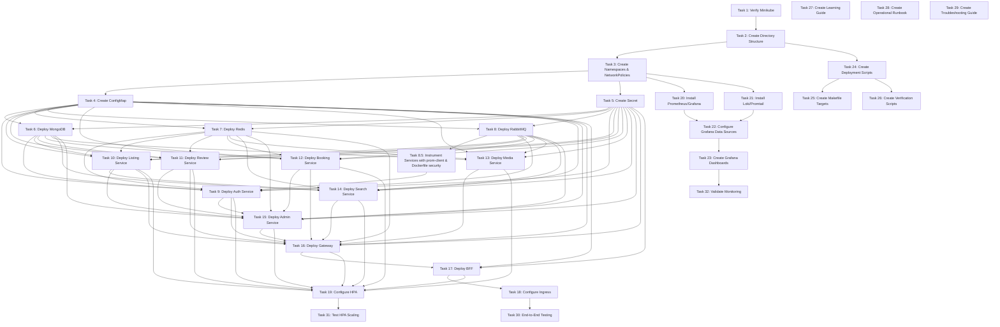

# Implementation Plan: Kubernetes Monitoring Infrastructure

## Overview

This implementation plan outlines the tasks required to migrate the Heavenly microservices platform from Docker Compose to Kubernetes with comprehensive monitoring and observability using Minikube locally.

## Tasks

- [ ] 1. Verify Minikube installation and configure cluster with 6 CPUs, 10GB RAM, and enable ingress and metrics-server addons
- [ ] 2. Create k8s/ directory structure with subdirectories: base/, infra/, apps/, edge/, hpa/, monitoring/
- [ ] 3. Create namespace.yaml defining 'heavenly' and 'monitoring' namespaces, and network-policies.yaml for pod-to-pod communication restrictions
- [ ] 4. Create configmap.yaml with all non-sensitive configuration (service URLs, ports, database URLs using Kubernetes DNS format)
- [ ] 5. Create Secret from .env file using kubectl create secret command with all sensitive credentials (JWT secrets, Cloudinary, RabbitMQ, Razorpay)
- [ ] 6. Create mongodb-statefulset.yaml and mongodb-service.yaml with 10Gi PVC, health probes, resource limits (256Mi/250m request, 512Mi/500m limit), and NO authentication (matching docker-compose.yml)
- [ ] 7. Create redis-statefulset.yaml and redis-service.yaml with 1Gi PVC, redis-cli health probes, and resource limits (64Mi/100m request, 128Mi/250m limit)
- [ ] 8. Create rabbitmq-statefulset.yaml and rabbitmq-service.yaml with 5Gi PVC, rabbitmq-diagnostics health probes, and resource limits (128Mi/100m request, 256Mi/250m limit)
- [ ] 8.5. Install prom-client in all 9 services, create shared/src/metrics.js with HTTP request metrics middleware, wire /metrics endpoint into each service's index.js, and update all Dockerfiles to add non-root USER node directive
- [ ] 9. Build auth-service image and create auth-deployment.yaml and auth-service.yaml with environment variables from ConfigMap/Secret (ensure RABBITMQ_USER, RABBITMQ_PASS, RABBITMQ_HOST, RABBITMQ_PORT are declared BEFORE RABBITMQ_URL), /health probes, revisionHistoryLimit: 5, and resource limits (128Mi/100m request, 256Mi/250m limit)
- [ ] 10. Build listing-service image and create listing-deployment.yaml and listing-service.yaml with port 3002 and MONGO_URL_LISTING configuration
- [ ] 11. Build review-service image and create review-deployment.yaml and review-service.yaml with port 3003 and MONGO_URL_REVIEW configuration
- [ ] 12. Build booking-service image and create booking-deployment.yaml and booking-service.yaml with port 3004, MONGO_URL_BOOKING, and Razorpay credentials
- [ ] 13. Build media-service image and create media-deployment.yaml and media-service.yaml with port 3005, Cloudinary credentials, and adjusted resource limits (64Mi/50m request, 128Mi/150m limit)
- [ ] 14. Build search-service image and create search-deployment.yaml and search-service.yaml with port 3006 and Redis configuration
- [ ] 15. Build admin-service image and create admin-deployment.yaml and admin-service.yaml with port 3007, inject AUTH_SERVICE_URL, LISTING_SERVICE_URL, REVIEW_SERVICE_URL, BOOKING_SERVICE_URL from ConfigMap, and adjusted resource limits (64Mi/50m request, 128Mi/150m limit)
- [ ] 16. Build gateway image and create gateway-deployment.yaml and gateway-service.yaml with port 3000 and all backend service URLs
- [ ] 17. Build bff image and create bff-deployment.yaml and bff-service.yaml with port 8080, SESSION_SECRET, and GATEWAY_URL
- [ ] 18. Create ingress.yaml routing heavenly.local to bff-service:8080 with NGINX ingress controller and timeout annotations, then add Minikube IP to /etc/hosts
- [ ] 19. Create HPA manifests for all 9 stateless services with 70% CPU threshold, minReplicas=1, maxReplicas=5 (backend) or 3 (edge), and stabilization windows
- [ ] 20. Add prometheus-community Helm repo, create prometheus-values.yaml with scraping config for heavenly namespace, and install kube-prometheus-stack in monitoring namespace
- [ ] 21. Add grafana Helm repo, create loki-values.yaml with modern tsdb/v13 schema and compactor-based retention (NOT deprecated boltdb-shipper/table_manager), Promtail config for heavenly namespace, and install loki-stack in monitoring namespace
- [ ] 22. Access Grafana UI and add Loki as data source (URL: http://loki:3100), verify both Prometheus and Loki data sources are working
- [ ] 23. Create 7 Grafana dashboards: Heavenly Services Overview (health, pod count), Resource Usage (CPU/memory by pod), HPA Status (replicas, scaling events), RabbitMQ Monitoring (queue depths, message rates), Request Latency (P50/P95/P99), Pod Status (lifecycle events, restarts), and Logs Explorer (log querying)
- [ ] 24. Create deployment scripts: k8s-deploy.sh (full deployment with PVC deletion BEFORE namespace deletion in cleanup), k8s-cleanup.sh (resource cleanup), k8s-restart.sh (service restart), and create-secret.sh (secret generation)
- [ ] 25. Extend Makefile with Kubernetes targets: k8s-start, k8s-deploy, k8s-status, k8s-logs, k8s-cleanup with documentation
- [ ] 26. Create verify-deployment.sh script that checks namespace, ConfigMap, Secret, all service pods, HPA, Ingress, and monitoring stack with colored pass/fail output
- [ ] 27. Create docs/KUBERNETES_GUIDE.md explaining all Kubernetes concepts used (Pods, Deployments, StatefulSets, Services, Ingress, ConfigMaps, Secrets, PVCs, HPA, Namespaces, Health Probes, NetworkPolicies) with examples
- [ ] 28. Create docs/KUBERNETES_RUNBOOK.md with operational procedures: starting/stopping cluster, deploying services, viewing logs, scaling, rollbacks, backups, accessing Grafana, common kubectl commands
- [ ] 29. Create docs/KUBERNETES_TROUBLESHOOTING.md covering common failure scenarios (Pending, ImagePullBackOff, CrashLoopBackOff, CreateContainerConfigError, service issues, Ingress issues, HPA issues) with diagnostics and resolutions
- [ ] 30. Perform end-to-end testing: access http://heavenly.local, test user registration/login, create listings/bookings/reviews, verify service communication, test data persistence across pod restarts
- [ ] 31. Generate load on services using hey or Apache Bench to trigger HPA scaling, verify replica count increases when CPU exceeds 70%, verify scale-down after load stops, monitor in Grafana
- [ ] 32. Validate monitoring: verify all Prometheus targets are UP, test PromQL queries for metrics, verify Loki receives logs from all pods, test LogQL queries, verify Grafana dashboards display real-time data

## Task Dependency Graph

```json
{
  "waves": [
    {
      "name": "Prerequisites",
      "tasks": [1, 2]
    },
    {
      "name": "Base Configuration",
      "tasks": [3, 4, 5]
    },
    {
      "name": "Infrastructure Services",
      "tasks": [6, 7, 8]
    },
    {
      "name": "Service Instrumentation",
      "tasks": ["8.5"]
    },
    {
      "name": "Core Application Services",
      "tasks": [9, 10, 11, 12]
    },
    {
      "name": "Supporting Services",
      "tasks": [13, 14, 15]
    },
    {
      "name": "Edge Services",
      "tasks": [16, 17, 18]
    },
    {
      "name": "Autoscaling",
      "tasks": [19]
    },
    {
      "name": "Monitoring Stack",
      "tasks": [20, 21, 22, 23]
    },
    {
      "name": "Automation",
      "tasks": [24, 25, 26]
    },
    {
      "name": "Documentation",
      "tasks": [27, 28, 29]
    },
    {
      "name": "Testing",
      "tasks": [30, 31, 32]
    }
  ]
}
```



## Notes

### Prerequisites

Before starting implementation, ensure you have:
- Minikube installed (version 1.30+)
- kubectl installed (version 1.27+)
- Helm installed (version 3.12+)
- Docker installed (version 24+)
- At least 10GB free RAM and 6 CPU cores available
- Basic understanding of Kubernetes concepts
- Familiarity with the Heavenly microservices architecture

### Implementation Phases

The tasks are organized into logical phases:

**Phase 0: Prerequisites (Tasks 1-2)**
- Set up Minikube cluster (6 CPUs, 10GB RAM)
- Create directory structure

**Phase 1: Base Configuration (Tasks 3-5)**
- Create namespaces
- Create ConfigMap and Secret

**Phase 2: Infrastructure Services (Tasks 6-8)**
- Deploy MongoDB (no auth), Redis, RabbitMQ as StatefulSets

**Phase 2.5: Service Instrumentation (Task 8.5)**
- Install prom-client in all services
- Create shared metrics middleware
- Update Dockerfiles with non-root USER

**Phase 3: Core Application Services (Tasks 9-12)**
- Deploy auth, listing, review, booking services

**Phase 4: Supporting Services (Tasks 13-15)**
- Deploy media, search, admin services

**Phase 5: Edge Services (Tasks 16-18)**
- Deploy gateway, BFF, and Ingress

**Phase 6: Autoscaling (Task 19)**
- Configure HPA for all stateless services

**Phase 7: Monitoring Stack (Tasks 20-23)**
- Install Prometheus, Grafana, Loki
- Configure data sources and dashboards

**Phase 8: Automation (Tasks 24-26)**
- Create deployment scripts
- Extend Makefile
- Create verification scripts

**Phase 9: Documentation (Tasks 27-29)**
- Create learning guide
- Create operational runbook
- Create troubleshooting guide

**Phase 10: Testing (Tasks 30-32)**
- End-to-end testing
- HPA scaling tests
- Monitoring validation

### Estimated Timeline

- **Phase 0-1**: 2-3 hours (setup and configuration)
- **Phase 2**: 2-3 hours (infrastructure deployment)
- **Phase 3-4**: 4-6 hours (application services)
- **Phase 5**: 2-3 hours (edge services and ingress)
- **Phase 6**: 1-2 hours (HPA configuration)
- **Phase 7**: 3-4 hours (monitoring stack)
- **Phase 8**: 2-3 hours (automation)
- **Phase 9**: 4-6 hours (documentation)
- **Phase 10**: 3-4 hours (testing)

**Total Estimated Time**: 23-34 hours

### Key Design Decisions

1. **Local Development First**: Using Minikube for local learning before cloud migration
2. **Minimal Code Changes**: Leveraging existing /health endpoints and configurations
3. **Phased Deployment**: Infrastructure → Core → Supporting → Edge services
4. **Monitoring from Day 1**: Installing observability stack early in the process
5. **Automation Focus**: Creating scripts and Makefile targets for common operations
6. **Learning-Oriented**: Comprehensive documentation for Kubernetes beginners

### Success Criteria

The implementation is complete when:
- ✅ All 32 tasks are completed
- ✅ All services running and healthy in Kubernetes
- ✅ Application accessible at http://heavenly.local
- ✅ HPA scaling services based on load
- ✅ Prometheus collecting metrics from all services
- ✅ Loki collecting logs from all services
- ✅ Grafana dashboards displaying real-time data
- ✅ All documentation complete
- ✅ End-to-end tests passing
- ✅ Verification scripts passing

### Important Commands Reference

**Cluster Management:**
```bash
minikube start --cpus=6 --memory=10240
minikube status
minikube stop
minikube delete
```

**Deployment:**
```bash
kubectl apply -f k8s/base/
kubectl apply -f k8s/infra/
kubectl apply -f k8s/apps/
kubectl apply -f k8s/edge/
kubectl apply -f k8s/hpa/
```

**Monitoring:**
```bash
kubectl get pods -n heavenly
kubectl get pods -n monitoring
kubectl logs -f <pod-name> -n heavenly
kubectl describe pod <pod-name> -n heavenly
```

**Port Forwarding:**
```bash
kubectl port-forward -n monitoring svc/prometheus-grafana 3000:80
kubectl port-forward -n monitoring svc/prometheus-kube-prometheus-prometheus 9090:9090
```

**Troubleshooting:**
```bash
kubectl get events -n heavenly --sort-by='.lastTimestamp'
kubectl top pods -n heavenly
kubectl get hpa -n heavenly
kubectl describe hpa <hpa-name> -n heavenly
```

### Next Steps After Completion

1. **Optimize Resources**: Adjust requests/limits based on actual usage patterns
2. **Add Alerting**: Configure Prometheus alerting rules and Grafana notifications
3. **Enhance Dashboards**: Create additional dashboards for specific use cases
4. **Plan Cloud Migration**: Prepare for GKE deployment
5. **Consider Advanced Features**:
   - Service mesh (Istio/Linkerd)
   - GitOps workflow (ArgoCD/Flux)
   - CI/CD pipeline integration
   - Certificate management (cert-manager)
   - Network policies for security

### Troubleshooting Tips

**If pods are stuck in Pending:**
- Check cluster resources: `kubectl describe nodes`
- Verify PVC binding: `kubectl get pvc -n heavenly`

**If pods are in ImagePullBackOff:**
- Verify images exist: `docker images | grep heavenly`
- Check imagePullPolicy is set to `Never`

**If pods are in CrashLoopBackOff:**
- Check logs: `kubectl logs <pod-name> -n heavenly`
- Verify dependencies are ready (MongoDB, Redis, RabbitMQ)

**If services are not accessible:**
- Check service endpoints: `kubectl get endpoints -n heavenly`
- Verify pods are ready: `kubectl get pods -n heavenly`

**If HPA is not scaling:**
- Verify metrics-server is running: `kubectl get pods -n kube-system | grep metrics-server`
- Check metrics availability: `kubectl top pods -n heavenly`

### Additional Resources

- [Kubernetes Documentation](https://kubernetes.io/docs/)
- [Minikube Documentation](https://minikube.sigs.k8s.io/docs/)
- [Helm Documentation](https://helm.sh/docs/)
- [Prometheus Documentation](https://prometheus.io/docs/)
- [Grafana Documentation](https://grafana.com/docs/)
- [Loki Documentation](https://grafana.com/docs/loki/)

