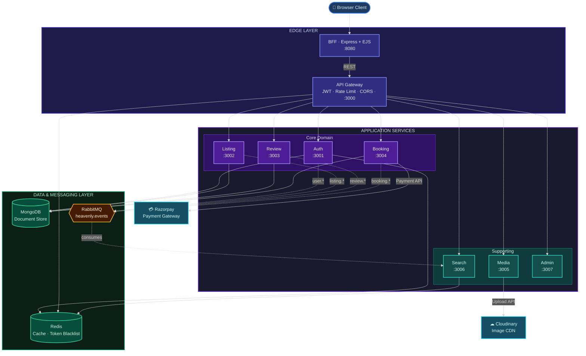
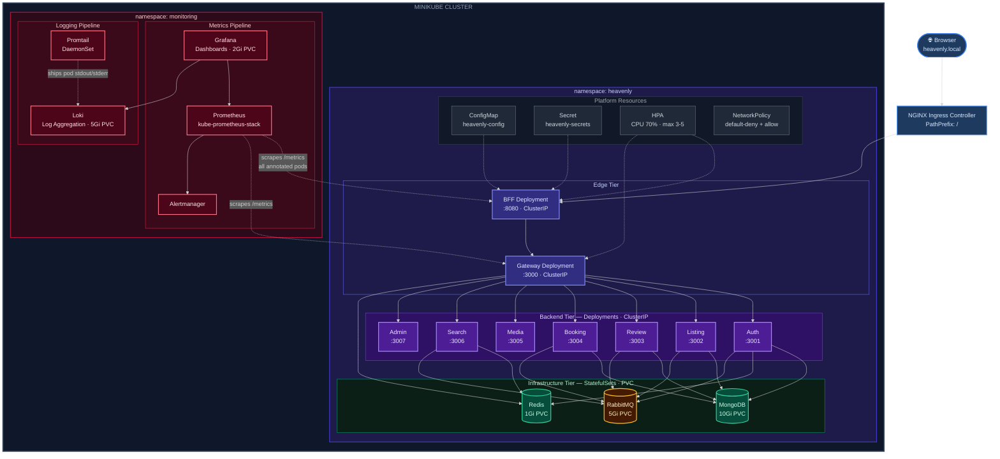

<div align="center">

# 🏨 Heavenly

**Property Rental Platform with Microservices Architecture**

*A distributed property rental platform with an Express/EJS BFF, API Gateway, service-oriented backend, event-driven workflows, Docker Compose local orchestration, and Minikube Kubernetes deployment with observability.*

[](https://nodejs.org/)
[](https://expressjs.com/)
[](https://www.mongodb.com/)
[](https://www.rabbitmq.com/)
[](https://redis.io/)
[](https://www.docker.com/)
[](https://minikube.sigs.k8s.io/)
[](https://helm.sh/)
[](https://kubernetes.github.io/ingress-nginx/)
[](https://prometheus.io/)
[](https://grafana.com/)
[](https://grafana.com/oss/loki/)

[Overview](#-overview) • [Architecture](#-architecture) • [Services](#-services) • [Quick Start](#-quick-start) • [Features](#-features) • [Documentation](#-documentation)

</div>

---

## 📋 Overview

Heavenly is a full-featured property rental platform built from multiple Node.js/Express services. Users interact with a server-rendered BFF, while API traffic flows through a Gateway into dedicated services for authentication, listings, reviews, bookings, media, search, and admin operations.

### 🎯 Key Highlights

- **7 backend service packages** plus an **API Gateway** and **Backend-for-Frontend**
- **Server-rendered UI** using Express, EJS, and `ejs-mate`
- **Event-driven workflows** using RabbitMQ and shared event helpers
- **MongoDB-backed persistence** through Mongoose models
- **Redis-backed support** for cache/token-blacklist flows where implemented
- **Razorpay payment integration** with simulation fallback when credentials are absent
- **Cloudinary media upload/delete** through the media service
- **Admin dashboard** for cross-service management workflows
- **Docker Compose stack** for local development
- **Kubernetes stack** for Minikube with NGINX Ingress, HPA, Prometheus, Grafana, Loki, and Promtail
- **Prometheus metrics** through `/metrics` endpoints on all app services
- **Operational scripts** for seed, migration, smoke test, backup, and restore

---

## 🏗️ Architecture

Heavenly uses a layered service-oriented architecture. A server-rendered BFF handles browser sessions, an API Gateway manages routing and security, dedicated backend services own their domains, and shared infrastructure (MongoDB, Redis, RabbitMQ) provides persistence, caching, and event-driven coordination.

### High-Level System Architecture

> **Legend** — Solid lines: synchronous HTTP/REST &nbsp;|&nbsp; Dashed lines: asynchronous events via RabbitMQ



### Kubernetes Deployment Architecture

> **Legend** — Solid lines: application traffic &nbsp;|&nbsp; Dashed lines: observability pipeline (metrics scrape / log shipping)



👉 **For the evidence-backed deep dive, read the [Architecture Guide](docs/02_ARCHITECTURE.md).**

---

## 📦 Services

### Infrastructure Services

| Service | Port | Purpose |
|---------|------|---------|
| **MongoDB** | `27017` | Document database for service data |
| **Redis** | `6379` | Cache and token-blacklist support |
| **RabbitMQ** | `5672`, `15672` | Message broker and management UI |

### Application Services

| Service | Port | Responsibility |
|---------|------|----------------|
| **BFF** | `8080` | EJS rendering, browser sessions, user-facing routes |
| **API Gateway** | `3000` | Request routing, JWT validation, rate limiting |
| **Auth Service** | `3001` | User identity, authentication, JWT lifecycle |
| **Listing Service** | `3002` | Property CRUD, availability, ownership |
| **Review Service** | `3003` | Ratings, reviews, review statistics |
| **Booking Service** | `3004` | Reservations, payments, cancellation, refunds |
| **Media Service** | `3005` | Image uploads and deletes through Cloudinary |
| **Search Service** | `3006` | Listing search and geocoding |
| **Admin Service** | `3007` | Cross-service admin aggregation |

---

## ⚡ Quick Start

### Prerequisites

- **Docker** and **Docker Compose**
- **Node.js 20+** for local package scripts
- **Make** for convenience commands
- **Minikube**, **kubectl**, and **Helm** for Kubernetes deployment and monitoring
- **Cloudinary credentials** for real media uploads
- **Razorpay credentials** for real payment processing

### Docker Compose Installation

```bash
# Clone the repository
git clone https://github.com/rudra1806/Heavenly.git
cd Heavenly

# Create local environment file
cp .env.example .env

# Start the full stack
make up-build
```

Equivalent Docker Compose command:

```bash
docker-compose up --build
```

### Configuration

Create `.env` from `.env.example` and fill in the values needed for your local run:

```env
# JWT Configuration
JWT_SECRET=your_jwt_secret_key_here_make_it_long_and_random
JWT_REFRESH_SECRET=your_jwt_refresh_secret_key_here_different_from_above

# Session (BFF)
SESSION_SECRET=your_session_secret_here

# Cloudinary (Media Service)
CLOUD_NAME=your_cloudinary_cloud_name
CLOUD_API_KEY=your_cloudinary_api_key
CLOUD_API_SECRET=your_cloudinary_api_secret

# RabbitMQ
RABBITMQ_USER=heavenly
RABBITMQ_PASS=heavenly123

# Admin Seed (optional)
ADMIN_USERNAME=admin
ADMIN_EMAIL=admin@heavenly.com
ADMIN_PASSWORD=admin123

# Razorpay (Booking Service)
RAZORPAY_KEY_ID=your_razorpay_key_id
RAZORPAY_KEY_SECRET=your_razorpay_key_secret
```

Razorpay credentials are optional for local testing. When they are absent, booking payment flows use simulation mode.

### Seed Data

```bash
# Seed admin user and sample microservice data
make seed
```

Equivalent direct command:

```bash
cd scripts && node seed-microservices.js
```

### Access Points

| Service | URL | Description |
|---------|-----|-------------|
| **BFF** | http://localhost:8080 | Main browser application |
| **API Gateway** | http://localhost:3000 | REST API entry point |
| **RabbitMQ Management** | http://localhost:15672 | Broker management UI |

### Kubernetes Quick Start

The Kubernetes workflow runs the app locally on Minikube and exposes the BFF through `http://heavenly.local`.

```bash
# Create or update .env first
cp .env.example .env

# Start Minikube with the requested resources and addons
make k8s-start

# If an older Minikube profile already exists with different CPU/RAM:
make k8s-reset

# Build local images into Minikube and deploy app + monitoring
make k8s-deploy
```

Add a hosts entry after deployment. With a normal Minikube IP:

```text
<minikube-ip> heavenly.local
```

On Docker Desktop for Mac, Minikube may ask you to run a tunnel. Keep this running in another terminal:

```bash
minikube tunnel
```

Then use:

```text
127.0.0.1 heavenly.local
```

Useful checks:

```bash
kubectl get pods -n heavenly
kubectl get pods -n monitoring
make k8s-status
make k8s-verify
```

Open the app:

```text
http://heavenly.local
```

Open Grafana:

```bash
make k8s-grafana
```

Then visit `http://localhost:3000`. The username is `admin`; get the password with:

```bash
kubectl -n monitoring get secret kube-prometheus-stack-grafana -o jsonpath="{.data.admin-password}" | base64 -d ; echo
```

---

## ✨ Features

### 🏠 Property Management

- Listing browse/detail flows
- Owner-aware listing create, update, and delete workflows
- Image upload support through media handling
- Availability and listing metadata management
- Map rendering with MapLibre GL JS and OpenStreetMap tiles

### 📅 Booking System

- Booking creation and lookup
- Date validation and overlap checks
- Payment order and verification flows
- Razorpay-backed payment path with simulation fallback
- Cancellation and refund handling
- Booking and payment status tracking

### ⭐ Reviews & Ratings

- Star ratings and review text
- Review lookup and listing-level statistics
- Author-aware delete behavior

### 👤 Authentication & Authorization

- JWT access and refresh token utilities
- Password hashing with bcrypt
- Redis-backed token blacklist on logout where Redis is available
- BFF session management
- Admin-only route protection

### 👑 Admin Dashboard

- Platform statistics
- User, listing, review, and booking management views
- Cross-service aggregation through the admin service

### 🔍 Search & Discovery

- Listing search endpoints
- Geocoding support
- Redis-backed geocoding cache
- Cluster and listing maps in the BFF

---

## 🛠️ Development Commands

The project includes a Makefile for common local operations:

```bash
# Start all services
make up              # Foreground mode
make up-d            # Background mode
make up-build        # Rebuild and start

# Stop services
make down            # Stop all services, keep volumes
make clean           # Stop and delete volumes after confirmation

# View logs
make logs            # All services
make logs-bff        # BFF only
make logs-booking    # Booking service only

# Restart services
make restart         # All services
make restart-bff     # BFF only
make restart-auth    # Auth service only

# Data operations
make seed            # Seed initial data
make backup          # Backup MongoDB data
make restore BACKUP=./backups/20260511_143000

# Utilities
make ps              # Show running containers
make status          # Service status and volumes
make mongo           # Open MongoDB shell
make redis           # Open Redis CLI

# Kubernetes
make k8s-start       # Start Minikube with ingress and metrics-server
make k8s-reset       # Recreate Minikube with configured CPU/RAM
make k8s-deploy      # Build images and deploy app + monitoring
make k8s-status      # Show Kubernetes app resources
make k8s-logs        # Tail Kubernetes logs
make k8s-grafana     # Port-forward Grafana to localhost:3000
make k8s-cleanup     # Remove app resources, keeping PVCs by default
```

👉 **See the full [Scripts Reference](docs/13_SCRIPTS_REFERENCE.md) for every package script, Makefile target, and utility script.**

---

## 📁 Project Structure

```text
Heavenly/
├── docker-compose.yml           # Local multi-container stack
├── docker-compose.prod.yml      # Production Compose variant
├── k8s/                         # Minikube Kubernetes manifests
│   ├── base/                    # Namespaces, ConfigMap, NetworkPolicies
│   ├── infra/                   # MongoDB, Redis, RabbitMQ StatefulSets
│   ├── apps/                    # Backend service Deployments
│   ├── edge/                    # Gateway, BFF, Ingress
│   ├── hpa/                     # HorizontalPodAutoscalers
│   └── monitoring/              # Helm values and Grafana dashboard
├── .env.example                 # Environment variable template
├── Makefile                     # Development commands
├── README.md                    # Project entry point
├── docs/                        # Generated project documentation
│   ├── INDEX.md
│   ├── 00_PHASE0_RECONNAISSANCE.md
│   └── 01_PROJECT_OVERVIEW.md ... 15_IMPROVEMENTS.md
│
├── shared/                      # Shared middleware, events, errors, utilities
├── gateway/                     # API Gateway (:3000)
├── bff/                         # Backend-for-Frontend (:8080)
├── services/                    # Backend service packages
│   ├── auth-service/
│   ├── listing-service/
│   ├── review-service/
│   ├── booking-service/
│   ├── media-service/
│   ├── search-service/
│   └── admin-service/
│
└── scripts/                     # Seed, migration, smoke-test, backup, restore, Kubernetes automation
```

---

## 🛠️ Tech Stack

| Category | Technology | Purpose |
|----------|------------|---------|
| **Runtime** | Node.js 20 | Service runtime |
| **Framework** | Express.js 5.2 | HTTP servers, routes, middleware |
| **Frontend Rendering** | EJS + ejs-mate | Server-rendered browser UI |
| **Database** | MongoDB 7 | Service data persistence |
| **ODM** | Mongoose | MongoDB models and queries |
| **Message Broker** | RabbitMQ 3 | Event-driven async communication |
| **Cache** | Redis 7 | Cache and token blacklist support |
| **Authentication** | JWT + bcrypt | Token auth and password hashing |
| **Validation** | Joi | Request validation in supported services |
| **File Uploads** | multer | Multipart upload handling |
| **Media Storage** | Cloudinary | Image storage and deletion |
| **Payment Gateway** | Razorpay | Payment order, verification, refund flows |
| **Geocoding** | Nominatim / OpenStreetMap | Address-to-coordinate lookup |
| **Maps** | MapLibre GL JS | Browser map rendering |
| **Orchestration** | Docker Compose | Local multi-service environment |
| **Kubernetes** | Minikube + kubectl | Local Kubernetes environment |
| **Ingress** | NGINX Ingress | Routes `heavenly.local` to the BFF |
| **Autoscaling** | Horizontal Pod Autoscaler | CPU-based scaling for stateless services |
| **Metrics** | Prometheus + prom-client | App and container metrics |
| **Dashboards** | Grafana | Metrics and log visualization |
| **Logs** | Loki + Promtail | Centralized Kubernetes pod logs |

---

## 🔄 Communication Patterns

Heavenly uses synchronous REST calls for request/response workflows and RabbitMQ for asynchronous service coordination. The Gateway handles external API routing, while the BFF uses the Gateway as its backend API surface.

👉 **See [Architecture Deep Dive](docs/02_ARCHITECTURE.md) and [Backend Services](docs/04b_BACKEND_SERVICES.md) for service flow details.**

---

## 🔐 Security Notes

- **JWT authentication** is implemented through the Auth Service, Gateway validation, and shared middleware.
- **Password hashing** uses bcrypt in the Auth Service user model.
- **Rate limiting** is applied in the Gateway.
- **CORS** is configured in the Gateway and service entry points.
- **Input validation** uses Joi in supported route layers.
- **Payment verification** uses Razorpay signature verification when Razorpay is enabled.

👉 **For gaps and evidence, see the [Security Analysis](docs/09_SECURITY.md).**

---

## 🧪 Verification

### Smoke Test

Run the confirmed smoke test after the stack is running:

```bash
cd scripts && npm run smoke-test
```

The repository does not currently include a formal unit/integration test suite. The smoke script is the confirmed verification path.

### Manual API Checks

```bash
# Gateway health
curl http://localhost:3000/health

# BFF health
curl http://localhost:8080/health

# Public listings through Gateway
curl http://localhost:3000/api/listings
```

---

## 📊 Observability

### Health Checks

The Gateway, BFF, and services expose `/health` endpoints.

### RabbitMQ Management UI

Open http://localhost:15672 to inspect broker state.

### Kubernetes Metrics and Logs

All app services expose `/metrics` using `prom-client`. In Kubernetes, Prometheus scrapes annotated pods in the `heavenly` namespace, and Promtail ships pod stdout/stderr logs to Loki.

```bash
make k8s-grafana
```

Grafana includes a `Heavenly Services Overview` dashboard with request rate, P95 latency, CPU, memory, HPA desired replicas, and recent logs. You can also use:

```text
Explore -> Prometheus
Explore -> Loki
```

Useful queries:

```promql
sum by (service) (rate(heavenly_http_requests_total[5m]))
sum by (pod) (container_memory_working_set_bytes{namespace="heavenly"})
```

```logql
{namespace="heavenly"}
```

### Docker Logs

```bash
# View all logs
docker-compose logs -f

# View a specific service
docker-compose logs -f auth-service

# View recent booking logs
docker-compose logs --tail=100 booking-service
```

👉 **For logging, health checks, metrics, and Kubernetes observability, see [Observability](docs/10_OBSERVABILITY.md) and [Kubernetes Guide](docs/KUBERNETES_GUIDE.md).**

---

## 🚀 Deployment

The repository includes Dockerfiles for the BFF, Gateway, and service packages, plus `docker-compose.yml`, `docker-compose.prod.yml`, and a local Kubernetes stack under `k8s/`.

The Kubernetes stack targets Minikube for local learning and validation. It is cloud-portable in shape, but it is not yet packaged as a production Helm chart and does not include Terraform, Pulumi, CI/CD, TLS certificate automation, or cloud load-balancer configuration.

👉 **See [DevOps & Infrastructure](docs/07_DEVOPS_INFRASTRUCTURE.md), [Kubernetes Guide](docs/KUBERNETES_GUIDE.md), and [Kubernetes Runbook](docs/KUBERNETES_RUNBOOK.md).**

---

## 📚 Documentation

The project docs are kept in [`docs/`](docs/):

| Topic | File |
|-------|------|
| Documentation Index | [docs/INDEX.md](docs/INDEX.md) |
| Reconnaissance | [docs/00_PHASE0_RECONNAISSANCE.md](docs/00_PHASE0_RECONNAISSANCE.md) |
| Project Overview | [docs/01_PROJECT_OVERVIEW.md](docs/01_PROJECT_OVERVIEW.md) |
| Architecture | [docs/02_ARCHITECTURE.md](docs/02_ARCHITECTURE.md) |
| Folder Structure | [docs/03_FOLDER_STRUCTURE.md](docs/03_FOLDER_STRUCTURE.md) |
| Backend Routes | [docs/04a_BACKEND_ROUTES.md](docs/04a_BACKEND_ROUTES.md) |
| Backend Services | [docs/04b_BACKEND_SERVICES.md](docs/04b_BACKEND_SERVICES.md) |
| Frontend | [docs/05_FRONTEND.md](docs/05_FRONTEND.md) |
| Database | [docs/06_DATABASE.md](docs/06_DATABASE.md) |
| DevOps | [docs/07_DEVOPS_INFRASTRUCTURE.md](docs/07_DEVOPS_INFRASTRUCTURE.md) |
| Environment Variables | [docs/08_ENVIRONMENT_VARIABLES.md](docs/08_ENVIRONMENT_VARIABLES.md) |
| Security | [docs/09_SECURITY.md](docs/09_SECURITY.md) |
| Observability | [docs/10_OBSERVABILITY.md](docs/10_OBSERVABILITY.md) |
| Dependencies | [docs/11_DEPENDENCIES.md](docs/11_DEPENDENCIES.md) |
| Setup Guide | [docs/12_SETUP_GUIDE.md](docs/12_SETUP_GUIDE.md) |
| Scripts Reference | [docs/13_SCRIPTS_REFERENCE.md](docs/13_SCRIPTS_REFERENCE.md) |
| Troubleshooting | [docs/14_TROUBLESHOOTING.md](docs/14_TROUBLESHOOTING.md) |
| Improvements | [docs/15_IMPROVEMENTS.md](docs/15_IMPROVEMENTS.md) |
| Kubernetes Guide | [docs/KUBERNETES_GUIDE.md](docs/KUBERNETES_GUIDE.md) |
| Kubernetes Runbook | [docs/KUBERNETES_RUNBOOK.md](docs/KUBERNETES_RUNBOOK.md) |
| Kubernetes Troubleshooting | [docs/KUBERNETES_TROUBLESHOOTING.md](docs/KUBERNETES_TROUBLESHOOTING.md) |

---

## 🔧 Troubleshooting

### Services Won't Start

```bash
make down
make up-build
```

### Database Connection Issues

```bash
make mongo
# In mongosh:
db.adminCommand('ping')
```

### Port Conflicts

```bash
lsof -i :3000
lsof -i :8080
```

### Service Crashes

```bash
docker-compose logs --tail=100 <service-name>
docker-compose restart <service-name>
```

### Kubernetes Checks

```bash
kubectl get pods -n heavenly
kubectl get pods -n monitoring
kubectl get hpa -n heavenly
kubectl get ingress -n heavenly
```

👉 **See [Troubleshooting](docs/14_TROUBLESHOOTING.md) and [Kubernetes Troubleshooting](docs/KUBERNETES_TROUBLESHOOTING.md).**

---

## 👤 Author

**Rudra Sanandiya**

- GitHub: [@rudra1806](https://github.com/rudra1806)
- Project: [Heavenly](https://github.com/rudra1806/Heavenly)

---

<div align="center">

**Built with ❤️ using Node.js, Express, MongoDB, RabbitMQ, Redis, Docker Compose, Kubernetes, and Grafana**

[⬆ Back to Top](#-heavenly)

</div>
