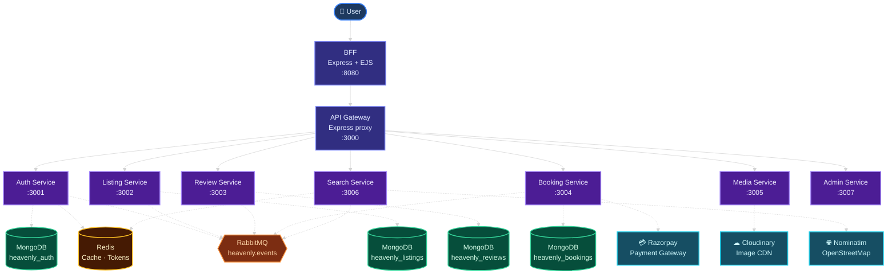

## Section 1 — Project Overview

### 1.1 — What This System Does

Heavenly is a server-rendered listing and booking application built from several Node.js/Express services. It lets users interact with listings, bookings, reviews, authentication, media uploads, search/geocoding, payments, and admin dashboards through an EJS BFF and REST APIs routed by an API gateway.

Evidence: `bff/src/views/`, `gateway/src/proxy.js`, `services/*/src/routes/*.js`, `services/*/src/models/*.js`, and `docker-compose.yml`.

### 1.2 — Business Purpose

This system supports a marketplace-style workflow around property/listing discovery, reservation, payment, review, and administration. The code shows browser-facing pages for listings, bookings, user login/signup, dashboards, and admin views under `bff/src/views/`.

Users evidenced in the repository:

| User Type | Evidence |
|---|---|
| Anonymous visitors | Public listing/search routes in `bff/src/routes/listings.js`, `services/listing-service/src/routes/listing.js`, and `services/search-service/src/routes/search.js` |
| Authenticated users | JWT/session flow in `bff/src/routes/auth.js`, `bff/src/middleware.js`, `services/auth-service/src/routes/auth.js`, and `shared/middleware/authMiddleware.js` |
| Listing owners/hosts | Dashboard and host booking routes in `bff/src/routes/dashboard.js`; `ownerId` field in `services/listing-service/src/models/listing.js` |
| Admin users | Admin guards/routes in `bff/src/routes/admin.js`, `services/admin-service/src/routes/admin.js`, and `shared/middleware/authMiddleware.js` |

Without this system, the repository's implemented workflows for listing management, booking creation, payment handling, reviews, media upload, search/geocoding, and admin aggregation would not have an application surface or service layer.

### 1.3 — Core Features

| Feature | Evidence |
|---|---|
| Server-rendered browser UI | `bff/src/views/`, `bff/src/routes/*.js`, `bff/package.json` with `ejs` and `ejs-mate` |
| API gateway routing | `gateway/src/proxy.js`, `gateway/src/index.js`, `http-proxy-middleware` in `gateway/package.json` |
| User registration, login, refresh, logout, profile, and admin user management | `services/auth-service/src/routes/auth.js`, `services/auth-service/src/controllers/auth.js`, `services/auth-service/src/models/user.js` |
| JWT authentication and admin authorization | `services/auth-service/src/utils/jwt.js`, `shared/middleware/authMiddleware.js`, `gateway/src/middleware/jwtValidation.js` |
| Listing browsing and CRUD | `services/listing-service/src/routes/listing.js`, `services/listing-service/src/controllers/listing.js`, `services/listing-service/src/models/listing.js` |
| Booking creation, lookup, cancellation, and payment actions | `services/booking-service/src/routes/booking.js`, `services/booking-service/src/controllers/booking.js`, `services/booking-service/src/models/booking.js` |
| Razorpay-backed payment integration with simulation fallback when credentials are absent | `services/booking-service/package.json`, `services/booking-service/src/utils/razorpay.js`, `services/booking-service/src/controllers/booking.js` |
| Review creation, lookup, stats, and deletion | `services/review-service/src/routes/review.js`, `services/review-service/src/controllers/review.js`, `services/review-service/src/models/review.js` |
| Media upload/delete backed by Cloudinary | `services/media-service/src/routes/media.js`, `services/media-service/src/controllers/media.js`, `services/media-service/package.json` |
| Search and geocoding | `services/search-service/src/routes/search.js`, `services/search-service/src/controllers/search.js` |
| Redis-backed geocoding cache | `services/search-service/src/controllers/search.js`, `services/search-service/src/index.js`, `docker-compose.yml` |
| RabbitMQ event consumers | `shared/events/broker.js`, `services/listing-service/src/events/consumers.js`, `services/review-service/src/events/consumers.js`, `services/search-service/src/events/consumers.js`, `services/booking-service/src/events/consumers.js` |
| Admin aggregation APIs and pages | `services/admin-service/src/routes/admin.js`, `services/admin-service/src/controllers/admin.js`, `bff/src/routes/admin.js`, `bff/src/views/admin/` |
| Migration, seed, backup, restore, and smoke-test scripts | `scripts/migrate.js`, `scripts/seed-microservices.js`, `scripts/backup-data.sh`, `scripts/restore-data.sh`, `scripts/smoke-test.js`, `Makefile` |

### 1.4 — Tech Stack Table

| Layer | Technology | Version | Why Used |
|---|---:|---:|---|
| Runtime | Node.js | 20-alpine image | Container runtime for gateway, BFF, and services |
| Language/module format | JavaScript/CommonJS | `type: commonjs` | Application source and package format |
| Web framework | Express | `^5.2.1` | HTTP servers, routes, middleware, health endpoints |
| Frontend rendering | EJS + ejs-mate | `ejs ^4.0.1`, `ejs-mate ^4.0.0` | Server-rendered pages in the BFF |
| Browser session middleware | express-session | `^1.18.2` | Stores browser session state in BFF |
| API proxy | http-proxy-middleware | `^3.0.3` | Gateway forwards `/api/*` routes to services |
| Database | MongoDB | `mongo:7` | Persistence service in Docker Compose |
| ODM | Mongoose | `^9.1.4` service packages; `^8.15.1` scripts | Models for users, listings, reviews, bookings; migration/seed scripts |
| Cache | Redis | `redis:7-alpine`, npm `redis ^4.7.0` | Search geocoding cache and supporting cache/client package |
| Message broker | RabbitMQ + amqplib | `rabbitmq:3-management`, `amqplib ^0.10.4` | Event-driven service coordination |
| Authentication tokens | jsonwebtoken | `^9.0.2` | JWT access/refresh token creation and validation |
| Password hashing | bcrypt | `^5.1.1`; scripts `^6.0.0` | Hashes user passwords before storage |
| Validation | Joi | `^18.0.2` | Request body validation for listing, booking, and review APIs |
| File upload | multer | `^2.0.2`, BFF `^2.1.1` | Multipart image upload handling |
| Media storage | Cloudinary | `cloudinary ^1.41.3`, `multer-storage-cloudinary ^4.0.0` | Image storage and deletion |
| Payment provider | Razorpay | `^2.9.4` | Booking payment order, verification, and refund utility |
| Request logging | Morgan | `^1.10.0` | HTTP request logging in gateway, BFF, and services |
| CORS | cors | `^2.8.5` | Cross-origin request middleware |
| Rate limiting | express-rate-limit | `^7.5.0` | Gateway-level request limiting |
| Local orchestration | Docker Compose | Compose files present | Runs infrastructure and service containers locally |

### 1.5 — High-Level Architecture Diagram

> **Legend** — Solid lines: synchronous HTTP/REST &nbsp;|&nbsp; Dashed lines: data/cache/event connections

Evidence: `docker-compose.yml`, `gateway/src/proxy.js`, `bff/src/index.js`, `services/*/src/index.js`, `services/media-service/src/controllers/media.js`, `services/booking-service/src/utils/razorpay.js`, `services/search-service/src/controllers/search.js`, and `shared/events/broker.js`.

### 1.6 — What This Project Does NOT Include

This project does not currently include:

| Missing Area | Evidence |
|---|---|
| Separate SPA frontend | No React/Vue/Angular/Svelte package or `frontend/` app found; UI is in `bff/src/views/` |
| Mobile app | No mobile app source folder or mobile framework config found |
| GraphQL API | No GraphQL dependency, schema file, or resolver folder found |
| WebSocket API | No `ws` or `socket.io` dependency found |
| gRPC services | No gRPC package or `.proto` files found |
| Relational database | No PostgreSQL/MySQL service, Prisma, TypeORM, Sequelize, or SQL migration setup found |
| Email sending | No `nodemailer`, SendGrid, SES, or email-send code found |
| CI/CD pipeline | No `.github/workflows/`, `.gitlab-ci.yml`, Jenkinsfile, CircleCI, or Bitbucket pipeline config found |
| Distributed tracing/APM SaaS | No OpenTelemetry, Datadog, New Relic, Jaeger, or Zipkin config found |
| Error tracking service | No Sentry, Bugsnag, Rollbar, or equivalent package/config found |
| Formal test suite | No `*.spec.*`, `*.test.*`, `tests/`, or framework test config found; only `scripts/smoke-test.js` was found |
| Formal workspace tooling | No root `package.json`, npm workspaces, `turbo.json`, pnpm workspace, or yarn workspace config found |
