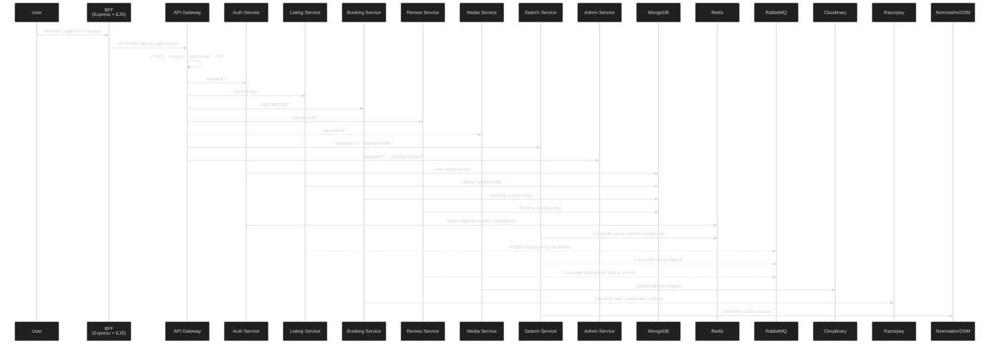
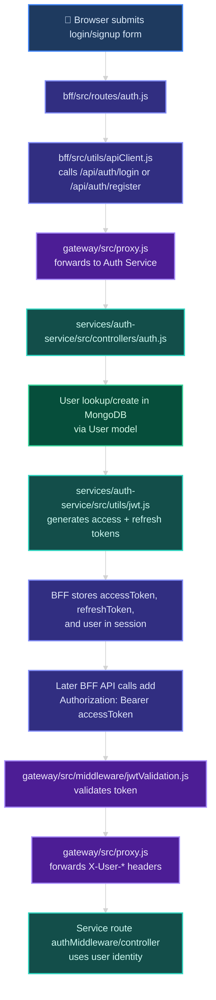
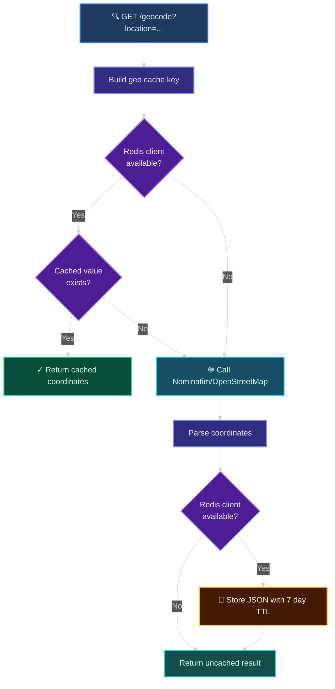
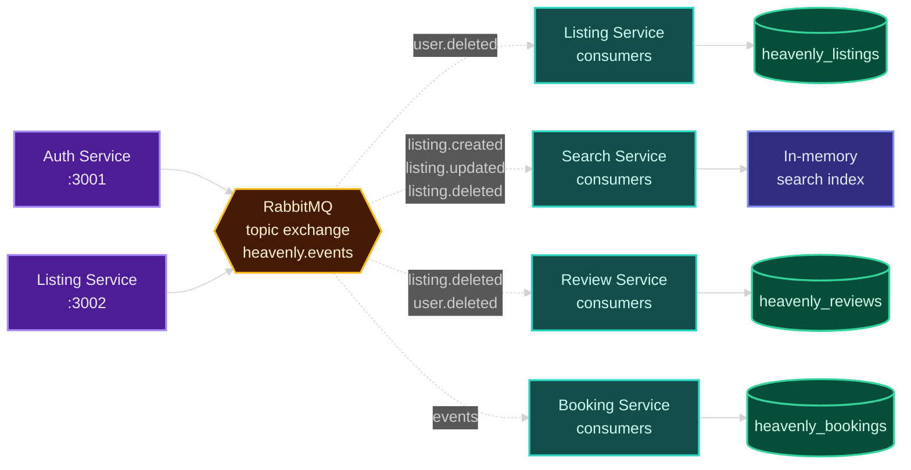
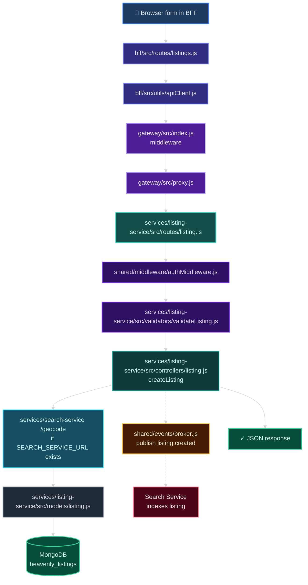
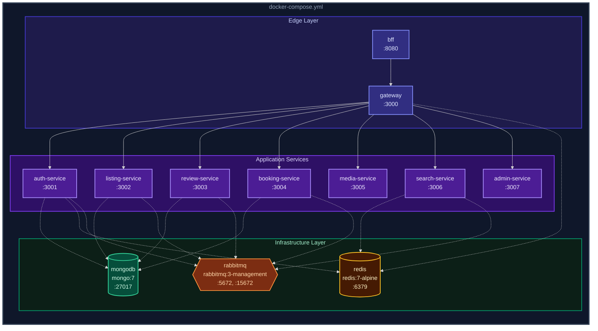

## Section 2 — Architecture Deep Dive

### 2.1 — Architecture Pattern

Pattern: Microservices-style application with an API Gateway and Backend-for-Frontend.

Evidence:

| Layer | Evidence |
|---|---|
| Browser-facing BFF | `bff/src/index.js` renders EJS views, manages sessions, and calls the gateway |
| Gateway | `gateway/src/index.js` applies logging, CORS, rate limiting, JWT validation, and proxy setup |
| Services | `services/auth-service`, `services/listing-service`, `services/review-service`, `services/booking-service`, `services/media-service`, `services/search-service`, `services/admin-service` |
| Shared infrastructure code | `shared/events/broker.js`, `shared/middleware/authMiddleware.js`, `shared/utils/serviceClient.js` |
| Infrastructure | `docker-compose.yml` defines MongoDB, Redis, RabbitMQ, gateway, BFF, and each service |

Why it fits this project:

- Each service has its own `package.json`, Dockerfile, `src/index.js`, and route/controller files.
- The gateway routes `/api/*` traffic to service URLs from `gateway/src/proxy.js`.
- The BFF is the only browser-facing server according to `bff/src/index.js`.
- Data ownership is split by service-owned MongoDB databases in `docker-compose.yml`.
- Cross-service cleanup and search indexing are handled by RabbitMQ consumers in service `events/consumers.js` files.


### 2.2 — Component Interaction Diagram

> **Legend** — Solid lines: synchronous HTTP calls &nbsp;|&nbsp; Dashed lines: async operations



Gateway proxy mapping is defined in `gateway/src/proxy.js`: `/api/auth`, `/api/listings`, `/api/reviews`, `/api/bookings`, `/api/media`, `/api/search`, `/api/geocode`, `/api/admin`, and `/api/dashboard`.


### 2.3 — Request Lifecycle

Example lifecycle: creating a listing through the browser.

1. Browser submits to the BFF route in `bff/src/routes/listings.js`.
2. BFF route uses `apiCall()` from `bff/src/utils/apiClient.js`.
3. `apiCall()` builds a gateway URL from `GATEWAY_URL` and forwards `session.accessToken` as `Authorization: Bearer ...`.
4. Gateway middleware in `gateway/src/index.js` applies `morgan`, CORS, `rateLimiter`, then `jwtValidation.optional` for `/api/listings`.
5. `setupProxies(app)` in `gateway/src/proxy.js` forwards `/api/listings` to the Listing Service and sets `X-User-*` headers when `req.user` exists.
6. Listing Service route `services/listing-service/src/routes/listing.js` handles `POST /listings` with `authMiddleware`, `validateListing`, and `listingController.createListing`.
7. `createListing()` in `services/listing-service/src/controllers/listing.js` gets owner identity from `X-User-Id` or `req.user`.
8. If `SEARCH_SERVICE_URL` exists, Listing Service calls Search Service `/geocode` through `serviceClient`.
9. Listing Service saves a Mongoose `Listing` document from `services/listing-service/src/models/listing.js`.
10. If RabbitMQ is connected, Listing Service publishes `listing.created`; Search Service consumes it to update its in-memory index.
11. Response returns as JSON through Listing Service → Gateway → BFF, and the BFF renders or redirects based on route logic.

Relevant gateway snippet:

```js
// gateway/src/index.js
app.use(rateLimiter);
app.use('/api/listings', jwtValidation.optional);
app.use('/api/bookings', jwtValidation.required);
app.use('/api/media', jwtValidation.required);
app.use('/api/admin', jwtValidation.required, jwtValidation.requireAdmin);
setupProxies(app);
// ... rest of file
```

Relevant listing route snippet:

```js
// services/listing-service/src/routes/listing.js
router.get('/listings', listingController.getAllListings);
router.get('/listings/:id', listingController.getListing);
router.post('/listings', authMiddleware, validateListing, listingController.createListing);
router.put('/listings/:id', authMiddleware, listingController.updateListing);
router.delete('/listings/:id', authMiddleware, listingController.deleteListing);
// ... rest of file
```


### 2.4 — Authentication Flow

Authentication is present. Evidence: `services/auth-service/src/routes/auth.js`, `services/auth-service/src/controllers/auth.js`, `services/auth-service/src/utils/jwt.js`, `bff/src/utils/apiClient.js`, `gateway/src/middleware/jwtValidation.js`, and `shared/middleware/authMiddleware.js`.

> **Legend** — Solid lines: synchronous flow



Token details confirmed in `services/auth-service/src/utils/jwt.js`:

| Token | Contents | Expiry | Secret |
|---|---|---:|---|
| Access token | `id`, `username`, `email`, `role` | `15m` | `JWT_SECRET` |
| Refresh token | `id` | `7d` | `JWT_REFRESH_SECRET` |

BFF session storage is implemented in `bff/src/utils/apiClient.js`:

```js
// bff/src/utils/apiClient.js
if (data.data?.accessToken) {
    session.accessToken = data.data.accessToken;
    session.refreshToken = data.data.refreshToken;
    const user = data.data.user;
    user.id = user._id;
    session.user = user;
}
// ... rest of file
```

Gateway validation modes in `gateway/src/middleware/jwtValidation.js`:

| Mode | Behavior |
|---|---|
| `required` | Returns 401 when token is missing or invalid |
| `optional` | Adds `req.user` when token is valid; allows anonymous access otherwise |
| `requireAdmin` | Returns 403 when `req.user.role !== 'admin'` |


### 2.5 — Caching Strategy

Caching is present in two places with different purposes.

| Cache Use | File | Storage | Behavior |
|---|---|---|---|
| Geocoding cache | `services/search-service/src/controllers/search.js` | Redis | Stores `geo:<normalized location>` values for 7 days with `EX: 604800` |
| BFF user validation cache | `bff/src/middleware.js` | In-memory `Map` | Caches user existence checks for 5 minutes |

Redis is connected by Search Service only when `REDIS_URL` is present:

```js
// services/search-service/src/index.js
if (process.env.REDIS_URL) {
    const redisClient = createClient({ url: process.env.REDIS_URL });
    redisClient.on('error', (err) => console.error('[Redis] Error:', err.message));
    await redisClient.connect();
    searchController.setRedisClient(redisClient);
}
// ... rest of file
```

Search geocoding cache flow:

> **Legend** — Solid lines: synchronous flow &nbsp;|&nbsp; Dashed lines: conditional paths



Auth Service also connects to Redis when `REDIS_URL` exists and uses it in `services/auth-service/src/controllers/auth.js` to blacklist logout tokens with a 900-second TTL. No code was found that checks this blacklist during gateway token validation, so the documented confirmed behavior is token storage on logout, not full gateway-enforced revocation.


### 2.6 — Message Queue / Event Flow

RabbitMQ is present. Evidence: `docker-compose.yml`, `shared/package.json`, `shared/events/broker.js`, and service `events/consumers.js` files.

The shared broker uses:

| Item | Confirmed Value | Evidence |
|---|---|---|
| Client package | `amqplib ^0.10.4` | `shared/package.json` |
| Exchange type | `topic` | `shared/events/broker.js` |
| Exchange name | `heavenly.events` | `shared/events/eventNames.js` and `shared/events/broker.js` |
| Queue behavior | Durable queues, `prefetch(1)`, ack/nack handling | `shared/events/broker.js` |
| Reconnect behavior | Exponential backoff and consumer resubscription | `shared/events/broker.js` |

> **Legend** — Solid lines: event publishing &nbsp;|&nbsp; Dashed lines: event consumption



Confirmed consumer files:

| Service | File | Consumes |
|---|---|---|
| Listing Service | `services/listing-service/src/events/consumers.js` | `user.deleted` |
| Review Service | `services/review-service/src/events/consumers.js` | `listing.deleted`, `user.deleted` |
| Search Service | `services/search-service/src/events/consumers.js` | `listing.created`, `listing.updated`, `listing.deleted` |
| Booking Service | `services/booking-service/src/events/consumers.js` | Present; details to be documented in Section 4 |

Relevant broker snippet:

```js
// shared/events/broker.js
await channel.assertExchange(eventNames.EXCHANGE, 'topic', {
    durable: true
});
await channel.assertQueue(queueName, { durable: true });
await channel.bindQueue(queueName, eventNames.EXCHANGE, routingKey);
await channel.prefetch(1);
// ... rest of file
```


### 2.7 — Data Flow

Example data flow: `POST /listings`.

> **Legend** — Solid lines: synchronous HTTP flow &nbsp;|&nbsp; Dashed lines: async event publishing



Actual data ownership:

| Data | Owner | Persistence Evidence |
|---|---|---|
| Users | Auth Service | `services/auth-service/src/models/user.js`, `MONGO_URL=mongodb://mongodb:27017/heavenly_auth` in Compose |
| Listings | Listing Service | `services/listing-service/src/models/listing.js`, `MONGO_URL=mongodb://mongodb:27017/heavenly_listings` in Compose |
| Reviews | Review Service | `services/review-service/src/models/review.js`, `MONGO_URL=mongodb://mongodb:27017/heavenly_reviews` in Compose |
| Bookings | Booking Service | `services/booking-service/src/models/booking.js`, `MONGO_URL=mongodb://mongodb:27017/heavenly_bookings` in Compose |
| Search index | Search Service | In-memory `Map` in `services/search-service/src/controllers/search.js` |
| Geocoding cache | Search Service | Redis keys in `services/search-service/src/controllers/search.js` |

Validation and storage are both present for listing creation:

```js
// services/listing-service/src/validators/validateListing.js
const { error } = listingSchema.validate(req.body, { abortEarly: false });
if (error) {
    const message = error.details.map(el => el.message).join(', ');
    return res.status(400).json({ success: false, error: message });
}
next();
// ... rest of file
```

```js
// services/listing-service/src/controllers/listing.js
const listing = new Listing(listingData);
await listing.save();
if (publishEvent) {
    await publishEvent('listing.created', {
        listingId: listing._id.toString(),
        title: listing.title,
        description: listing.description,
// ... rest of file
```


### 2.8 — Deployment Architecture

Docker and Docker Compose are present. Evidence: `docker-compose.yml`, `docker-compose.prod.yml`, `gateway/Dockerfile`, `bff/Dockerfile`, and `services/*/Dockerfile`.

> **Legend** — Solid lines: HTTP communication &nbsp;|&nbsp; Dashed lines: data/message connections



Confirmed Compose services:

| Compose Service | Port(s) | Purpose |
|---|---|---|
| `mongodb` | `27017:27017` | MongoDB database |
| `redis` | `6379:6379` | Redis cache/client service |
| `rabbitmq` | `5672:5672`, `15672:15672` | AMQP broker and management UI |
| `gateway` | `3000:3000` | API gateway |
| `bff` | `8080:8080` | Browser-facing EJS server |
| `auth-service` | `3001:3001` | User identity and JWT auth |
| `listing-service` | `3002:3002` | Listings |
| `review-service` | `3003:3003` | Reviews |
| `booking-service` | `3004:3004` | Bookings and payments |
| `media-service` | `3005:3005` | Cloudinary media handling |
| `search-service` | `3006:3006` | Search and geocoding |
| `admin-service` | `3007:3007` | Admin aggregation |

`docker-compose.prod.yml` exists and changes services to `NODE_ENV=production`, removes bind mounts with `volumes: []`, adds `restart: unless-stopped`, and adds resource limits. Kubernetes manifests are now present under `k8s/`, with Helm values for Prometheus/Grafana/Loki monitoring under `k8s/monitoring/`. CI/CD and cloud infrastructure files are still not present, so cloud deployment documentation remains out of scope.
