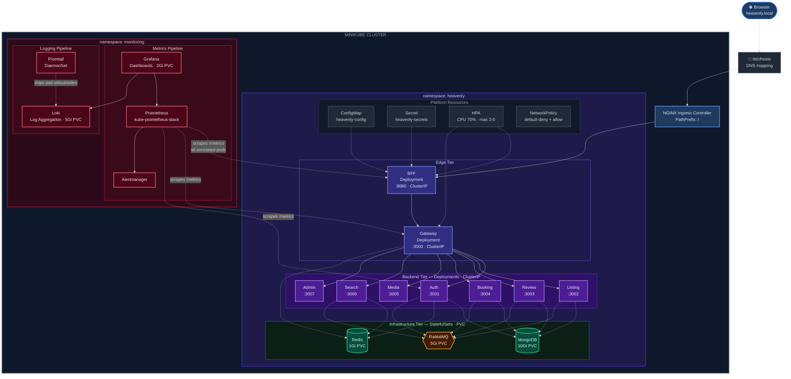
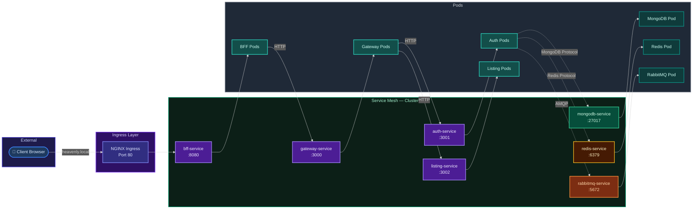
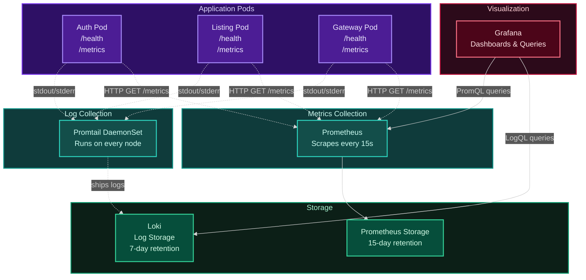

# Heavenly Kubernetes Guide

This Kubernetes setup runs Heavenly locally on Minikube with application workloads in the `heavenly` namespace and observability workloads in `monitoring`.

## Overview

The Heavenly platform consists of:
- **9 Stateless Services**: auth-service, listing-service, review-service, booking-service, media-service, search-service, admin-service, gateway, bff
- **3 Stateful Services**: MongoDB, Redis, RabbitMQ
- **Monitoring Stack**: Prometheus, Grafana, Loki, Promtail

## Architecture Diagrams

### High-Level Architecture

> **Legend** — Solid lines: application traffic &nbsp;|&nbsp; Dashed lines: observability pipeline (metrics scrape / log shipping)



### Network Architecture

> **Legend** — Solid lines: HTTP traffic flow &nbsp;|&nbsp; Dashed lines: protocol-specific connections



**Key Networking Concepts**:

- **ClusterIP Services**: Provide stable internal DNS names (e.g., `mongodb-service.heavenly.svc.cluster.local`)
- **Service Discovery**: Kubernetes DNS automatically resolves service names
- **Load Balancing**: Services distribute traffic across healthy pods using round-robin
- **Health-Based Routing**: Only pods passing readiness probes receive traffic

### Monitoring Architecture

> **Legend** — Solid lines: query/visualization flow &nbsp;|&nbsp; Dashed lines: metrics scraping / log collection



**Monitoring Data Flow**:

1. **Metrics Path**: Pods expose `/metrics` → Prometheus scrapes → Stores in TSDB → Grafana queries with PromQL
2. **Logs Path**: Pods write to stdout/stderr → Promtail collects → Ships to Loki → Grafana queries with LogQL
3. **Health Checks**: Kubernetes probes `/health` → Determines pod readiness/liveness

## Kubernetes Concepts Used

- **Namespace**: isolates app resources (`heavenly`) from monitoring resources (`monitoring`).
- **ConfigMap**: stores non-secret runtime config such as service URLs, ports, Mongo URLs, and Redis URL.
- **Secret**: stores JWT, session, Cloudinary, RabbitMQ, and Razorpay credentials generated from `.env` by `scripts/create-secret.sh`.
- **Deployment**: runs stateless services: auth, listing, review, booking, media, search, admin, gateway, and bff.
- **StatefulSet**: runs MongoDB, Redis, and RabbitMQ with stable pod names and persistent volume claims.
- **Service**: gives each workload a stable DNS name such as `auth-service.heavenly.svc.cluster.local`.
- **Ingress**: routes `http://heavenly.local` to `bff-service:8080` through NGINX.
- **Health probes**: `/health` readiness and liveness checks keep traffic on healthy pods and restart stuck containers.
- **HPA**: scales stateless Deployments based on 70% average CPU utilization.
- **PersistentVolumeClaim**: keeps MongoDB, Redis, and RabbitMQ data across pod restarts.
- **Prometheus/Grafana**: collects and displays container and application `/metrics` data.
- **Loki/Promtail**: collects stdout/stderr logs from pods and exposes them in Grafana.
- **NetworkPolicy**: starts with restricted ingress, then allows internal app traffic, ingress traffic, and monitoring scrapes.

## Directory Structure

The Kubernetes manifests are organized in a `k8s/` directory at the project root:

```
k8s/
├── base/
│   ├── namespace.yaml              # Namespace definitions
│   ├── configmap.yaml              # Non-sensitive configuration
│   ├── secret.yaml                 # Sensitive credentials (base64 encoded)
│   └── network-policies.yaml       # Network access controls
├── infra/
│   ├── mongodb-statefulset.yaml    # MongoDB with PVC
│   ├── mongodb-service.yaml        # MongoDB ClusterIP service
│   ├── redis-statefulset.yaml      # Redis with PVC
│   ├── redis-service.yaml          # Redis ClusterIP service
│   ├── rabbitmq-statefulset.yaml   # RabbitMQ with PVC
│   └── rabbitmq-service.yaml       # RabbitMQ ClusterIP service
├── apps/
│   ├── auth-deployment.yaml        # Auth service deployment
│   ├── auth-service.yaml           # Auth ClusterIP service
│   ├── listing-deployment.yaml     # Listing service deployment
│   ├── listing-service.yaml        # Listing ClusterIP service
│   ├── review-deployment.yaml      # Review service deployment
│   ├── review-service.yaml         # Review ClusterIP service
│   ├── booking-deployment.yaml     # Booking service deployment
│   ├── booking-service.yaml        # Booking ClusterIP service
│   ├── media-deployment.yaml       # Media service deployment
│   ├── media-service.yaml          # Media ClusterIP service
│   ├── search-deployment.yaml      # Search service deployment
│   ├── search-service.yaml         # Search ClusterIP service
│   ├── admin-deployment.yaml       # Admin service deployment
│   └── admin-service.yaml          # Admin ClusterIP service
├── edge/
│   ├── gateway-deployment.yaml     # Gateway deployment
│   ├── gateway-service.yaml        # Gateway ClusterIP service
│   ├── bff-deployment.yaml         # BFF deployment
│   ├── bff-service.yaml            # BFF ClusterIP service
│   └── ingress.yaml                # NGINX Ingress for external access
├── hpa/
│   └── hpa.yaml                    # HPA configuration for all stateless services
└── monitoring/
    ├── prometheus-values.yaml      # Helm values for kube-prometheus-stack
    ├── loki-values.yaml            # Helm values for loki-stack and Promtail
    └── grafana-dashboards.yaml     # Dashboard ConfigMap for Grafana sidecar
```

## Local Image Build Pattern

`scripts/k8s-deploy.sh` runs `eval "$(minikube docker-env)"` and builds images directly inside Minikube's Docker daemon. This avoids pushing images to an external registry.

The script pre-pulls `node:20-alpine` and retries image builds because local Docker Hub pulls can intermittently time out.

All Deployments use `imagePullPolicy: Never` to use local images.

## Monitoring Stack

### Prometheus

- Installed through `kube-prometheus-stack` Helm chart
- Scrapes metrics every 15 seconds from annotated pods
- 15-day retention period
- Stores metrics in persistent volume (20Gi)
- Includes Alertmanager, node-exporter, and kube-state-metrics

### Grafana

- Installed with kube-prometheus-stack
- Persistent volume for dashboard storage (10Gi)
- Pre-configured with Prometheus and Loki data sources
- Includes preloaded `Heavenly Services Overview` dashboard
- Access via `make k8s-grafana` (port-forward to localhost:3000)

### Loki

- Installed through `grafana/loki-stack` Helm chart
- Version 2.6.1 with `schema: v11` and `boltdb-shipper` for compatibility
- 7-day log retention period
- Persistent volume for log storage (20Gi)
- Grafana datasource provisioned with UID `loki`

### Promtail

- Runs as DaemonSet (one pod per node)
- Collects stdout/stderr logs from all pods
- Adds metadata labels (pod, namespace, container, service)
- Ships logs to Loki in real-time

## Useful Queries

### PromQL (Prometheus Metrics)

```promql
# HTTP request rate per service
sum by (service) (rate(heavenly_http_requests_total[5m]))

# CPU usage per pod
sum by (pod) (rate(container_cpu_usage_seconds_total{namespace="heavenly"}[5m]))

# Memory usage per pod
sum by (pod) (container_memory_working_set_bytes{namespace="heavenly"})

# Pod restart count
kube_pod_container_status_restarts_total{namespace="heavenly"}

# HPA current replicas
kube_horizontalpodautoscaler_status_current_replicas{namespace="heavenly"}
```

### LogQL (Loki Logs)

```logql
# All logs from heavenly namespace
{namespace="heavenly"}

# Logs from specific service
{namespace="heavenly", service="bff"}

# Error logs from all services
{namespace="heavenly"} |= "error" or "ERROR"

# Rate of error logs
rate({namespace="heavenly"} |= "error" [5m])

# Logs with JSON parsing
{namespace="heavenly"} | json | level="error"
```
