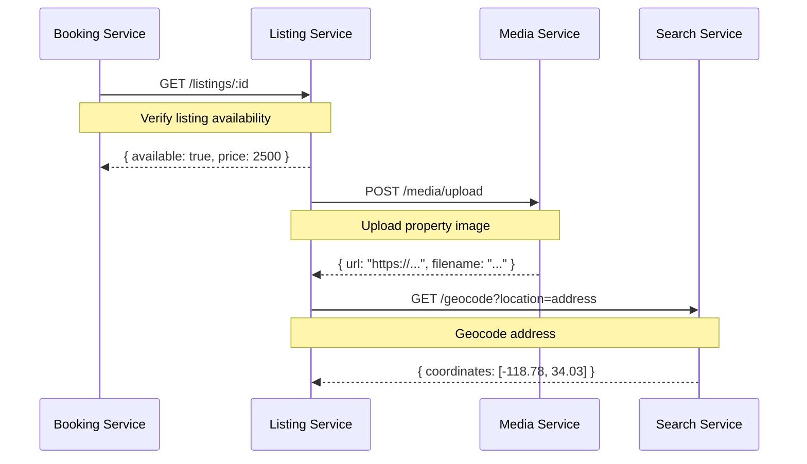
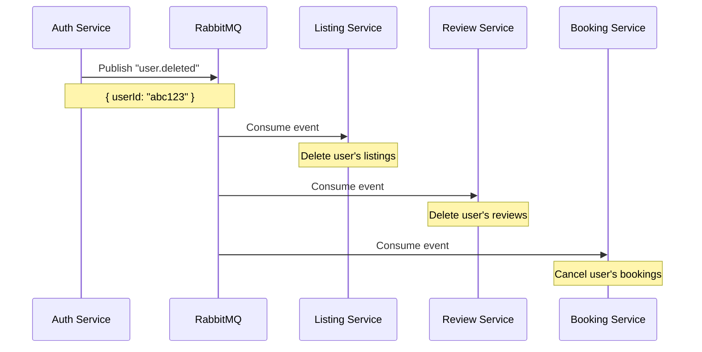
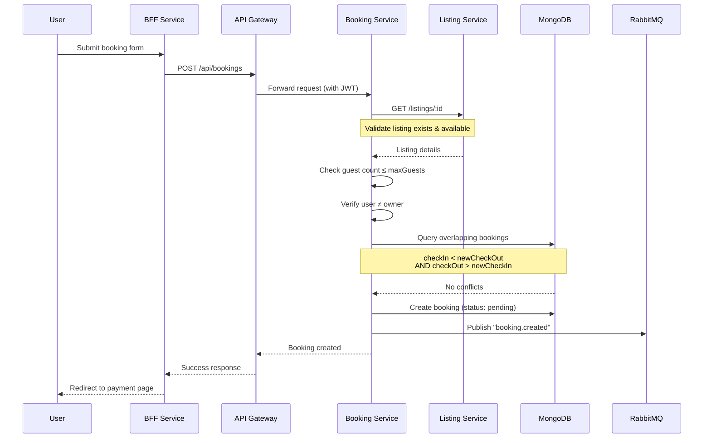
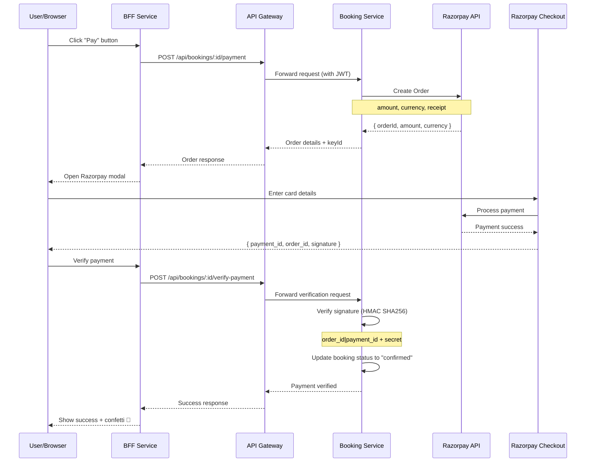
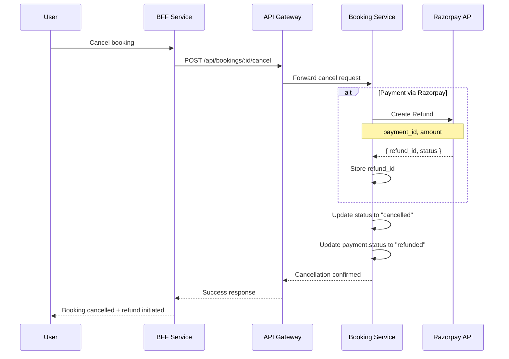
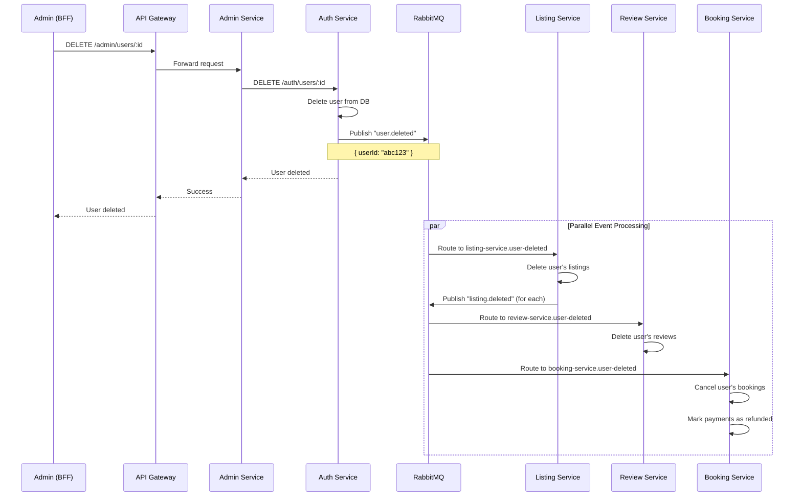

<div align="center">

# 🏨 Heavenly Microservices Architecture

**Property Rental Platform**

*A microservices implementation with distributed systems, event-driven architecture, and modern design patterns*

[](https://nodejs.org/)
[](https://expressjs.com/)
[](https://www.mongodb.com/)
[](https://www.rabbitmq.com/)
[](https://redis.io/)
[](https://www.docker.com/)

[Architecture](#-architecture) • [Services](#-service-catalog) • [Quick Start](#-quick-start) • [Tech Stack](#-tech-stack) • [API Reference](#-api-reference)

</div>

---

## 📋 Overview

Heavenly is a property rental platform built with microservices, evolved from a monolithic Express.js application. It demonstrates distributed systems patterns like service decomposition, event-driven communication, API gateway pattern, and database-per-service architecture.

### 🎯 What We're Building

- **Scalability**: Each service can scale independently based on its load
- **Resilience**: If one service fails, it doesn't bring down the whole system
- **Maintainability**: Clear boundaries make it easier to understand and modify
- **Deployability**: Deploy services independently without affecting others
- **Technology Freedom**: Each service can use different tech if needed

### ✨ Key Features

- **8 Independent Microservices** with their own databases
- **Event-Driven Architecture** using RabbitMQ for async communication
- **API Gateway** with JWT validation and rate limiting
- **Backend-for-Frontend (BFF)** pattern for better client experience
- **Distributed Caching** with Redis for better performance
- **Batch API Queries** for optimized cross-service data fetching
- **Dashboard Response Cache** (30s TTL) for snappy navigation
- **Health Checks & Monitoring** for all services
- **Docker Compose** for easy local development
- **Graceful shutdown** and proper error handling

---

## 🏗️ Architecture

### High-Level System Design

```
┌─────────────────────────────────────────────────────────────────────┐
│                        Client (Browser)                             │
└────────────────────────────┬────────────────────────────────────────┘
                             │ HTTP/HTML
                             ▼
┌─────────────────────────────────────────────────────────────────────┐
│                    BFF Service (:8080)                               │
│         Express + EJS Templates + Session Management                 │
│         Renders HTML, translates session → JWT for API calls         │
└────────────────────────────┬────────────────────────────────────────┘
                             │ HTTP/JSON + JWT
                             ▼
┌─────────────────────────────────────────────────────────────────────┐
│                     API Gateway (:3000)                              │
│         JWT Validation · Rate Limiting · Request Routing             │
│              Centralized entry point for all services                │
└───┬──────┬──────┬──────┬──────┬──────┬──────┬──────┬───────────────┘
    │      │      │      │      │      │      │      │
    ▼      ▼      ▼      ▼      ▼      ▼      ▼      ▼
 ┌──────┐┌──────┐┌──────┐┌──────┐┌──────┐┌──────┐┌──────┐
 │ Auth ││ List ││Review││ Book ││Media ││Search││Admin │
 │:3001 ││:3002 ││:3003 ││:3004 ││:3005 ││:3006 ││:3007 │
 └──┬───┘└──┬───┘└──┬───┘└──┬───┘└──┬───┘└──┬───┘└──────┘
    │       │       │       │       │       │
    ▼       ▼       ▼       ▼       ▼       ▼
 ┌──────┐┌──────┐┌──────┐┌──────┐┌──────┐┌──────┐
 │ Auth ││ List ││Review││ Book ││Cloud-││ Redis │
 │  DB  ││  DB  ││  DB  ││  DB  ││inary ││ Cache │
 └──────┘└──────┘└──────┘└──────┘└──────┘└──────┘

              ┌────────────────────────┐
              │   RabbitMQ (:5672)     │
              │   Event Bus (Async)    │
              │   Topic Exchange       │
              └────────────────────────┘
```

### 🔄 Communication Patterns

#### Synchronous Communication (HTTP/REST)

When we need an immediate response:



#### Asynchronous Communication (RabbitMQ Events)

For cascade operations and eventual consistency:



**Event Exchange**: `heavenly.events` (Topic Exchange)  
**Queue Pattern**: Durable queues per consumer (e.g., `listing-service.user-deleted`)  
**Reliability**: Messages survive broker restarts

---

## 📦 Service Catalog

### Infrastructure Services

| Service | Port | Purpose | Dependencies |
|---------|------|---------|--------------|
| **MongoDB** | 27017 | Document database (per-service DBs) | — |
| **Redis** | 6379 | Caching & JWT blacklist | — |
| **RabbitMQ** | 5672, 15672 | Message broker + Management UI | — |

### Core Microservices

| Service | Port | Database | Responsibility | Status |
|---------|------|----------|----------------|--------|
| **API Gateway** | 3000 | — | Request routing, JWT validation, rate limiting | ✅ Complete |
| **Auth Service** | 3001 | `heavenly_auth` | User identity, authentication, JWT lifecycle | ✅ Complete |
| **Listing Service** | 3002 | `heavenly_listings` | Property CRUD, availability, ownership | ✅ Complete |
| **Review Service** | 3003 | `heavenly_reviews` | Ratings & reviews for listings | ✅ Complete |
| **Booking Service** | 3004 | `heavenly_bookings` | Reservations, Razorpay payments, date validation | ✅ Complete |
| **Media Service** | 3005 | — | Image uploads via Cloudinary | ✅ Complete |
| **Search Service** | 3006 | — | Full-text search, geocoding (Redis cached) | ✅ Complete |
| **Admin Service** | 3007 | — | Cross-service aggregation, admin operations | ✅ Complete |
| **BFF** | 8080 | — | EJS rendering, session management | ✅ Complete |

---

## 🛠️ Tech Stack

### Core Technologies

| Category | Technology | Version | Purpose |
|----------|-----------|---------|---------|
| **Runtime** | Node.js (Alpine) | 20 | Lightweight container runtime |
| **Framework** | Express.js | 5.2 | HTTP server for all services |
| **Database** | MongoDB | 7 | Per-service document storage |
| **Message Broker** | RabbitMQ | 3 | Event-driven async communication |
| **Cache** | Redis | 7 | JWT blacklist, geocoding cache |
| **Authentication** | JWT + bcrypt | — | Stateless token-based auth |
| **Validation** | Joi | 18 | Request schema validation |
| **File Storage** | Cloudinary | — | Image CDN and storage |
| **Payment Gateway** | Razorpay | 2.9 | Payment processing with test/live modes |
| **Geocoding** | Nominatim (OSM) | — | Free address-to-coordinates API |
| **Orchestration** | Docker Compose | — | Multi-container development |
| **Templating** | EJS + ejs-mate | 4 | Server-side HTML rendering |

### Service-Specific Dependencies

```json
{
  "shared": ["amqplib", "jsonwebtoken", "redis"],
  "gateway": ["http-proxy-middleware", "express-rate-limit"],
  "auth-service": ["bcrypt", "mongoose", "redis", "amqplib"],
  "listing-service": ["mongoose", "amqplib", "multer"],
  "review-service": ["mongoose", "amqplib"],
  "booking-service": ["mongoose", "amqplib", "razorpay"],
  "media-service": ["multer", "multer-storage-cloudinary", "cloudinary"],
  "search-service": ["redis", "amqplib"],
  "admin-service": [],
  "bff": ["express-session", "connect-flash", "ejs", "ejs-mate"]
}
```

---

## 📁 Project Structure

```
microservices/
├── docker-compose.yml           # 🐳 Orchestrates 12 containers
├── docker-compose.prod.yml      # 🚀 Production configuration
├── .env.example                 # 🔐 Environment variables template
├── Makefile                     # 🛠️ Development commands
│
├── shared/                      # 📦 Shared NPM Package
│   ├── package.json
│   ├── index.js                 # Barrel export
│   ├── middleware/
│   │   └── authMiddleware.js    # JWT verification
│   ├── errors/
│   │   └── AppError.js          # Consistent error class
│   ├── events/
│   │   ├── eventNames.js        # Event name constants
│   │   └── broker.js            # RabbitMQ client
│   └── utils/
│       └── serviceClient.js     # HTTP client for inter-service calls
│
├── gateway/                     # 🚪 API Gateway (:3000)
│   ├── Dockerfile
│   ├── package.json
│   └── src/
│       ├── index.js             # Entry point
│       ├── proxy.js             # Route → service mapping
│       └── middleware/
│           ├── jwtValidation.js # Token verification
│           ├── rateLimiter.js   # Rate limiting
│           └── errorHandler.js  # Error responses
│
├── services/
│   ├── auth-service/            # 🔐 User Identity (:3001)
│   ├── listing-service/         # 🏠 Property Management (:3002)
│   ├── review-service/          # ⭐ Ratings & Reviews (:3003)
│   ├── booking-service/         # 📅 Reservations (:3004)
│   ├── media-service/           # 📸 Image Uploads (:3005)
│   ├── search-service/          # 🔍 Search & Geocoding (:3006)
│   └── admin-service/           # 👑 Admin Aggregator (:3007)
│
├── bff/                         # 🖥️ Backend-for-Frontend (:8080)
│   ├── Dockerfile
│   ├── package.json
│   └── src/
│       ├── index.js             # Entry point
│       ├── middleware.js        # Auth middleware
│       ├── utils/
│       │   ├── apiClient.js     # Session → JWT translation
│       │   └── dashboardCache.js # 30s TTL response cache
│       ├── routes/              # 7 route modules
│       ├── views/               # 30+ EJS templates
│       └── public/              # Static assets (CSS, JS)
│
└── scripts/                     # 🔧 Utilities
    ├── package.json
    ├── data.js                  # Sample data
    ├── seed-microservices.js    # Database seeding
    ├── migrate.js               # Monolith → microservices migration
    ├── smoke-test.js            # E2E testing
    ├── backup-data.sh           # MongoDB backup
    └── restore-data.sh          # MongoDB restore
```

---

## ⚡ Quick Start

### Prerequisites

- **Docker** 20+ and **Docker Compose** 2+
- **Node.js** 20+ (for local development)
- **Cloudinary Account** (free tier works)
- **Razorpay Account** (optional, for real payments - free test mode available)

### Installation

```bash
# Clone the repository
git clone https://github.com/rudra1806/Heavenly.git
cd Heavenly/microservices

# Configure environment variables
cp .env.example .env
# Edit .env with your credentials (see Configuration section)

# Start all services
make up-build

# Or using docker-compose directly
docker-compose up --build
```

### Configuration

Create a `.env` file in the `microservices/` directory:

```env
# JWT Configuration
JWT_SECRET=your_jwt_secret_key_here_make_it_long_and_random
JWT_REFRESH_SECRET=your_jwt_refresh_secret_key_here_different_from_above

# Session (BFF)
SESSION_SECRET=your_session_secret_here

# Cloudinary (Media Service)
CLOUD_NAME=your_cloudinary_cloud_name
CLOUD_API_KEY=your_cloudinary_api_key
CLOUD_API_SECRET=your_cloudinary_api_secret

# RabbitMQ
RABBITMQ_USER=heavenly
RABBITMQ_PASS=heavenly123

# Razorpay (Booking Service) - Optional
RAZORPAY_KEY_ID=rzp_test_your_key_id
RAZORPAY_KEY_SECRET=your_key_secret

# Admin Seed (optional)
ADMIN_USERNAME=admin
ADMIN_EMAIL=admin@heavenly.com
ADMIN_PASSWORD=admin123
```

**Note:** Razorpay credentials are optional. Without them, the system uses simulation mode for testing.

### Razorpay Payment Setup (Optional)

The booking service supports real payment processing via Razorpay. Without configuration, it automatically falls back to simulation mode.

**1. Get Razorpay Credentials:**
- Sign up at https://dashboard.razorpay.com (free test mode)
- Navigate to Settings → API Keys
- Generate Test Mode keys

**2. Add to `.env`:**
```env
RAZORPAY_KEY_ID=rzp_test_YOUR_KEY_ID
RAZORPAY_KEY_SECRET=YOUR_KEY_SECRET
```

**3. Restart Booking Service:**
```bash
docker-compose up -d booking-service
```

**4. Verify:**
```bash
docker-compose logs booking-service | grep Razorpay
# Should show: [Razorpay] Initialized successfully
```

**Test Cards (Test Mode):**
- Indian Domestic: `4100 2800 0000 1007`
- International: `4111 1111 1111 1111` (enable in dashboard)
- UPI: `success@razorpay`
- CVV: `123`, Expiry: Any future date

**Features:**
- ✅ Real-time payment processing
- ✅ Automatic signature verification
- ✅ Refund processing on cancellation
- ✅ Multiple payment methods (cards, UPI, netbanking, wallets)
- ✅ Automatic fallback to simulation mode

### Seeding Data

```bash
# Seed admin user + 30 sample listings
make seed

# Or manually
cd scripts && node seed-microservices.js
```

### Access Points

| Service | URL | Description |
|---------|-----|-------------|
| **BFF (Frontend)** | http://localhost:8080 | Main application |
| **API Gateway** | http://localhost:3000 | REST API entry point |
| **RabbitMQ Management** | http://localhost:15672 | Message broker UI (heavenly/heavenly123) |
| **Auth Service** | http://localhost:3001 | Direct service access (dev only) |
| **Listing Service** | http://localhost:3002 | Direct service access (dev only) |
| **Review Service** | http://localhost:3003 | Direct service access (dev only) |
| **Booking Service** | http://localhost:3004 | Direct service access (dev only) |
| **Media Service** | http://localhost:3005 | Direct service access (dev only) |
| **Search Service** | http://localhost:3006 | Direct service access (dev only) |
| **Admin Service** | http://localhost:3007 | Direct service access (dev only) |

---

## 🔧 Development Commands

The project includes a comprehensive Makefile for common operations:

```bash
# Start all services
make up              # Foreground mode
make up-d            # Background (detached) mode
make up-build        # Rebuild and start

# Stop services
make down            # Stop all (keeps data)
make clean           # ⚠️ Stop and delete all data

# View logs
make logs            # All services
make logs-bff        # BFF only
make logs-booking    # Booking service only

# Restart services
make restart         # All services
make restart-bff     # BFF only
make restart-auth    # Auth service only

# Database operations
make seed            # Seed initial data
make backup          # Backup MongoDB data
make restore BACKUP=./backups/20260511_143000  # Restore from backup

# Utilities
make ps              # Show running containers
make status          # Service status + volumes
make mongo           # Connect to MongoDB shell
make redis           # Connect to Redis CLI
```

---

## 🔍 Service Deep Dives

### 1. API Gateway (:3000)

**Role**: Single entry point for all API traffic

**What it does**:
- Request Routing: Maps `/api/auth/*` → Auth Service, `/api/listings/*` → Listing Service
- JWT Validation: Verifies tokens in one place (required/optional/admin modes)
- Rate Limiting: 500 req/15min per user, 20 req/15min for auth endpoints
- User Context Forwarding: Passes decoded JWT data via `X-User-*` headers
- Error Handling: Consistent JSON error responses
- Timeout Management: 15s upstream timeout with `503` + `Retry-After` header

**Why this matters**: The gateway validates JWT centrally so individual services don't need to, reducing redundant token verification across services.

---

### 2. Auth Service (:3001)

**Role**: User identity and authentication

**Database**: `heavenly_auth`

**API Endpoints**:

| Endpoint | Method | Auth | Description |
|----------|--------|------|-------------|
| `/auth/register` | POST | Public | Create account, returns access + refresh tokens |
| `/auth/login` | POST | Public | Authenticate, returns tokens |
| `/auth/logout` | POST | Required | Blacklist current token |
| `/auth/refresh` | POST | Public | Exchange refresh token for new access token |
| `/auth/me` | GET | Required | Get current user profile |
| `/auth/users/:id` | GET | Internal | Fetch user info (inter-service) |
| `/auth/users` | GET | Admin | List all users with search |
| `/auth/users/:id` | DELETE | Admin | Delete user + publish `user.deleted` event |

**Implementation Highlights**:
- Password Security: bcrypt with 12 salt rounds, pre-save middleware
- JWT Strategy: Access token (15min) + Refresh token (7d) with separate secrets
- Logout: Redis blacklist with TTL matching token expiry
- Event Publishing: `user.deleted` triggers cascading deletes across services
- Graceful Shutdown: Closes MongoDB, Redis, and RabbitMQ connections on SIGTERM/SIGINT

---

### 3. Listing Service (:3002)

**Role**: Property management

**Database**: `heavenly_listings`

**API Endpoints**:

| Endpoint | Method | Auth | Description |
|----------|--------|------|-------------|
| `/listings` | GET | Public | All listings (filter by `ownerId`, `isAvailable`) |
| `/listings/:id` | GET | Public | Single listing |
| `/listings` | POST | Required | Create listing (auto-geocodes) |
| `/listings/:id` | PUT | Owner/Admin | Update listing (re-geocodes if location changed) |
| `/listings/:id` | DELETE | Owner/Admin | Delete listing + image + publish event |
| `/listings/:id/toggle-availability` | POST | Owner/Admin | Toggle availability flag |

**Implementation Highlights**:
- Decoupled Reviews: No `reviews[]` array (owned by Review Service)
- Ownership Check: Verifies `ownerId === X-User-Id` header (admin bypass)
- Inter-Service Calls: Media Service (image upload), Search Service (geocoding)
- Event Publishing: `listing.created`, `listing.updated`, `listing.deleted`
- Event Consumption: `user.deleted` → cascade delete user's listings

---

### 4. Review Service (:3003)

**Role**: Ratings and reviews

**Database**: `heavenly_reviews`

**API Endpoints**:

| Endpoint | Method | Auth | Description |
|----------|--------|------|-------------|
| `/reviews` | GET | Public | List reviews (filter by `listingId`, `listingIds`, or `authorId`) |
| `/reviews/stats/:listingId` | GET | Public | Rating count + average |
| `/reviews/:id` | GET | Public | Single review |
| `/reviews` | POST | Required | Create review |
| `/reviews/:id` | DELETE | Author/Admin | Delete review |

**Batch Query Support**:
```
GET /reviews?listingIds=id1,id2,id3   → Returns all reviews for multiple listings in one call
GET /reviews?listingId=id1            → Returns reviews for a single listing (legacy)
```

**Implementation Highlights**:
- **Batch Queries**: Supports `listingIds` (comma-separated) for fetching reviews across multiple listings in a single MongoDB `$in` query — eliminates N+1 API call patterns
- Denormalized Data: Stores `authorUsername` to avoid calling other services on read
- Stats Endpoint: Calculates average rating and count per listing
- Authorization: Only author or admin can delete
- Event Publishing: `review.created`, `review.deleted`
- Event Consumption: `listing.deleted` → delete all reviews, `user.deleted` → delete user's reviews

---

### 5. Booking Service (:3004)

**Role**: Reservations and Razorpay payment processing

**Database**: `heavenly_bookings`

**API Endpoints**:

| Endpoint | Method | Auth | Description |
|----------|--------|------|-------------|
| `/bookings` | GET | Public | List bookings (filter by `userId`, `listingId`, `listingIds`) |
| `/bookings/:id` | GET | Public | Single booking |
| `/bookings` | POST | Required | Create booking (validates listing, checks overlap) |
| `/bookings/:id/payment` | POST | Required | Create Razorpay order or process simulated payment |
| `/bookings/:id/verify-payment` | POST | Required | Verify Razorpay payment signature |
| `/bookings/:id/cancel` | POST | Owner/Admin | Cancel booking + process refund |
| `/bookings/:id` | DELETE | Admin | Hard delete booking |

**Batch Query Support**:
```
GET /bookings?listingIds=id1,id2,id3   → Returns all bookings for multiple listings in one call
GET /bookings?listingId=id1            → Returns bookings for a single listing (legacy)
GET /bookings?userId=uid1              → Returns bookings for a specific user
```

**Booking Creation Flow**:



**Implementation Highlights**:
- **Batch Queries**: Supports `listingIds` (comma-separated) for fetching bookings across multiple listings in a single MongoDB `$in` query — eliminates N+1 API call patterns
- Overlap Detection: Checks existing bookings where `checkIn < newCheckOut AND checkOut > newCheckIn`
- Listing Validation: HTTP call to Listing Service (exists, available, guest limit, no self-booking)
- **Razorpay Integration**: Real payment processing with order creation, signature verification, and automatic refunds
- **Dual Mode**: Automatically falls back to simulation mode if Razorpay credentials not configured
- **Platform Fee Model**: Automatically calculates 15% platform fee and 85% host earnings per booking
- Denormalized Data: Stores `listingTitle`, `listingImage`, `listingLocation`, `guestUsername`
- Soft Delete: Users can hide cancelled bookings (`isHidden` flag), admins can hard delete
- Event Publishing: `booking.created`, `booking.payment.completed`, `booking.cancelled`

**Payment Flow (Razorpay Mode)**:



**Refund Flow**:



---

### 6. Media Service (:3005)

**Role**: Image upload and management

**Database**: None (stateless)

**API Endpoints**:

| Endpoint | Method | Description |
|----------|--------|-------------|
| `/media/upload` | POST | Upload image (multipart) → Cloudinary → returns URL + filename |
| `/media/:filename` | DELETE | Delete image from Cloudinary by public_id |

**Implementation Highlights**:
- Multer Integration: `multer-storage-cloudinary` for easy file handling
- Storage: Images stored in `Heavenly_DEV` folder on Cloudinary
- Filename Sanitization: Alphanumeric + hyphens/underscores with timestamp suffix
- Allowed Formats: JPG, JPEG, PNG, AVIF
- Protection: Can't delete the default placeholder image

---

### 7. Search Service (:3006)

**Role**: Full-text search and geocoding

**Database**: None (in-memory index + Redis cache)

**API Endpoints**:

| Endpoint | Method | Description |
|----------|--------|-------------|
| `/geocode?location=X` | GET | Convert address → `[longitude, latitude]` |
| `/search?q=X&minPrice=N&maxPrice=N` | GET | Search listings by text and price range |

**Implementation Highlights**:
- Geocoding: Nominatim (OpenStreetMap) API with Redis caching (7-day TTL)
- Rate Limiting: Respects Nominatim's 1 req/sec limit through caching
- Search Index: In-memory `Map` keyed by listing ID (demonstrates Elasticsearch pattern)
- Text Search: Case-insensitive substring matching across title, description, location, country
- Event Consumption: `listing.created` → add to index, `listing.updated` → update, `listing.deleted` → remove

---

### 8. Admin Service (:3007)

**Role**: Cross-service aggregation and admin operations

**Database**: None (pure aggregation layer)

**API Endpoints**:

| Endpoint | Method | Auth | Description |
|----------|--------|------|-------------|
| `/admin/dashboard` | GET | Admin | Platform-wide stats (users, listings, reviews, bookings, revenue) |
| `/admin/user-dashboard/:userId` | GET | Admin | User-specific host + guest dashboard |
| `/admin/users` | GET | Admin | All users (with search) |
| `/admin/users/:id` | DELETE | Admin | Delete user → delegates to Auth Service |
| `/admin/listings` | GET | Admin | All listings (with search) |
| `/admin/listings/:id` | DELETE | Admin | Delete listing → delegates to Listing Service |
| `/admin/reviews` | GET | Admin | All reviews (with search) |
| `/admin/reviews/:id` | DELETE | Admin | Delete review → delegates to Review Service |
| `/admin/bookings` | GET | Admin | All bookings |
| `/admin/bookings/:id` | DELETE | Admin | Hard delete booking → delegates to Booking Service |

**Implementation Highlights**:
- Pure Aggregation: No database, no message broker (only HTTP calls)
- Parallel Queries: `Promise.all` for dashboard stats from multiple services
- Delegation Pattern: All delete operations delegate to the owning service (which publishes events)
- Client-Side Computation: Booking status breakdown, payment stats, revenue calculations

---

### 9. BFF (Backend-for-Frontend) (:8080)

**Role**: User-facing server (replaces monolith's `app.js`)

**Database**: None (session-based, no persistence)

**What it does**:
- HTML Rendering: EJS templates for all user-facing pages
- Session Management: Express sessions (replaces Passport.js)
- Session → JWT Translation: Converts session data to JWT for API Gateway calls
- Flash Messages: User feedback via `connect-flash`
- Static Assets: Serves CSS, JavaScript, images
- Route Mapping: 7 route modules (auth, listings, reviews, bookings, dashboard, admin, pages)

**Dashboard Performance Optimizations**:
- **Batch API Calls**: Dashboard routes use `?listingIds=id1,id2,id3` instead of N individual calls per listing
- **Response Cache**: 30-second TTL in-memory cache (`dashboardCache.js`) prevents redundant API calls during rapid tab navigation
- **Parallel Fetching**: Independent API calls run concurrently via `Promise.all()`
- **Write-Through Invalidation**: POST/PUT/DELETE actions automatically clear the user's cache
- **Result**: Dashboard API calls reduced from ~44 to ~3-4 per page load (92% reduction)

**Dashboard Views**:
- `dashboard/index.ejs` — Main dashboard with host + guest stats
- `dashboard/listings.ejs` — User's listings with booking/review counts
- `dashboard/bookings.ejs` — Guest booking history
- `dashboard/host-bookings.ejs` — Bookings received on user's listings
- `dashboard/host-reviews.ejs` — Reviews received on user's listings
- `dashboard/listing-bookings.ejs` — Bookings for a specific listing
- `includes/dashboard-sidebar.ejs` — Reusable sidebar navigation partial

---

## 📦 Shared Package

The `@heavenly/shared` package provides common utilities used across all services:

### Middleware

**`authMiddleware.js`**: JWT verification with three modes
- `requireAuth`: Blocks unauthenticated requests
- `optionalAuth`: Attaches user if token present
- `requireAdmin`: Blocks non-admin users

### Errors

**`AppError.js`**: Consistent error class with HTTP status codes

```javascript
throw new AppError('Resource not found', 404);
```

### Events

**`eventNames.js`**: Centralized event name constants

```javascript
module.exports = {
  USER_DELETED: 'user.deleted',
  LISTING_CREATED: 'listing.created',
  LISTING_UPDATED: 'listing.updated',
  LISTING_DELETED: 'listing.deleted',
  REVIEW_CREATED: 'review.created',
  REVIEW_DELETED: 'review.deleted',
  BOOKING_CREATED: 'booking.created',
  BOOKING_PAYMENT_COMPLETED: 'booking.payment.completed',
  BOOKING_CANCELLED: 'booking.cancelled'
};
```

**`broker.js`**: RabbitMQ client
- `connect()`: Establish connection with retry logic
- `publish(eventName, data)`: Publish event to topic exchange
- `consume(queueName, eventName, handler)`: Subscribe to events

### Utils

**`serviceClient.js`**: HTTP client for inter-service calls

```javascript
const { get, post, put, del } = require('@heavenly/shared').serviceClient;

// Example usage
const listing = await get('http://listing-service:3002/listings/123');
```

---

## 🔐 Security & Authentication

### JWT Token Strategy

**Access Token**:
- Expiry: 15 minutes
- Payload: `{ id, username, email, role }`
- Purpose: API authentication
- Storage: HTTP-only cookie (BFF) or Authorization header

**Refresh Token**:
- Expiry: 7 days
- Payload: `{ id }`
- Purpose: Obtain new access token
- Storage: HTTP-only cookie

**Logout**:
- Access token added to Redis blacklist
- TTL matches remaining token lifetime
- Blacklisted tokens get rejected on subsequent requests

### Authorization Levels

1. **Public**: No authentication required
2. **Authenticated**: Valid JWT required
3. **Owner**: Resource ownership verification
4. **Admin**: Admin role required

### Rate Limiting

- **Global**: 500 requests per 15 minutes per user
- **Auth Endpoints**: 20 requests per 15 minutes per IP
- **Key Strategy**: Uses `X-User-Id` from JWT (not container IP)

---

## 🔄 Event-Driven Architecture

### Event Flow Example: User Deletion



### Event Catalog

| Event | Publisher | Consumers | Purpose |
|-------|-----------|-----------|---------|
| `user.deleted` | Auth Service | Listing, Review, Booking | Cascade delete user data |
| `listing.created` | Listing Service | Search | Add to search index |
| `listing.updated` | Listing Service | Search | Update search index |
| `listing.deleted` | Listing Service | Review, Booking, Search | Cascade delete + remove from index |
| `review.created` | Review Service | — | Future: Notification service |
| `review.deleted` | Review Service | — | Future: Analytics service |
| `booking.created` | Booking Service | — | Future: Notification service |
| `booking.payment.completed` | Booking Service | — | Future: Analytics service |
| `booking.cancelled` | Booking Service | — | Future: Notification service |

---

## 📊 Database Schema

### Database-per-Service Pattern

Each service owns its database with clear boundaries:

**heavenly_auth**
```javascript
users {
  _id: ObjectId,
  username: String (unique),
  email: String (unique),
  password: String (hashed),
  role: String ('user' | 'admin'),
  createdAt: Date
}
```

**heavenly_listings**
```javascript
listings {
  _id: ObjectId,
  title: String,
  description: String,
  image: { url: String, filename: String },
  price: Number,
  location: String,
  country: String,
  maxGuests: Number,
  ownerId: String,
  isAvailable: Boolean,
  geometry: { type: "Point", coordinates: [lon, lat] },
  createdAt: Date
}
```

**heavenly_reviews**
```javascript
reviews {
  _id: ObjectId,
  listingId: String,
  authorId: String,
  authorUsername: String (denormalized),
  rating: Number (1-5),
  comment: String,
  createdAt: Date
}
```

**heavenly_bookings**
```javascript
bookings {
  _id: ObjectId,
  listingId: String,
  listingTitle: String (denormalized),
  listingImage: String (denormalized),
  listingLocation: String (denormalized),
  userId: String,
  guestUsername: String (denormalized),
  checkIn: Date,
  checkOut: Date,
  guests: Number,
  pricePerNight: Number,
  totalPrice: Number,
  platformFee: Number,           // 15% of totalPrice
  hostEarnings: Number,          // 85% of totalPrice
  status: String,                // 'pending' | 'confirmed' | 'completed' | 'cancelled'
  isHidden: Boolean,             // Soft-delete flag for user's booking history
  payment: {
    status: String,              // 'pending' | 'completed' | 'refunded' | 'failed'
    method: String,              // 'simulated' | 'razorpay'
    transactionId: String,       // Razorpay payment_id or simulated ID
    razorpayOrderId: String,     // Razorpay order_id
    refundId: String,            // Razorpay refund_id (if cancelled)
    paidAt: Date
  },
  createdAt: Date
}
```

---

## 🧪 Testing

### Smoke Test

Run end-to-end health checks:

```bash
cd scripts
node smoke-test.js
```

**What it tests**:
- ✅ All services health endpoints
- ✅ User registration and login
- ✅ JWT token validation
- ✅ Listing CRUD operations
- ✅ Review creation and deletion
- ✅ Booking creation and payment
- ✅ Admin dashboard access
- ✅ Event publishing and consumption

### Manual Testing

```bash
# Test API Gateway
curl http://localhost:3000/health

# Test Auth Service
curl -X POST http://localhost:3000/api/auth/register \
  -H "Content-Type: application/json" \
  -d '{"username":"testuser","email":"test@example.com","password":"password123"}'

# Test Listing Service
curl http://localhost:3000/api/listings

# Test with JWT
curl http://localhost:3000/api/auth/me \
  -H "Authorization: Bearer YOUR_JWT_TOKEN"
```

---

## 📈 Monitoring & Observability

### Health Checks

All services expose `/health` endpoints:

```bash
# Check all services
curl http://localhost:3000/health  # API Gateway
curl http://localhost:3001/health  # Auth Service
curl http://localhost:3002/health  # Listing Service
# ... etc
```

### RabbitMQ Management UI

Access at http://localhost:15672 (heavenly/heavenly123)

**What you can monitor**:
- Message rates
- Queue depths
- Consumer status
- Exchange bindings

### Docker Logs

```bash
# View all logs
docker-compose logs -f

# View specific service
docker-compose logs -f auth-service

# View last 100 lines
docker-compose logs --tail=100 booking-service
```

### Service Status

```bash
# Check running containers
make ps

# Check service health
make status

# Check volumes
make volumes
```

---

## 🚀 Deployment

### Production Considerations

1. **Environment Variables**: Use secrets management (AWS Secrets Manager, HashiCorp Vault)
2. **Database**: Use managed MongoDB (MongoDB Atlas, AWS DocumentDB)
3. **Message Broker**: Use managed RabbitMQ (CloudAMQP, AWS MQ)
4. **Cache**: Use managed Redis (AWS ElastiCache, Redis Cloud)
5. **Container Orchestration**: Kubernetes or AWS ECS
6. **Load Balancing**: AWS ALB, NGINX, or Traefik
7. **Service Discovery**: Consul, Eureka, or Kubernetes DNS
8. **Monitoring**: Prometheus + Grafana, Datadog, or New Relic
9. **Logging**: ELK Stack, Splunk, or CloudWatch
10. **CI/CD**: GitHub Actions, GitLab CI, or Jenkins

### Docker Compose Production

```bash
# Use production compose file
docker-compose -f docker-compose.prod.yml up -d

# Scale specific services
docker-compose -f docker-compose.prod.yml up -d --scale listing-service=3
```

### Kubernetes Deployment Example

```yaml
apiVersion: apps/v1
kind: Deployment
metadata:
  name: listing-service
spec:
  replicas: 3
  selector:
    matchLabels:
      app: listing-service
  template:
    metadata:
      labels:
        app: listing-service
    spec:
      containers:
      - name: listing-service
        image: heavenly/listing-service:latest
        ports:
        - containerPort: 3002
        env:
        - name: MONGO_URL
          valueFrom:
            secretKeyRef:
              name: mongo-secret
              key: url
        - name: JWT_SECRET
          valueFrom:
            secretKeyRef:
              name: jwt-secret
              key: secret
```

---

## 🔧 Troubleshooting

### Common Issues

**Services won't start**:
```bash
# Check Docker resources
docker system df

# Clean up unused resources
docker system prune -a

# Rebuild from scratch
make clean
make up-build
```

**Database connection errors**:
```bash
# Check MongoDB health
make mongo
# In mongo shell:
db.adminCommand('ping')

# Check connection string in .env
MONGO_URL=mongodb://mongodb:27017/heavenly_auth
```

**RabbitMQ connection errors**:
```bash
# Check RabbitMQ status
docker-compose logs rabbitmq

# Access management UI
open http://localhost:15672
```

**Port conflicts**:
```bash
# Check what's using a port
lsof -i :3000

# Kill process
kill -9 <PID>
```

**Service crashes**:
```bash
# View logs
docker-compose logs --tail=100 <service-name>

# Restart specific service
make restart-<service-name>
```

---

## 📚 Design Decisions

### 1. Database-per-Service

**What we did**: Each service owns its database  
**Why**: Data isolation, independent scaling, technology freedom  
**Trade-off**: No cross-database joins, eventual consistency

### 2. Event-Driven Cascade Deletes

**What we did**: Use RabbitMQ events instead of database triggers  
**Why**: Loose coupling, service independence, audit trail  
**Trade-off**: Eventual consistency, added complexity

### 3. Denormalized Data

**What we did**: Store `authorUsername`, `listingTitle`, etc. in dependent services  
**Why**: Avoid calling other services on every read, better performance  
**Trade-off**: Data duplication, potential inconsistency

### 4. JWT over Sessions

**What we did**: Stateless JWT tokens instead of session-based auth  
**Why**: Scalability, no shared session store, works well with microservices  
**Trade-off**: Token size, revocation complexity (solved with Redis blacklist)

### 5. API Gateway Pattern

**What we did**: Single entry point for all API traffic  
**Why**: Centralized auth, rate limiting, routing, monitoring  
**Trade-off**: Single point of failure (mitigated with health checks)

### 6. BFF Pattern

**What we did**: Separate BFF for frontend instead of direct API calls  
**Why**: Better client experience, session management, SSR  
**Trade-off**: Additional service, more complexity

### 7. Batch Query APIs & Response Caching

**What we did**: Added `listingIds` batch query support to booking and review services; added 30s TTL response cache in BFF  
**Why**: Eliminated N+1 API call explosion that caused dashboard crashes — reduced ~44 API calls per page to ~3-4  
**Trade-off**: Slightly stale data during 30s cache window (acceptable for dashboard views)

### 8. In-Memory Search Index

**What we did**: In-memory `Map` instead of Elasticsearch (for now)  
**Why**: Simplicity, demonstrates the pattern, good enough for MVP  
**Trade-off**: Won't scale for large datasets, no persistence

### 9. Razorpay Payment Integration

**What we did**: Integrated Razorpay payment gateway with automatic fallback to simulation mode  
**Why**: Production-ready payment processing with real transaction handling  
**Features**:
- Order creation and signature verification
- Automatic refund processing on cancellation
- Dual mode operation (Razorpay or simulation)
- Secure server-side payment verification

See [Razorpay Quick Start Guide](RAZORPAY_QUICK_START.md) for setup instructions.

---

## 🎓 What We Learned

### What Worked Well

1. **Event-Driven Architecture**: Clean cascade deletes without tight coupling
2. **Shared Package**: Reduced code duplication across services
3. **Docker Compose**: Made local development and testing much easier
4. **Health Checks**: Caught service failures early
5. **Makefile**: Made common operations simple
6. **Denormalization**: Big performance improvement for reads

### Challenges We Faced

1. **Eventual Consistency**: Debugging cascade operations across services was tricky
2. **Inter-Service Communication**: Had to handle network latency and errors carefully
3. **Data Migration**: Moving from monolith to microservices took some work
4. **Testing Complexity**: E2E tests need all services running
5. **Debugging**: Distributed tracing would help (future: Jaeger/Zipkin)

### What's Next

1. **Service Mesh**: Istio or Linkerd for better traffic management
2. **Distributed Tracing**: Jaeger or Zipkin to trace requests across services
3. **Centralized Logging**: ELK Stack or Loki for log aggregation
4. **API Documentation**: Swagger/OpenAPI for all services
5. **GraphQL Gateway**: Alternative to REST for complex queries
6. **CQRS Pattern**: Separate read/write models for high-traffic services
7. **Saga Pattern**: Handle distributed transactions better
8. **Circuit Breaker**: Resilience4j or Hystrix for fault tolerance
9. **Webhooks**: Razorpay webhooks for real-time payment notifications
10. **Elasticsearch**: Replace in-memory search index

---

## 🤝 Contributing

1. Fork the repository
2. Create a feature branch (`git checkout -b feature/new-feature`)
3. Commit changes (`git commit -m 'Add new feature'`)
4. Push to branch (`git push origin feature/new-feature`)
5. Open a Pull Request

### How to Contribute

- Follow existing code structure and naming conventions
- Add health checks to new services
- Document API endpoints in this README
- Add event names to `shared/events/eventNames.js`
- Update docker-compose.yml for new services
- Add Makefile commands for common operations

---

## 📄 License

This project is licensed under the MIT License.

---

## 👤 Author

**Rudra Sanandiya**

- GitHub: [@rudra1806](https://github.com/rudra1806)
- Project: [Heavenly](https://github.com/rudra1806/Heavenly)

---

## 🙏 Thanks

- **Monolith Version**: The original Heavenly application
- **Inspiration**: Airbnb and Booking.com architecture patterns
- **Technologies**: Express.js, MongoDB, RabbitMQ, Redis, and Docker communities

---

<div align="center">

**Built with ❤️ using microservices architecture**

[⬆ Back to Top](#-heavenly-microservices-architecture)

</div>
